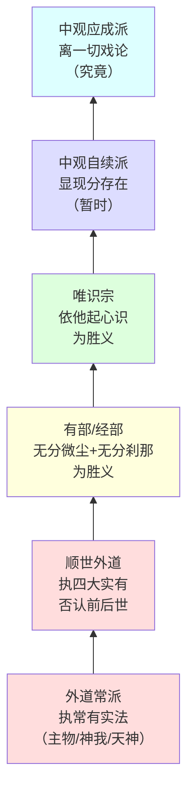

# 各宗派对二谛的认识阶梯

## 为什么要了解各宗派的二谛观？

麦彭仁波切在第7课提出全论内容的核心命题：**通过二理明确开显二谛无倒真如**。随即铺展一个系统的宗派比较——从外道到佛教最高见解，逐层递进，让读者亲身经历认识的攀升过程。

这不是学术综述，而是修行的必要准备。堪布在第8课说得明确："大家在闻思修行的过程中，一定要打破自相续中的我执。"而了解各宗派的所执，正是看清自己的相续中潜藏着哪些习气。

## 总原则

二谛的分基是**所知**。圣者所见的真相是胜义谛，凡夫所见的虚相是世俗谛——如同无眼病者见白海螺（胜义）与有眼翳者见黄海螺（世俗）（第9课）。

各宗派对二谛认识的差异，源于三种智慧层次（第7课）：

| 层次 | 表现 | 对应 |
|------|------|------|
| 颠倒分别 | 完全不知万法真相 | 外道 |
| 片面理解 | 稍微了解一部分 | 声闻缘觉 |
| 真实了达 | 如实证悟 | 中观所抉择的智慧 |

## 一、外道四派（第7-8课）

### 共同特征

所有外道——不论常派还是断派——**全部不离有实见、不离我见**（第8课）。

> "固执颠倒邪见的这些外道徒谁也无法堪忍无我的狮子巨吼声。"

常派在俱生我见的铁板上又钉上了遍计我执的铁钉（麦彭仁波切比喻）。

### 1. 数论派（Sāṃkhya）

| 项目 | 内容 |
|------|------|
| **胜义谛** | 三德平衡的自性主物（pradhāna）+神我（puruṣa）——二者皆常有实有 |
| **世俗谛** | 主物所变化的一切现象——欺惑性有法 |
| **解脱观** | 修禅定→见所有现象本来面目→现象融入主物→神我独自逍遥=解脱 |
| **与佛教的相似处** | 主物类似阿赖耶，神我类似意识（麦彭仁波切评） |
| **核心错误** | 承认常有实法的主物和神我 |

堪布评价：在所有外道中，数论派最接近唯识宗，"应该是最好不过的一种宗派"。但关键区别是——佛教立足于"无我"，而数论派的根基是一个常有的"我"。

### 2. 密行派（Pāśupata 等）

| 项目 | 内容 |
|------|------|
| **胜义谛** | 如虚空般周遍的、心识自性的、独一无二的胜我 |
| **世俗谛** | 多种多样的显现——与明知的我一味一体 |
| **解脱观** | 修胜我→本性/非本性无明脱离→如瓶破虚空回归大虚空→融入大我 |
| **与佛教的相似处** | 接近唯识宗（万法为心的显现）；"瓶破虚空归大虚空"的比喻接近密宗 |
| **核心错误** | 承认虚空般的常有之我实有 |

### 3. 吠陀派等

| 项目 | 内容 |
|------|------|
| **胜义谛** | 梵天/遍入天/大自在天等恒常天神 |
| **世俗谛** | 天神的神变所造万物——不稳固、欺惑之性 |
| **解脱观** | 修苦行、禁行、供养、禅定、观风→获得天尊果位=永久解脱 |
| **核心错误** | 将天神执为常有的究竟解脱者 |

### 4. 顺世派（Cārvāka/Lokāyata）

| 项目 | 内容 |
|------|------|
| **胜义谛** | 四大元素——现量所见、真实存在 |
| **世俗谛** | 由四大所生又将灭亡的万物——不稳固 |
| **解脱观** | 无解脱可言——前世后世不存在，一死了之 |
| **论证工具** | 一理证门（自根未见前世后世故不存在）、四理论（现世有/俱生/新生/非枉然）、三比喻（蘑菇/灰尘/豌豆圆荆棘尖） |
| **核心错误** | 断灭见——否认前后世、业果、解脱 |

**破斥方法**（第7课）：
- 破其四大存在→以破微尘理证
- 破其前后世不存在→以破无因理证（无因则应恒有或恒无）

堪布反复强调此派与辩证唯物论的相似性，告诫学人警觉自相续中的断灭习气。

### 外道统一破斥的关键

> "只要遮破常有实法就可以一并破除"所有常派。（第7课）

> "对于实执这一根本无有任何损害——只能称作是相似的空性，而对二谛纯粹是一无所知。"（第8课）

## 二、有部与经部（第8-9课）

### 共同承许

| 概念 | 内容 |
|------|------|
| **世俗谛** | 经过摧毁（铁锤砸瓶子）或分析（以心分析）可以抛弃执著之心的粗大法 |
| **胜义谛** | 无法舍弃的**无分刹那心识**+**无分微尘无情法** |
| **无我观** | 外道所许的常有我不存在；五蕴假合被想当然认为是我；以我而空的两个极微存在 |
| **解脱道** | 修人无我→断坏聚见→断轮回烦恼→有余/无余罗汉→涅槃 |

### 有部与经部的差别

| 问题 | 有部 | 经部 |
|------|------|------|
| 抉择灭 | 实有 | 非实有 |
| 见外境 | 以根见 | 以识见 |
| 相应行 | 实有 | 非实有 |
| 微尘构成 | 最少八极微（地水火风色香味触） | 地等不一定全具 |

### 对《般若经》"空性"的解释（第9课）

这是一个极为有趣的细节——有部经部如何处理佛经中"一切万法皆空"的文句：

| 宗派 | 解释策略 | 逻辑 |
|------|---------|------|
| **有部** | "微量"——有实法含量很少 | 就像说"没胆子"其实是胆子很小 |
| **有部** | "下劣"——有实法本体低微 | 以低微加否定词，并非真正不存在 |
| **经部** | "鲜少"——现在存在的法很少 | 过去已灭、未来未生，现在的数目少，故称"空" |

堪布评价：这说明他们从未触及过空性的真义。

### 现基（实法基础）的思路

有部经部的核心论证：

> "如果无分刹那心识与无分微尘也不存在，那么所有粗大无情物与心识显然就失去了赖以存在的基础……如同无有毛线的氆氇一般。"（第8课）

这个"现基"思维模式——万法必须有一个真实存在的基础——贯穿外道到唯识宗（中观应成派是唯一彻底拔除此根的宗派）。

## 三、唯识宗（第9-10课）

### 三大法的体系

| 概念 | 内容 | 比喻 |
|------|------|------|
| **遍计所执**（世俗谛） | 能取所取的一切显现——无而显现 | 梦中大象 |
| **依他起** | 自明自知的心识——清净不清净习气的染基 | 无垢水晶珠被各种颜料涂染 |
| **圆成实**（胜义谛） | 依他起上能取所取不存在——以外境所取与执取能取来空 | 水晶珠本身清净 |

### 依他起的二面性

这是理解唯识宗的**关键要点**（第10课麦彭仁波切特别提醒"不懂此点则如巴瓦匝草般混乱"）：

| 角度 | 依他起属于 | 理由 |
|------|-----------|------|
| 究竟实相 | 胜义谛 | 人我法我在依他起上不存在 |
| 现相 | 世俗谛 | 依他起显现能取所取的种种相 |

### 唯识宗的优点与不足

| 维度 | 评价 |
|------|------|
| **名言安立** | 无可挑剔——五道十地的地道功德抉择圆满（无著菩萨《瑜伽师地论》），中观宗在世俗名言方面也不超越此 |
| **人无我** | 已圆满抉择 |
| **法无我** | 自认圆满（以遍计法来空+无本性生），实际仅是"相近的法无我"——因承许依他起心识成实 |
| **成佛可能** | 以中观理观察：承认一法成实不空→法无我不圆满→连见道都得不到（《功德藏》论证）→无法成佛 |

> "唯识宗的法理作为世俗名言的真如本义可以说是千真万确，但美中不足的是，此宗耽著自明心识的自性成实存在这一点实属所破。"（第10课）

### 唯识宗的核心论证工具

| 工具 | 内容 | 出处 |
|------|------|------|
| 六尘环绕破 | 以六方微尘环绕中心微尘破外境实有 | 《唯识二十颂》 |
| 明知因 | 所见之红色柱子与能见眼识一体——对境具心之特征 | 因明 |
| 俱缘定因 | 蓝色与取蓝识非他体——必定同时缘 | 因明 |
| 串习力论证 | 贪欲/恐惧/不净观长久串习后外境现前——证明万法唯心 | 第10课三例 |

### 心识光明问题

唯识宗承认：自性光明的心识从凡夫地到佛地始终存在，作为显现刹土与色身的本基。堪布指出：密宗和中观也承认自性光明（如来藏），但**根本不承许自性光明实有**——这是关键区别。

## 四、中观宗（第10课暗示）

第10课并未系统展开中观宗的二谛观，但通过评判唯识宗，间接揭示了各宗派的层层所破：

| 宗派 | 所破（实执对象） |
|------|----------------|
| 有部/经部 | 无分微尘+无分刹那 |
| 唯识宗 | 自明自知的依他起心识 |
| 中观自续派 | 显现分实有 |
| 中观应成派 | 无任何所破——至高无上 |

## 阶梯图

**层层递进的关键转折**：每一层突破都是通过发现前一层的"现基执著"并破除它来实现的。从外道的常我，到有部的极微，到唯识的心识，到自续的显现分——每一步都在拔除一个更精微的实执根基。中观应成派是唯一不留任何现基的宗派。

## 修行启示

1. **检查自相续**：你心底里的二谛观更接近哪个宗派？很多人自认为修学大乘，但思维模式实际停留在有部经部甚至顺世派的层面。
2. **层层递进而非跳跃**：堪布没有直接讲中观应成派，而是从外道讲起——因为理解错误见解是理解正确见解的必要准备。
3. **名言与胜义不可混淆**：唯识宗的名言安立完美无缺（连中观宗也接受），问题在于将名言层面的东西提升为胜义层面的实有。

## 延伸：应成派与自续派的区分（第26-30课）

第26-30课在总义部分深入辨析了中观应成派与自续派之间的关系。麦彭仁波切提出的根本区分标准：

- **自续派法相**：着重抉择具有承认的**相似胜义**（单空）
- **应成派法相**：着重抉择远离一切承认的**真实胜义**（离戏）

二派究竟意趣无二无别——自续派最终也抉择离戏，应成派后得时也分析二谛。差别在于展开方式和侧重点。

详见[总义——应成自续与总义收结](09-应成自续与总义收结.md)。
