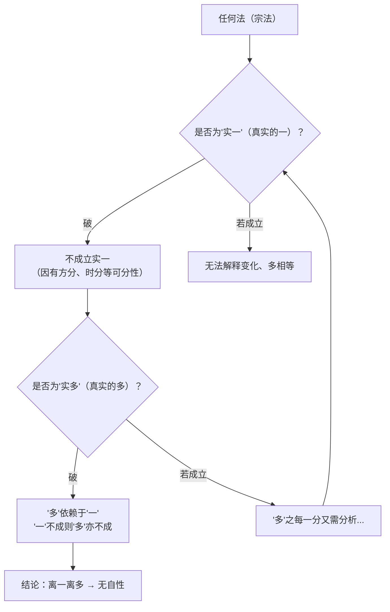

# 离一多因

## 概述

离一多因（梵：ekāneka-viyoga-hetu）是《中观庄严论》的**核心推理方法**，也是静命论师的标志性论证工具。全论开篇第一颂即宣示：

> **自他所说法，此等真实中，离一及多故，无性如影像。**

意为：自宗（佛教各派）和他宗（外道各派）所说的一切法，在真实（胜义）中，因为远离了"一"和"多"的自性，所以无有自性，如同影像。

## 推理结构

### 基本三支论式

- **宗（命题）**：一切法无自性
- **因（理由）**：离一及多故
- **喻（比方）**：如影像

### 逻辑结构

关键原理：**"一"与"多"是穷尽性的二分——任何实法要么是一体，要么是多体，不可能有第三选项。若证明既非实一也非实多，则实法不成立。**

颂文明确说：

> **分析何实法，某法无一性，何法一非有，彼亦无多体。**
> **除一及多外，具有他行相，实法不容有，此二互绝故。**

## 在第50课中的应用：破微尘之实一

第50课展示了离一多因在物质分析中的具体运用——先破"实一"（无分微尘），进而破"实多"（由微尘组成的粗法）。

### 破实一的具体路径

对方承认无分微尘（paramāṇu）是最终的实有法。论主以三种微尘组合方式逐一破析：

| 组合方式 | 提出者 | 破析 |
|---------|--------|------|
| 粘合 | 食米派 | 有接触面 → 有方分 → 非无分 → 矛盾；或融为一体 → 粗法不成 |
| 环绕 | 佛教部分论师 | 环绕需方向差异 → 有方分 → 非无分 |
| 无间住 | 部分论师 | 无间则不可区分 → 粗法不成 |

### 从破实一到破实多

此部分在"寅二·说明以破彼微尘而破多有实法"中展开（第50课末尾提及，详细论证可能在后续课程）。逻辑是：

- "多"由"一"组成
- "一"（无分微尘）已破
- 故"多"（粗大色法）亦不成实

## 与其他推理方法的关系

| 推理方法 | 关系 |
|---------|------|
| 六尘环绕破 | 离一多因的**具体化应用**——用六方微尘环绕中心微尘来破无分性 |
| 四边破（中论） | 相似但角度不同——四边破从有无是非四边破，离一多因从一多二分破 |
| 金刚屑因 | 从因的角度破（自生他生共生无因生），与离一多因互补 |
| 缘起因 | 从缘起角度破实有，离一多因更侧重逻辑分析 |

## 因明性质的三重分析（第36-37课）

麦彭仁波切对离一多因进行了因明学层面的精确定位，回答三个问题：

### 应成因还是自续因？

**二者皆可。** 关键论证：
- **作为应成因**：对方虽不直接承认离一多因，但承认所遍法（如有部的无分微尘），由此被迫承认离一多
- **作为自续因**：通过**遣余**的概念在分别心前安立有法。且此推理属于**遮破性论式**——遮破性论式中有法不成立也合理（区别于建立性论式，如"石女的儿子是无常的，所作故"则不合理）

此区分出自克主杰《遣除疑暗论》，是理解离一多因为何能统摄一切所破的关键。

### 证成义理因还是证成名言因？

**主要是证成义理因，亦可为证成名言因。** 静命论师主要在**意义**上与外道和有实宗辩论——推翻他们以遍计和俱生无明所执著的实有法。法王如意宝也确认此点。

### 无遮还是非遮？

**无遮。** 离一多因与无实所立都属于无遮——遮破所破后不引出其他法。从遣余的角度，因与所立虽本体无异（离一多即无有自性），但**反体不同**，可以建立关联。

## 三相推理的完整建立（第39课）

第39课确立了离一多因具足三相：

| 相 | 内容 |
|----|------|
| **宗法** | 离一多因在有法（自他所说的一切万法）和立宗（无有自性）上成立 |
| **同品遍** | 远离一体多体 → 必定无有自性（同体相属关系） |
| **异品遍** | 若非无有自性 → 离一多因无法安立 |

教证：陈那论师《集量论》"三相因见义"；法称论师《释量论》"宗法彼分遍"。

## 在破自宗假立之常法上的应用（第41-45课）

第41-45课将离一多因应用于佛教内部——破有部宗所承许的抉择灭无为法的"常有实一"。核心颂词："说修所生识，所知无为法，彼宗亦非一，与次识系故。"

论证采用**穷举二分**策略：前识之境要么跟随后识，要么不跟随后识——两者都不合理：

- **跟随**：对境一体→有境也应一体→预流果识应等同阿罗汉识→矛盾
- **不跟随**：无为法已成刹那性→要么观待缘（已成有为法）→要么不观待缘（应恒有或恒无）

第44课最为关键——从已见/未见、时间、方向、反体、正反两面五个维度展开分析，论证在所知万法中不可能存在任何实有一体之法。得出核心命题："万法若有一成实，诸所知成永不现，万法无一成实故，无边所知了分明。"

详见[第41至49课分析](../11-破常法之实一.md)。

## 在破常法上的应用（第39-40课）

第39-40课展示了离一多因在破外道常法上的具体运用：

> **果实渐生故，常皆非一性，若许各果异，失坏彼等常。**

核心论证：
- 果法次第渐生 → 常有之因不可能是实有一体
- 若承认各果不同 → 因有不同阶段 → 非一体 → 失坏常有
- 常有之因不能观待俱生缘（常法不受缘影响）
- 常有之因的"能力"若与因同体 → 恒有不灭；若异体 → 仅是俱生缘换名

此论证不仅破大自在天、遍入天等印度外道的造物主，也可类推破基督教的上帝——只要承认常有的因次第产生不同果法，就不可避免地自我矛盾。

### 涅槃法也不例外

第39课特别强调：如来藏、涅槃等也可用离一多因观察为无自性。《般若经》"若有较涅槃更为超胜之法，彼亦如梦如幻"；《楞伽经》如来藏即三解脱门——本体空性。如来藏与外道常我的关键差别在于三解脱门。

## 离一多因与缘起因的互摄关系（第32课）

第32课是理解离一多因在中观五大因中地位的关键。麦彭仁波切阐明了离一多因与缘起因并非简单的从属关系，而是**本体相同**：

- 因为离一离多→没有独立自主之法→全部依缘而显现→这就是**缘起**
- 如果非缘起而本性成立→就不可能存在离一与多
- 如果一或多实有→缘起也没有立足之地

**结论**：其余一切因实际上均可摄于离一多因中。缘起因虽为理证之王，但缘起因必须在离一多因的基础上建立。

### 离一多因的三大不共特点（第32课）

| 特点 | 说明 |
|------|------|
| **简明易懂** | 一不成立→多不成立，概念极简——不像自生他生那样复杂 |
| **便于思量** | 推理公式简洁："万法无实有，离一多因之故，犹如影像" |
| **坚不可摧** | 推出的结论颠扑不破，任何理证无法推翻 |

### 在经论中的广泛应用（第32课汇总）

| 论典 | 出现方式 |
|------|---------|
| 《中论》第十八品 | 以离一多因抉择"人我"不存在——全论精要所在 |
| 月称论师《入慧论》 | 唯以离一多因建立诸法无实 |
| 智藏论师《中观二谛论》 | 依离一多因破实有 |
| 莲花戒《中观光明论》 | 依离一多因破实有 |
| 《俱舍论》 | 一多分类分析为离一多因提供基础 |

## 有法的范围与俱生我执的遮破（第35课）

第35课回答了一个关键质疑：此推理能否损害无始以来的**俱生我执**？

有法的范围包括：外道的常我、帝释天等能遍实有法；内道的无为法（虚空、抉择灭等）；一切粗细事物；小乘的细微意识——覆盖一切有为无为法。

**破一与破二的关系**：
- 破遍计我执→不能破俱生我执（如墙上无象不除蛇怖）
- 破俱生我执→一并破遍计我执（如墙倒花纹毁）

因此，此推理的有法涵盖了俱生我执的设施处（五蕴），通过破除一切法的实有性，俱生我执的所依也随之瓦解。

## 此推理的特殊价值

麦彭仁波切特别强调离一多因的普遍性——它可以应用于**自他所说的一切法**（自他所说法），不仅破外道，也破佛教内部各派执实的对象。这使得它具有统摄性的论证力度。

第32课揭示了它与缘起因的本体同一关系；第36-37课进一步揭示了它的因明学地位：既可为应成因也可为自续因、主要是证成义理因、属于无遮——这些定位使得此推理在任何辩论场景中都立于不败之地。

## 在破补特伽罗上的应用（第47-48课）

第47-48课展示了离一多因在人我分析上的应用——核心颂词：

> **除非刹那性，无法说人有，是故明确知，离一多自性。**

论证要点：
- 五蕴是"我"的设施处——如车由零件组成，"我"由五蕴假合
- 犊子部的"不可思议我"（与蕴既非一体也非异体）→以能遍不可得因破：一体多体（能遍）不成立→不可思议我（所遍）也不成立
- 甚至名言量也找不到"我"——逐刹那分析，每一刹那都不是完整的"我"
- 假立的"我"不遮破——只破**成实唯一**的我

## 在破总能遍与粗大之实一上的应用（第49课）

第49课将离一多因应用于总法（能遍）和粗法：

**破总能遍**："异方相联故，诸遍岂成一？"——别法处于不同时间方位，若能遍与之相联则东方树=西方树；若不相联则不能安立为"遍"。

**破粗大之实一**："障未障实等，故粗皆非一。"——有支（整体）与支分（部分）若一体则支分不可分割；若异体则如瓶子与氆氇般无关。

## 在破心识之实一与外道实一识上的应用（第61-65课）

第61-65课展示了离一多因从物质领域转入心识领域的应用——论证实有一体的识不成立。

### 从佛教有实宗角度破（第61-62课）

**破相识等量**：即使承认"外境有多少行相，识也产生同等数目"——

- 白色也分上中下东西等部分，各部分本体完全不同→缘取识也应多种多样
- 将白色分析到无分微尘→六识中没有任何一个能领受→现量感受无分微尘"何时何地都不现实"
- 五根识所缘全部是积聚相→非独一无二
- 第六意识所缘为受想行三蕴（由心王心所组成）→亦非一体
- **结论**：不论从外境还是心识，唯一实有的识不可能存在

### 从外道自身教义角度破（第62-65课）

| 外道 | 破法 | 核心逻辑 |
|------|------|---------|
| 胜论派 | 六句义——实法九种、功德二十四种 | 所缘如此众多→识不可能为一 |
| 胜者派与伺察派 | 猫眼珠喻——多色而本体一 | 多色行相→缘取识也应多种 |
| 顺世派 | 四大聚合为五境五根 | "合"是多法聚集→取受"合"的识也应多种 |

精妙之处：**用对方自己的教义反驳对方**——即使从外道自身的立场出发，实有一体的识也找不到。

详见[第61至65课分析](../15-破有外境派之识-相识等量与外道.md)。

## 在破数论派与密行派实一之识上的应用（第66-70课）

第66-70课将离一多因应用于破外道所许的"实一之识"——从识的角度论证实一不成立。

### 破数论派（第66课）

核心逻辑：**境有境相违破**——"力等性声等，许具一境相，识亦不合理，三性境现故。"

数论派承许对境具有三德（尘·力·暗）自性，却主张取境之识唯一实有。这直接违背了境有境观待的基本原理——对境三性则能缘的识也应为三，不可能唯一。

### 破密行派（第67-68课）

密行派承许一切外境不存在，唯一常有之识显现为万法。颂词"诸外境虽无，现异种为常，同时或次第，生识极难立"从同时与次第两方面破：

- **同时显现**：万法多种→心识也应变成多→唯一不成立
- **次第显现**：先蓝后红之识若本体无别→前识变成后识

### 共同结尾（第70课）

从外境（虚空等唯名假立→非实一）和有境（不同类识无数→非实一）两面总结。颂词："故现各种识，何时何地中，如彼处异体，一性不合理。"

此处确认了一个贯穿全论的核心命题：不仅外境的实一不成立，识的实一同样不成立——何时何地都找不到实有唯一的自性。

详见[第66至70课分析](../15-破有外境派之识-相识等量与外道.md)。

## 在破唯识宗实一之识上的应用（第71-80课）

第71-80课将离一多因应用于唯识宗的核心——**自明自知的依他起识**。这是离一多因在"现基递进破除"链条中的关键一环——破完外境的实有后，直接指向唯识宗的最后据点：识本身的实有性。

### 论证要点

唯识宗以"破生同理""明知因""俱缘定因"证明外境不存在、万法唯心。论主对此功过并评：名言中善妙，但胜义中许识成实则是所破。

**核心论证**：唯识宗承许识在胜义中实有→实有必须是一体或多体→以"一多相违"和"微尘分析法"双线破析。

**三种观点的逐一破斥**：

| 唯识内部观点 | 破斥方法 | 名言中是否成立 |
|-------------|---------|--------------|
| 相识各一（行相一、识一） | 一多相违——行相多则识应多，或识一则行相应一 | **不成立**——动静过失等 |
| 相识等量（行相多、识等量多） | 如微尘可分析——识也可不断分析→无分实一不成立 | 成立——自宗名言中正许此观点 |
| 异相一识（行相多、识一） | 与裸体派无别——种种非一性，自性对立可得因 | **不成立**——遮障等差别无法解释 |

**关键逻辑转化**（第74课）：以分析微尘的方法分析识——对方无法说"这种观察只适用于微尘，不涉及识"，因为唯识宗承许识与行相一体，行相的可分性直接传导到识的可分性。

**假相唯识宗的特殊应对与五重破析**（第75-80课）：

假相唯识宗的策略是：承认行相不是心也不是外境（如毛发般虚假），以此规避行相数目传导到识的问题。但麦彭仁波切从五个角度证明这一策略在名言中都不成立：

1. **真正认知与假立认知均不可能**（第76-77课）
2. **行相与识之间同体/彼生相属均不成立**（第77课）
3. **行相无因或有因均导致矛盾**（第78课）
4. **无相之识如水晶球——终究无感受**（第78课）
5. **"迷乱了知迷乱"→行相已成依他起→推翻自宗**（第79-80课）

最终结论：假相唯识宗无法逃脱离一多因的论证框架——不论如何规避，只要承许一个成实的"实一之识"，在名言中就无法安立见闻觉知。

详见[第71至80课分析](../16-破唯识所许实一之识.md)。

## 建立离实多与建立周遍——论证的完成（第81-82课）

第81-82课以极简方式完成离一多因的全部论证：

### 建立离实多（第81课）

> **分析何实法，某法无一性，何法一非有，彼亦无多体。**

论证极其简洁：前面41课（第39-80课）已彻底论证"实一"不成立。"多"必须由"一"来组合——如无树不成林——故"一"不成则"多"亦无立足之地。

麦彭仁波切比喻：离一多因如**十万金刚山**，一切有实法如**水泡**。

### 建立周遍（第82课）

> **除一及多外，具有他行相，实法不容有，此二互绝故。**

一与多是互绝相违中的直接相违——不存在既非一也非多的第三选项。至此，离一多因的完整论证确立：

1. 宗法成立（第39-81课论证）
2. 同品遍成立（离一多→必定无自性）
3. 异品遍成立（找不到非一非多却有自性的法）

《楞伽经》教证（第81课）："若以心剖析，本性无所取"——从外境到三自性到阿赖耶，一切皆空。法称论师《释量论》也说："何定观实法，真实无彼实，如是彼等无，一与多自性。"

详见[第81至85课分析](../17-建立离实多与周遍.md)。

## 待充实的内容

以下方面需要通过分析更多课程来补充：

- [x] 离一多因在破常法（无为法、神我等）上的应用——第39-40课（外道常法），第41-46课（内道无为法）
- [x] 离一多因在破人我上的应用——第47-48课
- [x] 离一多因在破总能遍与粗法上的应用——第49课
- [x] 离一多因在破心识实一与外道实一识上的应用——第61-65课（破相识等量、破胜论派/胜者派/伺察派/顺世派）
- [x] 离一多因在破外道论议五派与密行派实一之识上的应用——第66-70课
- [x] 离一多因与唯识宗"识实有"的辩论——第71-80课（真相唯识三派 + 假相唯识五重破析）
- [x] 离一多因在因明学中的精确地位（应成/自续、义理/名言、无遮/非遮）——第36-37课
- [x] 建立离实多与建立周遍——论证的完成——第81-82课
- [ ] 与《入中论》、《中论》推理方法的系统比较
