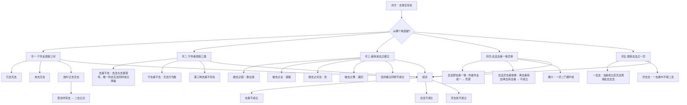

# 观去来品（品02）

## 在全论中的位置

品02与品01共同构成"**丁一·宣说主要特法**"，即缘起法的两个根本特性：无生（品01）和无来去（品02）。

结构逻辑是：品01破"生"，一旦没有产生，就没有存在的基础；品02破"去来"，进一步说明即便假设有什么东西存在，它也无法运动、转移。两品合在一起，从起点（产生）和过程（运动）两个维度彻底封堵了实有法的可能。宗喀巴大师在《理证海》中明确指出：本品虽从脚步行为观察来去，但意在揭示"真实义中一切万法都如虚空一样无来无去"。

法王如意宝曾说：若对本品某一推理有所领悟，就能轻易明白其他品的推理。可见品02在方法论上的核心地位。

## 核心问题

**去来是否真实存在？**

世人经验中去来无处不在——身体在六道来去、心识从无念趋至有念、器世界也有各种来去。佛陀说"来去无有实"，但如何用逻辑证明这一点？

品02的论证策略：将"去"分解为三个组成要素——**去者**（作者/能去）、**去法**（去的行为）、**去时**（所去道路/去业）——然后从五个角度分别遮破它们之间的关系，最终结论：三者皆不实有成立，去（和来）只是名言中如梦如幻的假相。

**论证路径总图**：

## 论证脉络详析

### 一、关键概念辨析（第9-10课）

理解本品必须先厘清三个核心概念：

| 术语 | 含义 | 说明 |
|------|------|------|
| **去**（去的动作） | 脚跨越的行为 | 自动性动词；来与去是观待方向而立，去不成立则来同样不成立 |
| **去法**（去法） | 与作者（去者）相关的去之行为 | 能去方面的行为 |
| **去时**（去时/去业） | 正在去的道路，即所去 | 与道路相关的行为；或指与去法相对的所去道路 |

**注意**：诸论师对"去时"解释稍有出入。月称菩萨《显句论》和本讲解主要以"正在去的道路"为"去时"；宗喀巴大师有时以"去者/去法/去业"三者合为"三去"。下文析义以麦彭仁波切《中论释》为主。

### 二、于作业（所去道路）观察三时而破（第9-11课）

**科判**：辛一（于作业观察三时而破）

#### 总破三时道（第9课·颂01）

> **已去无有去，未去亦无去，**
> **离已去未去，去时亦无去。**

三句论证——

**已去无去**：去的行为已经结束，去者、去法、所去道路三法随之灭尽，灭尽之法上何来"去"？

**未去无去**：去者、去法、所去道路三者皆尚未产生，如同石女儿，自相全无，何来"去"？

**去时/正去无去**：这是最有力的辩护，也是被重点破斥的对象。逻辑：
- 从道路微尘观察：脚与地面的接触，或"已接触"（已去），或"未接触"（未去）。除此两种以外，无论如何细分，永远找不到一个"正在接触"的刹那（因为每一个接触中的微尘，其前半与地面已接触，其后半与地面未接触）。故正去之道了不可得。
- 从时间刹那观察（第9课末尾）：认为"现在"是稳固刹那的想法不成立——"现在"本身是可分的（靠近过去的部分+靠近未来的部分），故无分别之刹那不存在，与之配合的"正在去"也无法安立。

#### 别破去时之道（第10-11课·颂02-05）

对方不服：正去道路中肯定有去，因为"动处则有去，此中有去时"。

中观宗逐步引出**二去之过**（核心论式）：

**颂02**（若去法有去则去时无去）：
> 云何于去时，而当有去法？
> 若离于去法，去时不可得。

去的行为只有一个。若用唯一的去成立了"去法"（与去者相关的行为），就没有去来成立"去时"（与道路相关的行为）；若去时不成立，"去时有去"之说不合理。

**颂03**（若去时有去则去法无去）：
> 若言去时去，彼者于去时，
> 应成无去法，去时有去故。

反之，若用唯一的去成立了去时，去法就无去可用。去法不成立则去时也不成立（互相观待），归谬为空。

**颂04-05**（若有二去则极过分）：
> 若去时有去，则有二种去。
> 一谓为去时，二谓去时去。
> 若有二去法，则有二去者。
> 以离于去者，去法不可得。

若承许去时中有去，就必须有两个去：一个成立去时，一个成立去法。有二去就有二去者——但一个去的过程只能有一个去者，二去者的过失难以辩解。

**果仁巴大师的分析框架**（第11课）更清晰：正去的行为是与能去（去者）相关，还是与所去（道路）相关，抑或两者皆相关？

- 若与能去相关：所去道路不成立（无对应的去的行为），但无所去的去者找不到。
- 若与所去相关：能去（去者）不成立，但无能去的所去也不成立。
- 若两者皆相关：有两个去的行为 → 两个去者 → 荒谬。

**三时破的现实体验**（第9课，堪布举例）：走路时，观察脚和道路：脚后跟接触的地面是已去之道，脚趾头未接触的是未去之道，无论如何细分，永远找不到一个"正接触"的微尘——正去之道了不可得。

### 三、于作者（去者）观察三类而破（第12-13课）

**科判**：辛二（于作者观察三类而破）

对方换策：如果观察道路不成立，那么从去者角度出发，去者是实存的，因此去法也存在。

#### 宣说作与作者互相观待（第12课·颂06）

> **若离于去者，去法不可得。**
> **以无去法故，何得有去者。**

去法与去者互相观待：无去法则无去者，无去者则无去法。对方想用"去者存在"来论证"去法存在"，但去者本身需要以去法为前提才能成立，故对方的能立（去者）尚未独立成立。这是**以同等理反破**。

#### 总破三类去者（第12课·颂07）

> **去者则不去，不去者不去，**
> **离去不去者，无第三去者。**

三类穷尽：
1. **去者不去**：在一个去的过程中只有一个去的行为。若此行为属于去者，去法就没有了去的行为来安立；若去法属于去法，去者就没有了去的行为，不成其为"去者"。一个去的行为无法同时安立去者和去法（见"二去之过"）。
2. **不去者不去**：不去者如石女儿，无去的行为，不可能去。
3. **第三去者不存在**：除去者和不去者之外，没有第三品补特伽罗，穷尽破斥完毕。

#### 别破去者去（第13课·颂08-10）

进一步从"去者与去法的关系"分三种情况遮破（详见 `推理方法/观察一体异体而破.md`）：

**颂08**（去法有去则去者无去——一体情况）：
> 若离于去法，去者不可得。
> 若言去者去，云何有此义？

若去者与去法一体，去者就没有单独的去法；无单独去法，"去者去"如何成立？

**颂09**（去者有去则去法无去——他体情况）：
> 去者去何处，彼去者将成，
> 无去之去者，许去者去故。

若去者与去法他体（完全分开），离开去法的去者就应该存在，但这样的"没有去行为的去者"在世间根本找不到。

**颂10**（若有二去则极过分——一体他体皆不成）：
> 若谓去者去，是人则有咎。
> 离去有去者，说去者有去。

若对方坚持承许，会有两个过失并生：既有离开去法而成立去者的他体过失，又有去者无单独去法的一体过失。

**麦彭仁波切 vs 果仁巴大师的分析角度**（第13课）：
- 麦彭仁波切：以去者和去法**一体、异体**分析
- 果仁巴大师：以去的行为**与去法相连/与去者相连/与两者相连**分析
- 两种方法在结论上一致，可从任一角度理解（堪布语）

### 四、破有来去之能立（第13-15课）

**科判**：辛三（破有来去之能立）

对方退而求其次：不管去是否成立，"去的因——出发"是存在的，既然因存在，果（去）也应该存在。

从五个能立一一破斥：

#### 1. 破去之因——发/出发（第13-14课）

**颂11**（承许作业也不成发）：
> **已去中无发，未去中无发，**
> **去时中无发，何处当有发？**

与破去的方法完全平行：已去道路上去的动作已灭，其上的出发不可能有；未去道路尚未产生，其上的出发也没有；正去道路不成立（同前述），其上的出发更无从谈起。三时皆无出发，出发不成立。

**颂12**（不承许作业也不成发）：
> **于未发之前，何处发可成？**
> **去无去时无，未去何有发？**

即便从"未出发之前（停留之际）"考察，三时道路也无法成立（去的行为尚无），故出发依然不成立。

另外，"出发"是去刚开始的行为，若正去存在，出发已完成，两者无法并存；若正去本身不成立，出发更不存在。

#### 2. 破去之业——道路（第14课·颂13）

> **无去无未去，亦复无去时，**
> **一切无有发，何故而分别？**

既然出发不存在，三时道路（依赖去的行为而成立）也不成立，故道路作为去的能立无效。

#### 3. 破去之对治——住（第14-15课·颂14-15）

对方认为：住（去的对立面）存在，因此去也存在（有此岸则有彼岸的逻辑）。

**总破住**（颂14）：
> **去者则不住，不去者不住，**
> **离去不去者，何有第三住？**

与总破三类去者的方法一模一样：
- 去者不住（与住相违）
- 不去者（住者）已经有了一个住法，若再有一个住，会有两个住的行为 → 两个住者之过
- 第三种去者（正住者）：正住的行为同样无法在任何刹那上安立（与三时破同理）

**别破去者住**（颂15）：
> **去者若当住，云何有此义？**
> **若当离于去，去者不可得。**

去和住相违，具有去法的去者不可能住；若去者没有去法，"去者"这个角色不成立，石女儿的住毫无意义。去者住不成立，住无法作为去的能立。

另一破法：即使住成立，也无法成立去，因为住和去无法并存（同时）或以他体形式分别存在。

#### 4. 破去之果——返回（第15课·颂16）

> **去时无有回，去未去无回。**

已去道路上返回不成立（去的动作已灭，道路随之灭尽）；未去道路不成立（动作尚未产生，道路不存在）；正去道路无法安立，其上的返回也无从谈起。返回不成立，去不成立。

#### 5. 破住等具有存在之能立（第15课·颂17）

> **所有行止法，皆同于去义。**

对方若转而以"住"为所立，以"去"为能立，可用完全相同的五步逻辑反破"住"。这就斩断了对方通过对立面互相证成的可能路径。

### 五、观察去法与去者一体异体而破（第15课·颂18-20）

**科判**：辛四

对方最后坚持：无论如何，现量可见有人在路上行走，去者和去法当然存在。

中观宗：如果认为两者有真实本体，那么一体还是异体？（见 `推理方法/观察一体异体而破.md`）

**略说**（颂18）：
> **去法即去者，是事则不然；**
> **去法异去者，是事亦不然。**

**广说·一体不成**（颂19）：
> **若谓于去法，即为是去者，**
> **作者及作业，是事则为一。**

若去法即去者，则一切作者与其行为皆成一体：砍者＝砍法、吃者＝吃法……这颠覆了一切分别的可能。另外，若去者与去法一体，去者就会永远去而无法住（因为去和住不能在同一本体上），但这不符合事实。

**广说·他体不成**（颂20）：
> **若谓于去法，有异于去者，**
> **离去者有去，离去有去者。**

若去法与去者是完全分开的他体，则"离开去者也会有去法，离开去法也会有去者"——但这样的法在世间找不到（每个角色都需要另一方才能成立）。

**摄义**（颂21）：
> **去去者是二，若一异法成，**
> **二门俱不成，云何当有成？**

一体、异体两种情况都不能成立，去法和去者就不可能有真实本体。

*附注：宗喀巴大师在《理证海》中此处额外破斥了犊子部的"非一非异"——犊子部主张有一种不可说的"我"与五蕴非一非异，去者与去法关系亦非一非异。宗大师单独遮破此见（第15课末）。*

### 六、观察去法之一异而破（第16课·颂22-23）

**科判**：辛五——以理广破来去的最后一节

#### 一去法（非同时）之破（颂22）

> **因去知去者，不能用是去，**
> **先无有去法，故无去者去。**

**麦彭仁波切的解释**（非同时产生）：
- 若先有去法、后有去者：去者由去法建立，此方向上没有"先有去者"的逻辑，但若去法先于去者而独立存在，在世间找不到（无去者的去法不存在）。
- 若先有去者、后有去法：去者用什么来安立？若去法尚未产生，去者无法成立（如同"未来的鲜花"不能在现在起作用）。

**龙树原意（鸠摩罗什译本解读）**（一去法逻辑）：整个去的过程只有一个去，若用此去安立了去者，就无去来成立去法；反之若用于去法，去者就不成立。一个去无法同时满足去者和去法。

#### 异去法（同时）之破（颂23）

> **因去知去者，不能用异去，**
> **于一去者中，不得二去故。**

若去者和去法同时存在，安立去法需要一个去的行为，安立去者又需要另一个去的行为，于是有二去——但于一个去者中不得二去（见"二去之过"）。

### 七、以理证略说（第16课·颂24-25）

**科判**：庚二

**观察是否去者而破**（颂24）：
> **决定有去者，不能用三去；**
> **不决定去者，亦不用三去。**

决定的去者（已有去行为而被称为去者）不能用已去/正去/未去三时之去作为去法；不决定的去者（未决定是否去）同样如此。

**观察第三者而破**（颂25）：
> **去法定不定，去者不用三，**
> **是故去法、去者、所去处皆无。**

既决定又不决定的第三品去者同样不存在，故三时皆不成立，**最终结论**：去法、去者、所去之处这三者皆不实有。

## 以教证总结（第16课末）

颂词讲完后，堪布引用了四部经证：

| 经典 | 引文 | 论证功能 |
|------|------|------|
| 《金刚经》 | "如来者，无所从来，亦无所去，故名如来。" | 以佛名"如来"本意证无来去 |
| 《无言说经》 | "来去无有实，诸法如虚空。" | 直接教证万法无来去 |
| 《无尽慧经》 | "无去无来者，名为圣去来。" | 圣者证量即无来去 |
| 《般若波罗蜜经》 | "彼微尘等，亦无所从来，亦无所去。" | 从微尘推广到五蕴一切法 |

## 诸注疏观点比较

| 论师 | 注疏 | 对品02的主要分析框架 |
|------|------|------|
| 麦彭仁波切 | 《中论释·善解龙树密意庄严论》（本讲解主依） | 以去者和去法**一体异体**、**非同时产生/同时产生**为主线 |
| 果仁巴大师 | 《中论注》 | 以去的行为**与去法/去者/两者皆相连**三分法为主线；科判有所不同 |
| 宗喀巴大师 | 《理证海》 | 额外破犊子部"非一非异"；将"三去"有时解为去者/去法/去业三法 |
| 月称菩萨 | 《显句论》 | 将"去时"定义为正去的道路（与本讲一致） |

**堪布说明**：从两种方法（麦彭/果仁巴）理解均可，圣者金刚语从任何角度理解都具价值（第13课）。

## 本品的推理方法总结

品02是《中论》推理方法最密集的一品，以下方法在此处均有重要应用：

1. **观察三时而破**（详见 `推理方法/观察三时而破.md`）：对已去/未去/正去道路的系统破斥，是本品最基础的框架
2. **互相观待而破**（详见 `推理方法/互相观待而破.md`）：去者与去法、能去与所去互相观待，二者无法独立成立
3. **观察一体异体而破**（详见 `推理方法/观察一体异体而破.md`）：对去法与去者关系的深层析破，本品首次系统展开此方法
4. **二去之过**（本品核心论式）：若去时中有去，则须有两个去的行为，则有两个去者，荒谬。

**法王如意宝评价**：如果对本品某一推理有所领悟，就能举一反三，轻松通达其他品的推理。

## 修行维度

本品不仅是哲学论辩，更有直接的观修意义：

1. **走路时观察**：观察自己的脚步，脚与地面或已接触或未接触，找不到"正在接触"的刹那——由此体会无来无去（堪布屡次建议）。

2. **观心的来去**：法王如意宝传授大圆满时要依靠中观理证破斥心的来去。堪布阿琼仁波切秘密教言：修大圆满应先以中观观察为主，对心的来龙去脉彻底认识之后，修行才不易退转。

3. **以无常入手**：若觉空性难懂，可先从无常入手（照镜子观察自他变化），"无常是诸法的世俗实相，无来无去是诸法的胜义实相"（第16课）。

4. **智慧自消**（第16课引麦彭仁波切）：用智慧观察对境，当认清所知法不存在之后，能执著的分别念也会灭尽无余——即大圆满所说的"无显智慧"。

## 与其他品的关联

- **品01（观因缘品）**：品01破"生"，品02破"去来"，共同构成"宣说主要特法"，是全论论证序列的起点。品01已建立的"互相观待而破"和"三时破"方法，在品02得到更系统的展开。
- **品08（观作作者品）**：品02的"去者/去法/去业"框架与品08的"作者/作业"框架完全平行。品02的一体异体分析为品08奠定了模式。
- **品09（观本住品）**："去者则不去，不去者不去"的三分法，与品09对"住者"的类似分析结构相同。
- **品14（观和合品）**：品02辛四对"去法与去者一体异体"的分析，与品14对"和合"的分析方法相呼应。
- **品19（观时品）**：品02的三时破是针对具体的运动现象，品19则直接以时间本身为破斥对象，进一步发展了三时破的哲学深度。
