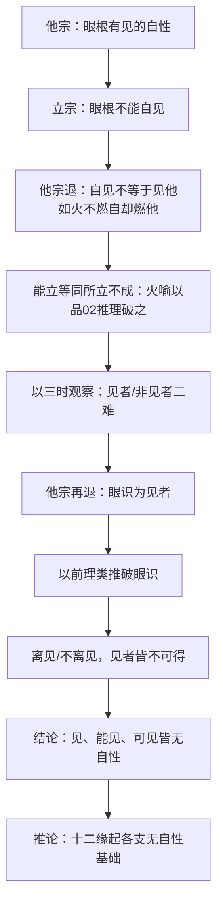

# 观六情品·论证脉络

## 在全论中的位置

品03是"抉择法我空性"（戊一）下"破法我之自性"（己一）的第一个科判——"破处"（庚一）。所谓"处"指十二处（六根+六境），是佛教基础分类体系中描述感知世界的框架。本品的策略是：首先仔细破眼见（根见vs.识见），然后以"以此理类推"一颂覆盖其余五根五识。

这与品01-02的结构关系是：品01-02破因缘生与来去，证明法无自性产生和运动。有部宗会退一步说："好，即使生灭运动都不真实，但至少'看见'这个现象是真实的——我眼睛看到了你，这是现量。"品03堵死了这个退路：即使"见"这一最直接的感知行为，也没有自性成立的基础。

## 所破对象（他宗）

**有部宗**：眼耳鼻舌身意六情（六根）行于色声香味触法六尘，两者均真实存在。依据：《俱舍论》以及佛经对十二处的安立。进一步推论：六根六境存在，故六识自然产生，十八界皆实有。

**经部宗**（品03后半段的补充所破）：真正的见者是眼识（非眼根），眼根只是助缘，类比"天授执斧砍树，天授是砍者，斧是能砍，树是所砍"。

## 论证结构

### 一、破眼根为见者（第17课，寅一至摄义颂）

**立宗**（寅一）：
> 是眼则不能，自见其己体。
> 若不能自见，云何见余物？

推理公式："眼根不能见色法，因为眼根不能自见之故。"

**为什么"不能自见"能推翻"见他"？**

对方的主张是眼根具有见色法的**自性**（非偶然的能力，而是本质上的能力）。如果见的自性真实存在，不应观待任何外缘，则既应能见他，也应能见自——因为眼根本身也是色法。《中观四百论》云："一切法本性，先应自能见，何故此眼根，不见于眼性？"

但现量可知眼根见不到自己：犹如剑锋不斩自身（《楞伽经》语）。《显句论》给出两个理由：（1）相违——自己对自己起作用相违；（2）不得——所有色法胜义中无有自性，根本无从可得。

**应成派三大不共因的演示**（第17课详论，为本品重要教学内容）：

中观应成派的论证工具与普通因明有所不同，堪布在此做了系统讲解：

| 应成因 | 内容 | 在品03的应用 |
|--------|------|-------------|
| 一、**汇集相违应成因** | 汇集对方自相矛盾的承许 | 对方承认眼根有见自性 → 应既见自又见他；但对方也承许眼根不自见 → 相违，故见自性不成 |
| 二、**是非相同应成因**（根据相同应成因） | 以同等根据推出同等结论 | 眼根和瓶子都是色法且都不能自见，若说眼根能见他，瓶子也应能见他；根据相同之故 |
| 三、**能立等同所立不成因** | 对方的能立（理由）与所立（结论）一样不成立 | 对方以火喻（火不燃自却燃他）立"眼不自见却见他"；但火喻本身用品02推理可破：能燃所燃三时中皆无燃 |

**关键颂词**（寅二，以品02类比驳火喻）：
> 火喻则不能，成于眼见法。
> 去未去去时，已总答是事。

即：将品02"已去未去去时"的推理，改为"已燃未燃燃时"，可以类推得出"燃"并不成立，故火喻无法成立。这是品02对品03的直接输出——品02奠定的方法论在此被调用。

**摄义颂**（寅三）：
> 见若未见时，则不名为见。
> 而言见能见，是事则不然。

从三时观察（已见/未见/正见），见者了不可得；如果见者不恒为见者（如暗中闭眼时），就不是自性见者，自性见者不成则见色之说不成立。

### 二、观察见者非见者而破（第18课，丑二）

> 见不能有见，非见亦不见。

从两面穷举：
- 若眼根是见者，见者自身已有一个见法，再见外境又一个见法，则有**二见之过**（与品02"二去之过"完全平行）；
- 若眼根是非见者，则无见自性，不可能见外境（如指尖不能见色）。

两面皆不成，故见不成立。

### 三、破眼识为见者（第18课）

**以前面理证而破**（丑一）：将"眼根→识"，前面两颂改字即可类推。

**以其他理证而破**（丑二）：
> 离见不离见，见者不可得。
> 以无见者故，何有见可见？

穷举见者是否具足见法：
- 离开见法：见者与之观待而成立，无见法则无见者（如瓶子无见，不成见者）；
- 不离开见法：见者已具足见法，再见外境又一见法，有**二见、二见者之过**（再次类比品02结构）。

无论哪种情况，见者不可得，故无见者，则无见法，亦无可见。

### 四、以此理类推其他（第18课，癸二）

> 耳鼻舌身意，声及闻者等，
> 当知如是义，皆同于上说。

破其余五根、五识、五境，只需将"眼/见/色"改为"耳/闻/声"等即可类推。中观宗的核心破法只有两种：（1）不自见故不见他；（2）离见/不离见，见者皆不可得。

### 五、十二缘起的连带破（第18课，丑三及教证总结）

> 见可见无故，识等四法无。
> 四取等诸缘，云何当得有？

有部宗争辩：依十二缘起，眼识→触→受→爱……之果已现量可见，故其因——见与所见必定存在（以果推因的逻辑）。

中观宗反驳：见的自性既已不成立，十二缘起以见为基础的后续各支皆如失去地基的墙——不可能产生。注意：此处并非否认名言层面的缘起显现，而是破其**自性成立**。

## 论证脉络图

## 本品在方法论上的意义

品03在论证手法上有两个特色：

1. **应成派三大因的完整演示**：第17课对三大因（汇集相违、是非相同、能立等同所立不成）做了系统讲解，是全论中最集中的因明工具说明。读者在此获得了理解全论推理的"元工具"。

2. **品02方法论的跨品调用**：通过"去未去去时，已总答是事"一颂，明确宣告品02的推理框架适用于品03的问题。这是品群之间方法论相互印证的第一个明确案例。法王如意宝所说"通品02则其他品推理皆可类推"在此得到第一次实践。

## 教证总结（第18课末）

引经多条，要点：
- 《般若波罗蜜经》："彼一切法，无知者，无见者。"
- 《金光明女经》："眼不能见色，意不知诸法，此是无上谛，世间不能了。"
- 宗喀巴大师《理证海》：通达空性后，以慧眼（非肉眼）才能照见万法实相；名言中如幻存在，胜义中如虚空了不可得。

## 修行维度

堪布在第17-18课多次强调：六根六识六境的"现量见"只是分别念的假立，如电视影像。修行要点：经常以品03推理观察"谁在见？见什么？"，逐步打破对感知真实性的执著。闻思需入心，出定后也能运用。
