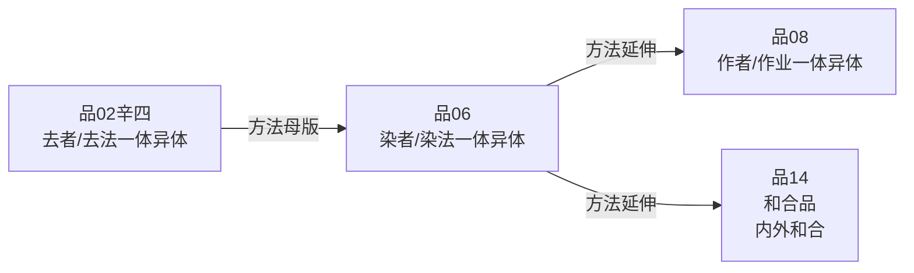

# 观染染者品·论证脉络

## 在全论中的位置

品06是"破法我之能立"（己二）的第一品。科判结构：

```
己二（破法我之能立）分三：
  庚一：观染染者品  ← 品06
  庚二：观三相品   ← 品07（第25-31课）
  庚三：观作作者品 ← 品08（第32-35课）
```

品03-05已经从处、蕴、界三个角度破了"法我之自性"——即法本身没有自性。品06-08进一步说：即便退一步，在名言层面的"能立"（建立法我的论据）上，也不成立。具体说：

- 品06破"染染者"（烦恼与烦恼者作为能立）；
- 品07破"三相"（生住灭作为有为法的法相，是实有法我的能立）；
- 品08破"作作者"（行为与行为者作为能立）。

**为什么从"染"入手？** 贪欲是最强烈的烦恼，是驱动轮回的直接动力。有部宗用"人们明明有贪心、有贪者"来论证法我存在。破贪欲与贪者的同时，也在撬动轮回结构的基础——这是从修行角度上最有现实意义的一品。

## 所破对象

**有部宗/经部宗**：法我（蕴界处的自性）存在，因为其能依——贪等烦恼（染法）真实存在，具有烦恼的补特伽罗（染者）也真实存在。依据：佛经"凡夫以眼见诸色法，于悦意处贪爱耽执，而成贪者"——染与染者两者在经文中都有安立。

## 论证总结构

本品的总论证思路（第23课明示）：

若染与染者的自性成立，两者关系必然是以下其中一种：
1. **前后成立**（非同时）：先有染者后有染法，或先有染法后有染者；
2. **同时成立**：染与染者同时产生。

观察之后，两者皆不成立，故染与染者无自性。

## 详细论证

### 一、破染染者前后成立（癸一，第23课）

#### 子一：破染法成立前有无染者

**颂词**：
> 若离于染法，先自有染者。
> 因是染欲者，应生于染法。

若先有染者（独立于染法），则依染欲者理应能产生染法，但这不合理——**因为染法和染者互相观待**：具有贪心才能成为贪者，若无贪心则无贪者（否则断除贪欲的阿罗汉也会是贪者，穷人也会是富人——"无染者"不能叫"染者"）。先有染者的说法不成立。

**反面论证**：
> 若无有染者，云何当有染？

若染法产生之前没有染者，贪心（染法）依靠什么成立？贪心必须是某个"贪者"的贪心，若贪者不存在，贪心无所依而不成。宗喀巴《理证海》以水果比喻：水果不存在，水果的成熟就不可能存在。

#### 子二：破染者成立前有无染法

> 若有若无染，染者亦如是。

以前面同样的观察次第类推即可：染者成立之前，有染法或无染法都不合理（论证对称，颂词半颂略说）。

**至此结论**：染与染者谁先谁后都不成立。

### 二、破染染者同时成立（癸二，第23-24课）

有部宗退路：贪者（心王）与贪心（心所）同时产生，互为相应因——不就解决了前后成立的矛盾吗？

#### 子一：应成互相不观待而破

> 染者及染法，俱成则不然。
> 染者染法俱，则无有相待。

若染者和染法同时产生，两者就没有了互相观待关系。然而，"染和染者"本质上是能所关系（染法是能染，染者是所染），必须互相观待。若同时独立产生，就像牛头两角各不观待，两者也就彼此独立，可以不依赖对方而存在——这样一来，贪者不依靠贪心也会成为贪者，贪心不依靠贪者也会产生贪心，皆不合理。

#### 子二：观察一体异体而破（丑一至丑二，跨第23-24课）

这是本品方法论上最重要的部分，延伸了品02"观察一体异体而破"框架（见 `推理方法/观察一体异体而破.md`）。

**总破一体异体**（丑一）：

*一体异体结合不成立*（寅一）：
> 染者染法一，一法云何合？
> 染者染法异，异法云何合？

- 若**一体**：一个法不能与自己结合（结合需两法以上）；
- 若**异体**：异体法（本体完全分开的两法）无法在时间/空间上真正融合。《显句论》：结合要求同一时间、同一环境彻底融合，但异体法各占各的位置，不可能实现。《入行论·智慧品》："尘尘不相入，无间等大故，不入则无合。"

*一体异体极其过分*（寅二）：
> 若一有合者，离伴应有合。
> 若异有合者，离伴亦应合。

- 若一体而有结合：离开同伴后，每法自身也应有结合（因为一体本已具足结合），但这荒谬；
- 若异体而有结合：说明每法自身本具结合，不依赖同伴，但这更荒谬。

**别破异体**（丑二，第24课）——深化论证：

*结合无有异体*（卯一）：
> 若异而有合，染染者何事？

若染与染者真有结合，两者就不能是自性成立的异体——因为结合意味着两者在某种意义上合一，这与"完全独立的异体"相矛盾。而且，染与染者互相观待，互相观待的法不可能是自性成立的别别他体。

*异体无有结合*（卯二）：

他宗坚持：两法先是分开的异体，之后结合在一起（类比东山西山的牦牛聚在一处）。

自宗回答（辰二）：
> 若染及染者，先各成异相，
> 既已成异相，云何而言合？

若两者先已成立为自性成立的异体，这个"自性"本就排斥结合——因为结合意味着本体在某种意义上相融，但自性成立的异体在时间上不能统一（各自占不同刹那），在空间上不能统一（各自的微尘各占其位，不能真正融入）。名言中说的"结合"只是一种表达习惯，胜义中根本不成立。

*互相依存之过失*（寅二，卯一卯二）：

> 异相无有成，是故汝欲合。
> 合相竟无成，而复说异相。

"异相不成→你们建立合相；为了合相成立→又要先有异相。"循环论证，合相与异相互相依存，谁也无法单独先成立。

> 异相不成故，合相则不成。
> 于何异相中，而欲说合相？

以异相不成→合相不成。进一步揭示：异相和合相互相观待，均无自性。

### 三、摄义（癸三）

> 如是染染者，非合不合成。

"合"=同时，"不合"=非同时（前后）。染法和染者无论同时还是非同时，皆不成立。

### 四、类推破其他法（壬二）

> 诸法亦如是，非合不合成。

一切心王心所，以及三毒为主的八万四千烦恼，均以同样逻辑不成立。推论：能取心识不存在，所取外境也了不可得。一切万法皆无自性。

## 本品在推理方法体系中的位置

品06与品02的"观察一体异体而破"形成直接呼应。品02辛四首次系统展开此方法（破去者/去法的一体异体），品06将其应用于"染者/染法"的存在关系。

本品对"异体结合"的详细辨析（第24课丑二）是全论中最精细的一处——将异体/结合的互相观待剥离得层层深入，为品08（观作作者品，破作与作者的异体关系）提供了方法论模板。



## 哲学含义：烦恼本来清净

品06的论证结论不只是逻辑上的破斥，更指向一个正面的佛教理论：烦恼没有自性，本来即清净。《般若经》："贪欲清净，故色法清净"；《无行经》："贪欲即是道，恚痴亦如是"。密宗将贪心本体视为五大智慧之一。这是龙树菩萨的论证所到达的，不只是"破"而是有深刻正面含义的"遮"。

## 教证总结（第24课末）

《等持王经》："贪欲之念、所贪之境与贪者；嗔恨之念、所嗔之境与嗔者；愚痴之念、所痴之境与痴者，此等诸法实则无迹可观，亦了不可得也。"

《般若波罗蜜经》对五蕴与染净的关系有详细分析，与本品论证相互印证。

## 修行维度

本品有最丰富的修行指导内容（第23-24课随处可见）：

- 用本品的推理详细观察自己的贪心：先次第分析贪者/贪心谁先谁后，再从一体异体分析，最后洞见两者均为假立——这是品06特有的"对治贪执的中观修法"；
- 堪布说：学了中观之后，对治烦恼不是只靠教证（"佛说贪心不好"），而是以理证（"分析贪者和贪心无论如何都无法自性成立"）——这是从信心层次到智慧层次的跃升；
- 断烦恼需要长期熏习，"久病需久治"——理解不是一次性的，需要反复结合自相续思维。
