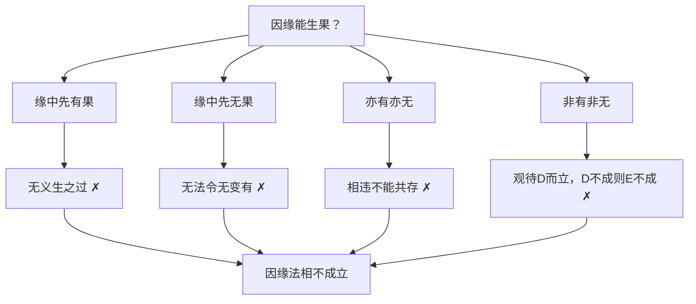

# 四边破

## 方法定义

四边破（藏：mtha' bzhi'i skur 'debs，梵：catuṣkoṭi）是龙树菩萨在《中论》中使用最广泛的遮破工具。其基本结构是：

对任何一个命题P（或一个法X的某种性质），穷举四种可能：
1. P（有，存在，肯定）
2. 非P（无，不存在，否定）
3. P且非P（亦有亦无，双肯定）
4. 非P且非非P（非有非无，双否定）

然后依次证明四种情况皆不成立，从而推翻对方的论证基础，建立"远离四边"的空性结论。

这不仅仅是一种逻辑否定——它的目标是让执著的"立足点"完全瓦解，而非用另一个命题取代被破的命题。

## 与相似方法的区别

**仅破有边（单空）**：只说"X不存在"，破"有"，但保留"无"的立场。这是自续派有时停留的层次（假胜义），或某些小乘论师的立场。中观应成派不满足于此。

**四边破**：不仅破有，也破无，也破双俱，也破双非。结果是连"X不存在"这个判断也不能执著。这才是"真胜义"——远离一切戏论的大空性。

## 在《中论》中的典型应用

### 应用一：破四生（品01·颂01）

**所破命题**：诸法有自性生
**四种可能**：自生、他生、共生、无因生（穷尽一切产生方式）
**逐一破**：
- 自生 → 无义生/无穷生之过
- 他生 → 一切生一切之过（因非因无差别）
- 共生 → 兼具前两者过失
- 无因生 → 因缘勤作无意义，恒有或恒无之过
**结论**：四边皆破，诸法无生

### 应用二：破因缘法相（品01·颂07）

**所破命题**：因缘能生果
**四种果**：有果/无果/亦有亦无之果/非有非无之果
**逐一破**：
- 因缘中先有果 → 无需再生，无义生之过
- 因缘中先无果 → 无法令不存在之法产生（"纵以亿万因，无不变成有"）
- 亦有亦无 → 相违二法不能在同一本体共存
- 非有非无 → 前者不成立，与之观待的此者亦不能成立
**结论**：因缘法相不成立，因缘无法安立

逻辑结构图：

### 应用三：破等无间缘（品01·颂09）

**所破命题**：灭法能成为生果之缘
**四边**：灭法的灭/生/亦生亦灭/非生非灭
- 灭法的灭 → 若果未生时灭法不应有灭（观待关系不成立）；若果已生则灭法毫无价值
- 灭法的生 → 无实法（灭法是"不存在"）由什么产生？
- 亦生亦灭 → 前两者既不成立，此者亦不成立
- 非生非灭 → 观待前者不成立
**结论**：灭法不成立，等无间缘不成立

### 应用四：破增上缘（品01·颂10）

**论证方式**：诸法无自性，有相之法不成立；若有相不成立，"有此法故有彼法"的增上缘安立也无从谈起。这里不是严格四边，而是破"有相"这一前提。

### 应用五：破苦的产生方式（品12·壬一，第43-44课）

品12将四边破直接应用于"痛苦的生起方式"，这是四边框架用于**作者/创作来源**维度的完整展开：

| 四边 | 对应宗派 | 主要过失 |
|------|----------|----------|
| 自作（苦由自蕴/自我产生） | 数论外道（主物自生） | 自己对自己起作用相违；不从他缘生，违现量 |
| 他作（苦由他体蕴/他者施予） | 内道有实宗·胜论外道 | 施者（人/蕴）与受者（天人/蕴）各自以人我或蕴角度观察皆不成立 |
| 共作（自他共同造作） | 裸体外道 | 自作他作各自既不成立，共作更不可能；兼具两者过失 |
| 无因作 | 顺世外道 | 恒有或恒无之过；与现量相违；解除痛苦的任何努力皆成无义 |

**关键总结颂**（第44课）：
> 非但说于苦，四种义不成，一切外万物，四义亦不成。

四边破推广至一切法——任何法若存在必须有生起方式，而四边皆不成立，故一切法皆空。

第44课明确将此破法称为**金刚屑因**：
> "破四边生的推理非常尖锐，就像金刚能将万物击为碎屑一样，也能将一切执著摧毁无余，没有一法经得起观察。"

品12的四边破与品01四生破构成**首尾呼应**：品01总破一切法之生（因的维度），品12在人我空的语境中重新应用同一框架破苦之生（作者的维度），展示了四边破的结构弹性。

## 在品20（观因果品）中的应用

品20从多个角度运用四边破的变体：

**因有无果而破**（癸一，第70课）：穷尽因缘和合中"有果/无果/有果不可得/无果则因非因同"四种情况——是四边破在因果语境中的直接展开。

**因果同时前后破**（癸三，第71课）：因果同时/先后/因在先三种时序皆不成立——三种时序穷尽了因果在时间上的所有安排。

**空不空而破**（子五，第73-74课）：因空果→不能生（如水中无酥油）；因不空果→已有→不须生。果不空→不生不灭；果空→不生不灭。有无穷尽。

## 在品21（观成坏品）中的应用

品21丑二（第77课）以四边生破法与非法的产生：

> 法不从自生，亦不从他生，不从自他生，云何而有生？

品01总纲在品21再次作为工具出场——四边生破法体→法不存在→成坏无法安立。这是四边破在全论第三次出现于品的正文中（品01、品12、品21），三次分别处于法我空、人我空、时间空的不同语境。

## 关键哲学意涵

四边破的力量在于它的**穷举性**：对于任何实有的执著，其可能的存在形式不超过四边。一旦四边皆破，执著就无处安身。

但四边破的目标不是立一个"什么都不是"的结论——那会成为第四边（双非）。而是让这四种分别念在分析中自动瓦解，露出"离戏"的实相。这就是为什么月称论师说中观宗"没有任何立宗"——一旦立了"空性"为宗，空性本身也会成为执著的对象，又需要被破。

## 在本讲解中的教学说明

索达吉堪布（第6课）解释了这一点：

> "各推理看似相同，但其实每一颂的推证方式都有差别，所诠内容也不尽相同。细致了解科判之后才会明白各推理之间的关联。"

每一颂的四边破都针对不同层次的执著，不能合并理解。

## 与其他方法的配合

四边破经常与以下方法结合：
- **互相观待而破**：在建立"四边中某一边不成立"时，常用"因果/能缘所缘/作业作者互相观待而双方皆不成立"来证明。见 `推理方法/互相观待而破.md`
- **观察三时而破**：在建立"作用/灭法/生等不成立"时，从过去/现在/未来三时均不成立来证明。见 `推理方法/观察三时而破.md`
- **可现不可得**（因明工具）：在破"某缘中有某果"时，若果真在缘中存在，用正常眼识应能见到，但不可得，故不存在。（品01第7课·破世人共称之他生部分）
