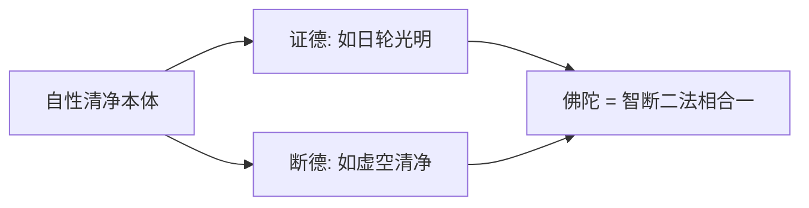
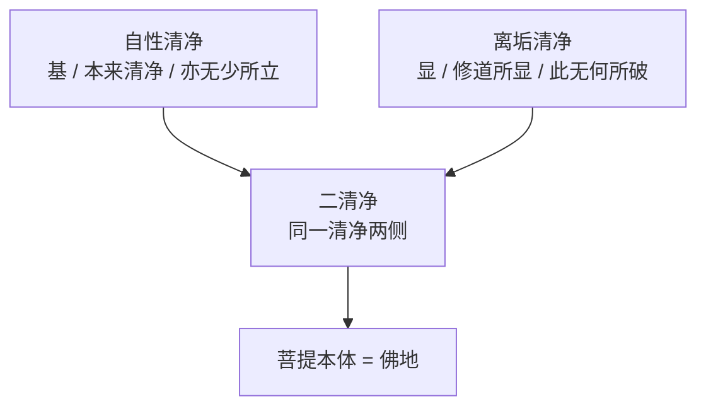

# 《宝性论》菩提品之一——二清净本体与离垢果

本文件是《宝性论》菩提品的首篇 doc, 承接如来藏品末篇 [`06-九喻与不空五过.md`](./06-九喻与不空五过.md) 结束处的 **"此无何所破, 亦无少所立"** 立场, 开启四金刚处中第二金刚处 —— **菩提 (无垢真如)** 的 doctrinal 建构。

## 〇、菩提品定位——从"有垢"到"无垢"的转依起点

### 0.1 承前启后

**如来藏品** (L6—L20, 共 15 堂课) 以十义 + 九喻 + 五过三个层次, 完整安立了 "有垢真如" (**因侧**) —— 众生位的如来藏尽管被客尘遮蔽, 但 "**心自性光明, 诸垢是客尘**" (《释量论·成量品》) , 法性永无变异。前品收束于 "**此无何所破, 亦无少所立, 真实观真性, 见真性解脱**" 颂 (06 §7.1), 宣示如来藏本体 **既非有所破, 也非有所立** 的最深立场。

**菩提品** (L21—L28 上, 共 7 堂课) 承此立场, 反转视角: 同一个法界自性清净真如, 在**客尘彻底离去** 的 "果侧" 名为 "**菩提**" (bodhi, 觉) —— 即 **"无垢真如"**。如来藏品 "本具 + 被遮" 的结构, 在菩提品转为 "本具 + 已显" 的结构。

朵洛瓦注菩提品开宗明义 (译作044 菩提品开篇):

> "现在是就法界远离所有垢染无余转依为佛陀出有坏无漏界的果而言。"

**"转依"** (āśraya-parāvṛtti / gnas gyur) 一词是菩提品的核心术语 —— 所依未变 (法性), 所转变的唯是 **客尘有无的差别**。这正是菩提品最精微、最易被误读之处: 菩提不是 "从无到有新生的佛果", 而是 **"本具如来藏在客尘全离时显发的名称"**。

索达吉堪布 (L21):

> "要得到佛宝的果位, 需要种姓, 就是界, 这个叫做如来藏, 也叫做因, 只有种子界性之因还不够, 还要修行, 通过修行得到的果是什么呢? 就是菩提。……前面讲的种子, 也就是佛性, 现前佛性以后得到菩提。"

### 0.2 菩提品整体的七科判——全品 navigational key

菩提品的整体结构为 **戊二 (证悟本体菩提之义) 分三**:
- **己一** 略说所说义之分类 (菩提八事)
- **己二** 归纳讲法总纲 (总颂概说)
- **己三** 彼等对应而广说 — **分七**

**己三广说的七科判** (朵洛瓦 L21):

| # | 庚级科判 | 核心义 | 所涵义 (八事中) | 对应课次 |
|---|---|---|---|---|
| 庚一 | **得清净中本体因之义** | 二清净本体 + 得清净的二种智慧因 | 本体 + 因 (合讲) | L21 末—L22 早 |
| 庚二 | **离垢果之义** | 二障习气俱清净的果 + 九喻果位无垢 | 果 | L22 中 |
| 庚三 | **自他二利事业之义** | 圆满自利他利的事业 | 事业 | L22 末—L24 |
| 庚四 | **所依具功德之义** | 佛地具足无量功德 | 具 (不可思议之所依) | L24—L25 |
| 庚五 | **以三身类别趋入之义** | 三身 (法身/报身/化身) 趋入 | 趋入 | L25—L26 |
| 庚六 | **彼等恒常之义** | 三身乃至虚空际恒常 | 恒常 | L27 |
| 庚七 | **如实不可思议之义** | 唯佛行境, 难测之不可思议 | 不可思议 | L28 上 |

本 doc 覆盖的是 **庚一 + 庚二** 两个科判 (全品七科判的前两个) , 是整个菩提品的 doctrinal 起点。

### 0.3 菩提八事 vs 七科判——为什么是 "八 → 七"

菩提 **八事** (己一总颂所立) 与菩提 **七科判** (己三广说所分) 之间有一处合并 —— **本体与因合讲为庚一**。朵洛瓦明言 (译作044):

> "虽然广说有八种, 但前两种合在一起讲, 就有七种。"

索达吉堪布 (L21) 进一步解释:

> "八个意义在广说中以七个科判宣讲, 其中前两种——本体和因一起讲。"

**为什么本体与因必须合讲**? —— 因为 **菩提的"本体"(二清净) 与 "能得的因"(二种智慧) 在"得"这一动作上是不可分离的一对**: 本体 (所得) 与因 (能得) 构成同一动作的两面, 如左右手必同时安立。故庚一科判直接命名为 "**得清净中本体因之义**", 把两件事放在 "得清净" 这一共同事件下合说。

### 0.4 菩提八事完整列表 (己一 L21)

总颂:

> **净得离二利, 所依深与广,**
> **以及大本性, 有际如所性。**

| # | 八事 | 义 | 对应七科判 |
|---|---|---|---|
| 1 | **净** (本体) | 远离所有客尘, 具二清净 (自性清净 + 离垢清净) | 庚一前半 |
| 2 | **得** (因) | 入定无分别如所有智 + 出定尽所有智, 二智圆融修行 | 庚一后半 |
| 3 | **离** (果) | 烦恼障 / 所知障 / 习气皆离的清净果 | 庚二 |
| 4 | **二利** (事业) | 自利 (断烦恼障得无漏功德) + 他利 (断所知障事业无碍) | 庚三 |
| 5 | **所依** (具) | 如来藏为一切功德之所依, 具不可思议功德 | 庚四 |
| 6 | **深与广, 以及大本性** (趋入) | 甚深 = 法身 / 广大 = 报身 / 大本性 = 化身 | 庚五 |
| 7 | **有际** (恒常) | 乃至尽虚空际, 三身事业恒常不变 | 庚六 |
| 8 | **如所性** (不可思议) | 唯佛行境, 其他众生难以通达 | 庚七 |

索达吉堪布 (L21) 逐一解析八事时, 首列 "净":

> "净, 远离了所有的客尘, 获得了最究竟的转依, 最后具足二清净——自性清净和随增清净, 叫菩提的本性。具二清净真正的法性, 或者如来藏的本来面目完全清净的部分, 叫菩提的本性——净。"

此八事是菩提品全部内容的 "**目录**"。本 doc 展开其中 1 (净) + 2 (得) + 3 (离), 即 **从本体到果的前三事**。

### 0.5 己二总纲颂——换词再说一遍

> **以本体因果, 事业具趋入,**
> **恒常不可思, 安立为佛地。**

此颂以 "本体 / 因 / 果 / 事业 / 具 / 趋入 / 恒常 / 不可思议" 八个词 (即八事) 重新列出一遍, 是总纲颂, 对应前颂八事一一映射 (L21 称此颂与前颂 "要求背诵")。

朵洛瓦注 (译作044):

> "如是以这八种意义安立究竟果佛地。"

**"佛地"** 一词在此处标明 —— 菩提品所讲的一切, 收束于 "佛地" 这一名义。菩提的八事不是八件孤立的事, 而是同一佛地的八个侧面。这个立场承接结构总览 §四因三果——三宝由四处所生, 菩提为第二因。"佛宝" 作为三宝之首的内涵, 即是菩提品所展开的 **佛地八事**。

---

## 一、庚一得清净中本体因之义——本体与因合讲

科判: 戊二·己三·庚一 (得清净中本体因之义) 分二: **辛一** 略说得清净之理 + **辛二** 广说。辛二再分 **壬一** 具二清净本体之义 + **壬二** 能得智慧因之义。壬一又分 **癸一** 真实 + **癸二** 差别。癸二再分 **子一** 自性光明之差别 + **子二** 远离客尘之差别。

这是本 doc 最核心的科判群。以下按辛一 → 辛二 (壬一 → 壬二) 顺序展开。

### 1.1 辛一略说得清净之理——日与虚空双喻

总颂 (L21 末):

> **自性光明说, 如日与虚空,**
> **客烦恼所知, 密云障碍遮,**
> **离垢具佛德, 常稳恒佛陀。**
> **依法无分别, 辨别智慧得。**

**三段内在结构**:
1. **本体之喻**: 自性光明, 如日轮与虚空
2. **障碍之喻**: 客尘烦恼障 + 所知障, 如密云遮日轮与虚空
3. **得之道**: 无分别智 (入定) + 辨别智 (出定), 二智修行而得

朵洛瓦注 (译作044):

> "了义经中宣说'心之自性原本光明'具足如日轮般所知真如光明的证以及如虚空般自性清净的断, 具体来说, 先前众生位被客尘烦恼障与所知障如密布云层般的障碍遮覆, 最终以真实道断除所有垢染, 不可分割具足力等佛陀的一切功德, 解脱生、老、死, 而获得恒常、稳固、永恒之本体的佛果, 即是具二清净本体之义。"

**"日轮 + 虚空" 双喻** 是菩提品的基础比喻, 贯穿庚一全段:

| 喻 | 所喻义 | 所立 |
|---|---|---|
| **日轮** (自性光明) | 如所有智之光明证德 | 证圆满 |
| **虚空** (自性清净) | 无为法之清净断德 | 断圆满 |
| **密云** (客尘) | 烦恼障 + 所知障 | 暂时遮障, 非本性 |

此双喻承 05 §4.2 "佛位无变" 之 "四德 (常 / 坚 / 寂 / 永)" 结构 —— 佛地 "离垢具佛德, 常稳恒佛陀"; 索达吉堪布 (L21) 引注释说 "解脱生的缘故是常, 解脱老的缘故是稳, 解脱死的缘故是恒", **这里的常 / 稳 / 恒正对应 05 §4.2 的常 / 坚 / 永**, 是如来藏品 "佛位无变四德" 在菩提品的直接承接。

**后二句 "依法无分别, 辨别智慧得"** 则引出 "得" —— 此菩提依靠入定无分别智 (如所有智) 与出定尽所有辨别智 (尽所有智) 二智修行而次第显现。

索达吉堪布 (L21) 特别指出此立场的独特性:

> "这里, 入定的智慧叫如所有智, 出定的智慧叫尽所有智, 分别是断除二障的因缘。这是《宝性论》的不共说法, 其他有些论典不一定这样讲。"

### 1.2 辛二·壬一·癸一真实——佛陀的证德与断德合一

总颂:

> **佛陀以无别, 净法而安立,**
> **如日与虚空, 智断二法相。**

**核心立场**: 所谓 "佛陀" 或 "圆满正等觉", 是以下二义合一安立的:
- **证德** (智): 与自性清净本体无二无别的境界 (从未离开过)
- **断德** (净): 以清净法远离所有客尘

索达吉堪布 (L21):

> "佛陀可以说安住于与自性清净本体无二无别中。所谓的佛陀或正等觉, 是众生的心自性清净, 在与此无二无别的境界中, 从来没有离开过, 这叫证德;'净法而安立', 以清净法远离所有的客尘, 这叫断德, 以这两个原因安立。日轮是从证德方面讲的, 虚空是从断德、清净方面讲的, 所以说'智断二法相'。"

《现观庄严论》教证 (L21 明引):

> "垢尽无生智, 说为大菩提。"

—— "垢尽" (断德) + "无生智" (证德) = 大菩提。《现观》三大 (断大 / 证大 / 心大) 中最根本的即断大 + 证大。

**双喻一体**:

朵洛瓦注 (译作044):

> "胜义的佛陀就是以安住于与自性清净本体一切无别中, 究竟远离客尘而具二清净的法而安立的, 它如同日轮自性光明与虚空自性清净般, 具足智慧光明的证与清净二障的断——断证圆满二者的法相。"

### 1.3 辛二·壬一·癸二·子一自性光明之差别——本来清净的一侧

总颂:

> **光明非造作, 无别而趋入,**
> **具超恒河沙, 佛陀一切法。**

**三要点**:

| 要点 | 内涵 |
|---|---|
| **光明非造作** | 如来藏 / 法身非因缘造作, 是无为法 |
| **无别而趋入** | 于一切众生自性中无别无离而趋入 (亦作 "无离而趋入") |
| **具超恒河沙功德** | 自性光明本自具足超越恒河沙数的佛陀功德 |

索达吉堪布 (L21):

> "如来藏法身并不是以因缘造作, 但是于一切众生的自性中无别而趋入, 有些地方是'无离而趋入', 无别和无离是一样的意思。非造作的光明, 每一个众生的相续从来没有离开过, 以无二无别的方式可以趋入。"

**这就是"自性清净"** —— 第一层清净, 指本体本来清净, 不需要任何动作 "使之清净"; 并且这个 "本来清净" 已经具足 "超越恒河沙" 的佛不共功德。

禅宗教证 (L21 明引):

> "夜夜抱佛眠。"

—— 即心即佛, 佛性本具, 不必心外求佛。

**承接 06 §7 立场**: 06 doc §7.1 "**此无何所破, 亦无少所立**" 颂中, "亦无少所立" 与本颂 "光明非造作" + "具超恒河沙功德本具" 严格一脉相承 —— 功德不是新建立的, 本就具足, 故 "亦无少所立"。

### 1.4 辛二·壬一·癸二·子二远离客尘之差别——离垢清净的一侧

总颂:

> **自性不成立, 周遍客性故,**
> **烦恼所知障, 是说犹如云。**

**三要点** (烦恼障与所知障同以此三理说明):

| # | 要点 | 内涵 | 对应云喻 |
|---|---|---|---|
| 1 | **自性不成立** | 客尘在心性光明本体中不成立 | 云不是虚空本体 |
| 2 | **周遍** (于不清净阶段) | 每一凡夫众生皆有此遮障 | 云可周遍各处 |
| 3 | **客性** (可断除) | 通过对治完全可以离开 | 风吹云散 |

索达吉堪布 (L21):

> "'自性不成立', 客尘在心性中不成立, 心的光明本性是成立的, 这是一个原因;'周遍', 每一个凡夫众生都有客尘;'客性故', 通过对治完全可以离开, 是客尘性, 不是永久的。"

朵洛瓦注 (译作044):

> "由于垢染自性原本不成立真实, 因为能周遍于一切不清净阶段, 因为是可断除之客性, 所以, 以这三种理由说明解脱之障——烦恼障与遍知之障——所知障这二者于众生位如云遮障日轮与虚空般遮障自性光明。断除这些障碍而具足二种清净。"

**这就是"离垢清净"** —— 第二层清净, 指 **客尘可断除后本体所显的清净**。注意此层清净并非新添, 只是 "云散日显" 的显发。

**承接 06 §7 立场**: 06 doc §7.1 "**此无何所破**" 与本颂 "自性不成立" 严格一脉相承 —— 客尘本来就在心性光明本体中 "不成立", 故 "无何所破" 不是不破, 而是本来没有东西可破。

### 1.5 【核心结构】二清净的双轨——自性清净 + 离垢清净

子一 + 子二两节合起来, 形成菩提品最核心的 **二清净结构**。这是菩提 "本体" (净) 的完整安立:

| 清净 | 依文 | 义 | 所破 | 所显 | 承 06 立场 |
|---|---|---|---|---|---|
| **自性清净** | 子一 "光明非造作, 无别而趋入, 具超恒河沙, 佛陀一切法" | 如来藏本体本净, 功德本具 (众生位亦如是) | 本来无任何垢染需除 | 显 "本来清净" | 承 "亦无少所立" |
| **离垢清净** | 子二 "自性不成立, 周遍客性故, 烦恼所知障, 是说犹如云" | 客尘通过对治彻底清净后所显的无垢果 | 烦恼障 / 所知障 / 习气障 | 显 "现前清净" | 承 "此无何所破" |

**关键结构性立场**:
- **二清净不是两个清净, 是同一清净的两个侧面** —— 自性清净是 **基**, 离垢清净是 **显**; 二者不可分离
- 若只说自性清净 (不讲修道) , 落入 "众生本来即佛, 不必修行" 的偏失
- 若只说离垢清净 (不讲本具) , 落入 "佛是修出来的" 的外道修造立场
- **二清净并举** 即是《宝性论》最精妙的安立: **果本具 + 道必需**

### 1.6 【核心双层立场】二清净 = 二转三转融通的最核心处

此处是菩提品最深的 doctrinal 张力处, 必须严守 [`../../topics/tathagatagarbha/index.md §Editorial Policy`](../../topics/tathagatagarbha/index.md#editorial-policy) 双层立场。

**承接 05 §5.3 "二转 / 三转法身差别"** —— 05 doc §5.3 已立:

| 法轮 | 法身义 | 所诠侧面 |
|---|---|---|
| 第二转 | 本体空性 (离戏 / 无遮) | **空分** |
| 第三转 | 具足如海广博佛不共法 | **光明分** |
| 合参 | 空性与光明无二 — 即大双运 | 同一实相 |

**本 doc §1.3 - §1.4 展开的二清净, 正是此立场的 "本体 / 果位" 层面 doctrinal 落地**:

| 清净 | 所偏显侧面 | 对应法轮 |
|---|---|---|
| **自性清净** | 具超恒河沙功德本具 (光明分) | 第三转侧重 |
| **离垢清净** | 客尘自性不成立 (空分) | 第二转侧重 |
| **二清净合一** | **光明 + 空性 = 大双运** | **二转三转无二** |

**朵洛瓦觉囊派立场**: "自性清净" 所摄 "具超恒河沙功德", 是如来藏 **实具** 功德的正面肯定 (倾向 "不空于功德法" 的义他空读法)。

**索达吉堪布宁玛重释**: 保留朵洛瓦对 "功德本具" 的正面语汇, 但依麦彭立场将 "自性清净" 理解为 **大双运的光明分**, 非实有功德。**索达吉堪布 (L21) 在第五过失段明文宣示此立场**:

> "第三转的胜义谛, 与二转空性法门的胜义谛有差别, 在真实义中, 如来藏就是胜义谛。按照麦彭仁波切的观点, 胜义谛和世俗谛的安立, 有相应三转和相应二转的两种安立方式。"

**麦彭仁波切《如来藏大纲要狮吼论》教证** (locus classicus):

> "凡是承许无变之法界为成佛种性, 首先需要认识所谓的法界是于何施设之基——真胜义二谛大双运极为不住的中观义。"

**读法要点**: 菩提 "自性清净" 所指的 "自性光明 + 超恒河沙功德" 不是一个 **实有本体**, 而是 **大双运之施设基**; "离垢清净" 所破之 "客尘" 不是一个 **他法**, 而是原本于心性本体中 "不成立真实" 的遍计法。两个清净合一, 即 **离戏大中观 / 大双运 / 大圆满本净**。

**参见**:
- [`../../topics/tathagatagarbha/index.md §Correctness Anchors "第二转与第三转所诠实相无二"`](../../topics/tathagatagarbha/index.md#correctness-anchors)
- [`../../topics/tathagatagarbha/index.md §Correctness Anchors "不空如来藏 = 离戏大双运"`](../../topics/tathagatagarbha/index.md#correctness-anchors)
- [`../../topics/madhyamaka/debates.md §1 第九诤辩`](../../topics/madhyamaka/debates.md)
- [`./05-如来藏-恒常无变与功德无别.md §5.3`](./05-如来藏-恒常无变与功德无别.md)
- [`./06-九喻与不空五过.md §7`](./06-九喻与不空五过.md)

### 1.7 辛二·壬二能得智慧因之义

总颂:

> **远离二障因, 即是二种智,**
> **无分别及彼, 后得许为智。**

**二智断二障对应**:

| 障 | 所断智 | 所得果 |
|---|---|---|
| **烦恼障** | 入定无分别如所有智 (根本慧定) | 解脱身 (断德) |
| **所知障** | 出定辨别尽所有智 (后得智) | 法身 (证德) |

索达吉堪布 (L21):

> "这里的如所有智和尽所有智不一定是佛地时候的两种智, 其实在菩萨修道位也可以具有, 比如说在入定的时候叫如所有智, 出定的时候智慧叫尽所有智, 可以分别断除烦恼障和所知障。"

《大乘经庄严论》教证 (L21 明引):

> "修道之此中, 修行二种智, 是故能尽净。"

朵洛瓦进一步说明 (译作044):

> "菩萨于入定中修三界的对治无分别智慧, 主要净治烦恼障, 其后得修行辨别深广所有所知义的智慧, 主要净治所知障。彼等承许是二智, 应当精进行持与其相关的事业。"

**特别说明** (L21): 此处 "所知障依出定智慧断" 是《宝性论》的不共立场 —— 其他论典常言 "法无我智断所知障" (多指根本慧定), 本论不同。索达吉堪布 (L21):

> "烦恼障依靠入定的空性智慧来断除, 而这里的所知障是对外境的执著, 依靠后得世间智慧对治。"

**庚一小结**: 菩提的 "本体 (净)" = 二清净 (自性清净 + 离垢清净); 菩提的 "因 (得)" = 二智 (入定无分别智 + 出定辨别智)。二者合观, 即是 "得清净中本体因之义"——菩提的**所得** (二清净) 与 **能得** (二智) 不离不二。

---

## 二、庚二离垢果之义——二清净的显发

科判: 戊二·己三·庚二 (离垢果之义) 分二: **辛一** 以比喻略说无垢 + **辛二** 广说理由。

庚一讲菩提 "本体 + 因" (净与得) , 庚二讲菩提 "果" (离) —— 修道达究竟时, 远离一切障碍垢染之所显。

### 2.1 辛一以比喻略说无垢——远离贪嗔痴三喻 + 九喻承接

辛一分两层:
- **第一层**: 远离贪嗔痴三喻 (湖 / 月 / 日)
- **第二层**: 九喻承接 (以如来藏品九喻反面对应佛果)

#### 2.1.1 远离贪嗔痴三喻颂

总颂 (L22):

> **净水渐茂莲覆湖, 离罗睺口之望月,**
> **离烦恼云之日轮, 无垢具德故具光。**

**三喻对应**:

| 喻 | 所破烦恼 | 画面 | 对应庚一喻 |
|---|---|---|---|
| **净水渐茂莲覆湖** | 贪心 | 无浑浊之垢, 大量水, 莲花遍地繁茂, 可爱清净 | (扩展庚一 "虚空清净") |
| **离罗睺口之望月** | 嗔心 | 离罗睺阿修罗口的满月, 无任何障蔽 | (承庚一 "日轮" 转义为月) |
| **离烦恼云之日轮** | 痴心 | 无任何密云遮蔽的纯净日轮 | (承庚一 "日轮 + 离云") |

**"无垢具德故具光"** —— 佛陀具 **断德圆满** (无垢) + **证德圆满** (具德) , 二圆满合为一身即是 "具光" 的佛陀。

朵洛瓦注 (译作044):

> "因为如同无有混浊之垢、具有大量的水、次第繁茂的莲花遍布覆盖的美丽湖泊一般解脱了贪烦恼, 如同脱离罗睺之口的圆满望月一般解脱了嗔烦恼, 解脱了如密云般痴烦恼、如日轮光芒明了般, 就是具足照见如所有与尽所有光明的佛陀, 因为佛陀无有客尘垢染, 具足断证圆满的究竟功德。"

#### 2.1.2 无垢光尊者之名的授记

索达吉堪布 (L22) 特别指出:

> "无垢光尊者的传记中最后一句讲到, 《宝性论》对无垢光尊者的名字作了授记:**无垢具德故具光——无垢光**。"

—— 宁玛派全知龙钦巴 (无垢光尊者 / 隆钦绕降) 的法名即出此颂。此非细节, 而是宁玛传承与《宝性论》的深度交涉之见证。

#### 2.1.3 鸽子公案印证"习气障唯佛断尽"

L22 引《大智度论》鸽子公案:

> 一鸽被老鹰追赶, 躲至佛陀影下, 心安无畏; 佛起身后, 鸽转躲舍利弗影下, 则发恐惧声。舍利弗请问, 佛答: "虽我与汝同断烦恼障, 然汝习气障未尽, 我则尽断, 故功德不同。"

此公案为本节 "三喻除贪嗔痴" 之教证 —— 佛远离贪嗔痴 **及其习气**, 非阿罗汉仅断现行烦恼可比。

### 2.2 辛一第二层——九喻承接

总颂:

> **能仁蜜果实, 宝金宝藏树,**
> **无垢宝佛身, 王金像如佛。**

此颂以 **如来藏品的九喻反面对应** —— 如来藏品 (06 §3) 九喻讲 "众生位被九种垢包裹的如来藏", 此处讲 "果位离九垢所显的圆满佛陀"。

**九喻对应一览**:

| # | 果位离垢名 | 如来藏品九喻 (众生位) |
|---|---|---|
| 1 | **能仁** (佛身) | 败莲中佛 → 离莲瓣 |
| 2 | **蜜** (蜂蜜) | 蜂群中蜜 → 离蜂群 |
| 3 | **果实** (糠果) | 糠秕中果 → 离糠秕 |
| 4 | **宝金** (净金) | 不净中金 → 离不净 |
| 5 | **宝藏** (地藏) | 地下宝藏 → 离地土 |
| 6 | **树** (果树) | 皮中苗芽 → 生成果树 |
| 7 | **无垢宝佛身** | 破衣中佛像 → 离破衣 |
| 8 | **王** (转轮王) | 女怀王 → 离胎胞 |
| 9 | **金像** | 泥模中金像 → 离泥模 |

朵洛瓦注 (译作044):

> "再者, 如同脱离莲花苞的能仁之尊佛陀身, 是指解脱客尘的如来。如是类推, ……解脱所有客尘就是克胜违品的圆满佛陀。"

索达吉堪布 (L22) 强调九喻的上上具足逻辑:

> "佛陀实际上是上面所讲到的九个比喻中的精华部分, 也就是说, 从有学道直至最后无学地之间的功德, 以上上具足的方式存在。"

即: 凡夫功德佛皆具足并超越, 阿罗汉功德佛皆具足并超越, 见修道菩萨功德佛皆具足并超越——佛为九喻精华之总和。

### 2.3 辛二广说理由——分三壬

科判: 辛二 (广说理由) 分三: **壬一** 智慧生二身之理 + **壬二** 断除三毒而成办二利之理 + **壬三** 清净垢染而得如来藏之理。

三壬合起来说明 "离垢果" 为何如此安立, 即从三个角度论证果之无垢:
1. **从智慧角度** (壬一): 二智因感二身果
2. **从对治角度** (壬二): 断三毒成二利
3. **从果之总名角度** (壬三): 清净垢染后所 "得" 的如来藏

### 2.4 壬一智慧生二身之理——二智 → 二身

总颂:

> **犹如湖泊等, 净贪等客惑,**
> **摄略说彼者, 无分别智果。**
> **具诸殊胜相, 佛身定随得,**
> **如是说彼者, 后得智慧果。**

**二智 → 二身对应**:

| 因智 | 所断 | 所得身 | 所对喻 |
|---|---|---|---|
| **入定无分别智** (如所有智) | 烦恼障 | **解脱身 (法身)** | 湖泊离浑浊 / 月离罗睺 / 日离云 |
| **出定辨别智** (尽所有智) | 所知障 | **佛身 (色身 = 报身 + 化身)** | 具殊胜相 |

索达吉堪布 (L22):

> "清净身的果 …… 是第一层意思。 …… 佛陀特别殊胜的受用圆满身或色身, 以及十力、四无畏、十八不共法等功德, 依靠什么得到的呢? 依靠各别自证, 以及后得世间智慧而得到。也就是, 在具德善知识面前听闻大乘深广佛法, 自己如理如实修行远离了所知障。"

**教证关联** (L22 明引): 《六十正理论》后半讲 "福德资粮 + 智慧资粮 → 色身 + 法身, 断烦恼障 + 所知障", 意趣与此略同。

### 2.5 壬二断除三毒而成办二利之理——三喻展开

壬二以三颂对应三喻 (湖 / 月 / 日), 分别说明断贪嗔痴后如何圆满二利。

#### 2.5.1 断贪——佛如净水池

总颂:

> **断除贪等尘, 于所化莲花,**
> **降静虑水故, 佛如净水池。**

**喻义**: 佛自断贪心如 "尘埃"; 对所化众生如 "莲花" 般的根器, 降下 **静虑 / 等持 / 智慧 / 戒律** 之水, 以止观滋润; 故佛自相续如 "盈满净水、莲花覆盖的美丽湖泊"。

索达吉堪布 (L22) 特别指出比喻的交互性:

> "有时将佛陀没有贪执比喻成莲花一样, 有时又将所化众生比喻为莲花, 为他灌禅定的水。在不同的法义中有不同的比喻方式。"

#### 2.5.2 断嗔——佛如净满月

总颂:

> **解脱嗔罗睺, 大悲大慈光,**
> **周遍众生故, 佛如净满月。**

**喻义**: 佛自断嗔如 "罗睺"; 以大慈大悲 "光" 周遍所化众生; 故佛如 "离罗睺的满月"。

《心地观经》教证 (L22 明引):

> "如来月光甚清凉, 能除众暗亦如是。"

索达吉堪布 (L22) 以佛陀因地 "忍辱仙人" 公案 (被割胳膊发愿先度害者为憍陈如) 印证佛确实断尽嗔恨。

#### 2.5.3 断痴——佛如无垢日

总颂:

> **解脱愚痴云, 以智光遣除,**
> **众生黑暗故, 佛如无垢日。**

**喻义**: 佛自断痴如 "密云"; 通过讲经说法以 "智光" 遣除所化众生 "黑暗"; 故佛如 "离云日轮"。

《方广大庄严经》教证 (L22 明引):

> "众生烦恼暗, 智慧能销除, 如来所以出, 为世光明者。"

### 2.6 壬三清净垢染而得如来藏之理——九喻果位对应

壬三以三颂分三组 (3 + 3 + 3) 对应九喻, 展开佛 "清净垢染而得如来藏" 的理。

#### 2.6.1 前三喻 (莲中佛 / 蜜 / 果实)

总颂:

> **不等等法故, 施予妙法味,**
> **远离皮壳故, 如佛蜜果实。**

**三重对应**:

| # | 佛之特点 | 对应喻 | 义 |
|---|---|---|---|
| 1 | **不等等法** | 莲中佛像 | 佛功德与众生功德不等同, 唯与佛等同 |
| 2 | **施予妙法味** | 蜂蜜 | 佛陀圣法"中边皆甜" |
| 3 | **远离皮壳** | 离糠之果 | 远离二障 + 习气之"皮壳" |

索达吉堪布 (L22):

> "第一比喻成莲花中的佛像; 第二比喻成蜂蜜, 因为蜂蜜很好吃, 佛陀圣法的味道也是中边皆甜; 第三比喻成远离了糠秕以后中间剩下的果实。"

#### 2.6.2 中三喻 (金 / 宝藏 / 树)

总颂:

> **净以功德物, 能除贫穷故,**
> **赐解脱果故, 如金宝藏树。**

**三重对应**:

| # | 佛之特点 | 对应喻 | 义 |
|---|---|---|---|
| 1 | **净 (以功德物)** | 离不净之金 | 自性无垢, 清净客尘 |
| 2 | **能除贫穷** | 地下宝藏 | 以无尽功德宝物遣众生精神贫乏 |
| 3 | **赐解脱果** | 种出果树 | 能施所化解脱大乐之果 |

#### 2.6.3 后三喻 (宝佛像 / 王 / 金像) —— 三身对应

总颂:

> **珍宝法身故, 二足尊胜故,**
> **珍宝色相故, 佛如宝王金。**

**三身对应**:

| # | 佛身 | 对应喻 | 义 |
|---|---|---|---|
| 1 | **法身** | 离破衣的宝佛像 | 如意宝具无量功德满众生所愿 |
| 2 | **报身** (二足尊胜) | 贫女胎中的转轮王 | 二足 (人类) 众中最殊胜, 受用圆满身 |
| 3 | **化身** | 离泥模的金像 | 随众生根机示现种种幻变 |

朵洛瓦注 (译作044):

> "因为现前了如同满愿的珍宝般具有无量功德的法身, 因为获得了堪为所化之主二足尊或殊胜导师之受用圆满身, 因为如同珍宝金子所造的色相般示现种种幻变之化身, 所以, 圆满三身的佛陀犹如离开破衣的珍宝佛像、离开胎包的转轮王、离开泥模的金像一般。"

此处三身虽点到, 但尚未展开 —— 三身广说在庚五 (doc 09 处理)。

### 2.7 【核心教义】"清净垢染而得如来藏" —— "得" 字的正解

壬三的科判名 "**清净垢染而得如来藏之理**" 是菩提品最易误读的关键点之一, 必须明确辨析。

**常见误读**: "得如来藏" 字面上像是说 "通过修行得到了一个先前没有的如来藏"。若如此理解, 即堕外道 "我见" —— 如来藏变成一个可得可失的独立实法, 与印度教梵我论合流。

**正确立场**: 此 "得" 字是 "显发义" , 不是 "新生义"。**清净垢染** (离垢清净) 所 "得" 的如来藏, 正是 **自性清净** 所本具的如来藏 —— 二清净是一事, "得" 即 "显"。

依据:

- **庚一 §1.3 "光明非造作, 无别而趋入, 具超恒河沙"** —— 功德本自具足, 非造作, 非新生
- **06 §7.1 "此无何所破, 亦无少所立"** —— 无一法可立, 遑论新得
- **朵洛瓦注菩提品开篇**: "法界远离所有垢染**无余转依**" —— 转依是所依不变, 唯转客尘有无
- **庚一 §1.2 "佛陀以无别, 净法而安立"** —— 佛陀即 "安住于与自性清净本体无二无别中, 从来没有离开过"

索达吉堪布 (L21 己一·得字解):

> "清净的本体通过什么来得到呢? ……就像伏藏一样, 怎么挖出来呢? 途径就是入定的无分别智慧和出定的清净世间智, 依靠这两者而修行。"

**"伏藏喻" 极为关键**: 伏藏 (gter, 地下埋藏的宝物) 的 "得" 不是从无到有, 而是 "本有被掘显"。同理, "得如来藏" 不是 "得一个原本没有的如来藏", 而是 "本具如来藏被修道显发"。

**再从麦彭立场看**: 若 "得" 理解为从无到有, 即堕义他空的 "实有成实法" 立场 —— 从空性修出一个实有的如来藏, "犹如由光明产生黑暗, 必无是处" (《如来藏大纲要狮吼论》)。唯有 "本具被显" 的读法, 方与 "大双运之施设基" 立场一致。

**此义连接点**:
- 上承庚一二清净结构 (§1.5)
- 下启庚三二利事业 (doc 08) —— 离垢清净果一旦现前, 二利事业自然任运显发; 这个 "自然" 的依据即在 "所依本具"

---

## 三、【编辑注】双层立场张力点汇总

本 doc 涉及的觉囊 / 宁玛双层张力按位置汇总:

| 位置 | 朵洛瓦 / 觉囊立场 | 索达吉堪布 / 宁玛调整 | 处理方式 |
|---|---|---|---|
| §1.3 自性清净 "具超恒河沙功德" | 功德本具, 实具于众生位如来藏 (倾向义他空) | 功德本具 = 大双运光明分, 非实有 (承麦彭 "施设基") | 双层并置, 正面语汇保留 |
| §1.5 二清净结构 | 自性清净与离垢清净各自成立, "不空于功德" | 二清净合观 = 离戏大双运; "不空" 仅对 "功德" 而非 "本体离戏" | 明确双照立场 |
| §1.6 二清净 = 二转三转融通 | 第三转 "法身具功德" > 第二转 "法身即空性" (朵洛瓦倾向了义 vs 不了义) | **空分 / 光明分侧面不同, 二转所诠无二** (承 05 §5.3) | 宁玛明文宣示 |
| §2.7 "得如来藏" | 朵洛瓦用 "转依" 一词避开 "新得" 之疑 | 明确 "伏藏喻" 显发义; "得" ≠ "新生", 否则堕外道 | 本 doc 明确辨析 |

**总原则** (参 [`../../topics/tathagatagarbha/index.md §Editorial Policy`](../../topics/tathagatagarbha/index.md#editorial-policy)):

- 引用朵洛瓦注释原文时, 保留 "功德本具" / "无余转依" / "具超恒河沙功德" 等正面语汇
- 解释 "自性清净 + 离垢清净" 时, 以麦彭 "大双运之施设基" 立场作 anchor
- **"自性清净" 不是一个实有光明本体, "离垢清净" 所破不是一个他物** —— 两者合观即离戏大中观

---

## 四、Correctness anchor 交叉定位

本 doc 涉及三个 topic 层 correctness anchor:

### 4.1 "第二转与第三转所诠实相无二"

**本 doc 最核心 anchor**。§1.5 二清净结构 + §1.6 明确承接 05 §5.3 "二转 / 三转法身双照" 立场, 以 **自性清净 (光明分) + 离垢清净 (空分)** 的完整二清净结构, 在菩提 "本体" 层面完成 anchor 的二度教证落地 (05 在功德无别层面已初度落地)。

详参 [`../../topics/tathagatagarbha/index.md §Correctness Anchors "第二转与第三转所诠实相无二"`](../../topics/tathagatagarbha/index.md#correctness-anchors)。

### 4.2 "不空如来藏 = 离戏大双运"

本 doc §1.3 "自性光明具超恒河沙佛陀一切法" + §1.6 双层立场 + §2.7 "得如来藏" 伏藏喻三处共同承接 06 §7.2-§7.3 "不空如来藏" 核心立场。**菩提的二清净本体正是 "不空如来藏" 在果位的展开**——自性清净分 "不空于功德", 离垢清净分 "空于客尘", 二合即大双运。

详参 [`../../topics/tathagatagarbha/index.md §Correctness Anchors "不空如来藏 = 离戏大双运"`](../../topics/tathagatagarbha/index.md#correctness-anchors)。

### 4.3 "如来藏不是外道的「我」" (间接关联)

§2.7 "得如来藏" 之 "得" 的正解段落, 是本 anchor 在菩提品的首度展开。若把 "得如来藏" 读成 "得一个新的实有如来藏", 即堕外道我见。此立场承 04 §1.3 + 06 §8.4.5 "大我 vs 神我" 辨析, 在菩提品 "得" 这一动作上再度强化 "二无我抉择 + 离戏光明" 的前提。

详参 [`../../topics/tathagatagarbha/index.md §Correctness Anchors "如来藏不是外道的「我」"`](../../topics/tathagatagarbha/index.md#correctness-anchors)。

---

## 五、小结——本 doc 立下的关键论式

1. **菩提品定位**: 如来藏品 (因侧) 完毕, 菩提品 (果侧) 开启。菩提 = 无垢真如 = 如来藏于客尘尽处之名, 非新生。

2. **菩提八事 (己一) + 七科判 (己三)**: 前两事 (本体 / 因) 合讲, 故八事 → 七科判。本 doc 覆盖七科判前二 (庚一 + 庚二)。

3. **庚一 "得清净中本体因之义"**:
   - **本体 (净) = 二清净** (自性清净 + 离垢清净)
     - **自性清净** (子一): "光明非造作, 无别而趋入, 具超恒河沙, 佛陀一切法" —— 本来清净, 功德本具
     - **离垢清净** (子二): "自性不成立, 周遍客性故, 烦恼所知障, 是说犹如云" —— 客尘如云, 可断而显
   - **因 (得) = 二智** (入定无分别如所有智 + 出定辨别尽所有智)
     - 二智分别断烦恼障 / 所知障, 对应得解脱身 / 法身

4. **庚二 "离垢果之义"**:
   - **辛一以喻略说**: 三喻 (湖 / 月 / 日) + 九喻承接
   - **辛二广说三壬**:
     - **壬一** 智慧生二身 (二智 → 二身)
     - **壬二** 断三毒成二利 (湖 / 月 / 日三喻展开)
     - **壬三** 清净垢染得如来藏 (九喻后三对应三身)

5. **核心 doctrinal 宣示**:
   - **二清净双轨** = 同一清净两面 (基 / 显)
   - **二清净** ↔ **二转三转融通** (光明分 + 空分 = 大双运)
   - **"得如来藏" 为显发义** (伏藏喻) , 非新生义 —— 避开外道我见

---

## 六、相关文档交叉索引

### 本文上游

- [`./05-如来藏-恒常无变与功德无别.md §4.2 佛位四德 + §5.3 二转三转法身差别`](./05-如来藏-恒常无变与功德无别.md) —— 本 doc §1.1 "常稳恒" 四德 + §1.6 二转三转融通立场直接承接
- [`./06-九喻与不空五过.md §3 九喻 + §7 "此无所破亦无所立"`](./06-九喻与不空五过.md) —— 本 doc §2.2 九喻果位承接 (众生位 → 佛位反面对应) + §1.5 二清净结构承 §7 "无破无立" 立场

### 本文下游

- `./08-菩提-事业功德.md` (下一 doc, 覆盖 L22 末庚三 + 后续几课) —— **本 doc §2.7 "得如来藏" 为显发义** 是下 doc 展开 "二利事业自然任运" 的教义基础: 因为果本具于所依 (自性清净) , 所以事业无需勤作即自然任运
- `./09-菩提-三身恒常.md` (再下一 doc) —— 本 doc §2.6.3 三身对应点到即止, 详释待 doc 09 (庚五趋入之义)

### 本文 Topic 层立场依据

- [`../../topics/tathagatagarbha/index.md §Editorial Policy`](../../topics/tathagatagarbha/index.md#editorial-policy) —— 双层立场强制规则
- [`../../topics/tathagatagarbha/index.md §Correctness Anchors`](../../topics/tathagatagarbha/index.md#correctness-anchors):
  - "第二转与第三转所诠实相无二" —— §1.6 + §4.1 (本 doc 最核心 anchor)
  - "不空如来藏 = 离戏大双运" —— §1.3 + §1.6 + §4.2
  - "如来藏不是外道的「我」" —— §2.7 + §4.3

### 跨 Topic 连接

- [`../../topics/madhyamaka/debates.md §1 第九诤辩`](../../topics/madhyamaka/debates.md) —— 菩提 "二清净" 立场的 madhyamaka 对应; 本 doc §1.6 双照立场的诤辩式裁定
- [`../../topics/madhyamaka/classifications.md §1 自空/他空`](../../topics/madhyamaka/classifications.md) —— 觉囊义他空 / 宁玛句他空精细辨析; §3 双层张力表的立场根据

### 全论坐标

- [`./结构总览.md §四因三果`](./结构总览.md) —— 本 doc 对应四因中 "第二因菩提" 的开篇 (第一因 "如来藏" 已于 03-06 完成) , 是 "如来藏 → 菩提 → 功德 → 事业" 因果链的第二站
- [`./01-总说-七金刚处.md §四个"不可思议"`](./01-总说-七金刚处.md) —— 菩提的不可思议理由是 "无染清净故 (本体无染 × 需修道方显)"; 本 doc §1.5 二清净结构正是此 "不可思议" 的完整展开 (金矿喻: 金性本具, 除锈方显)
