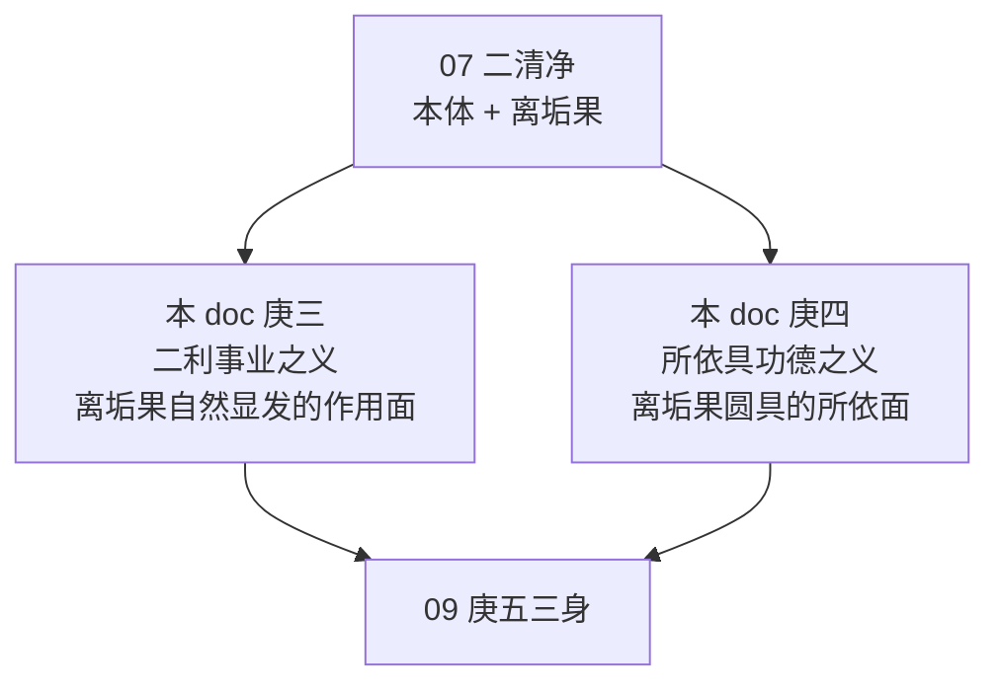
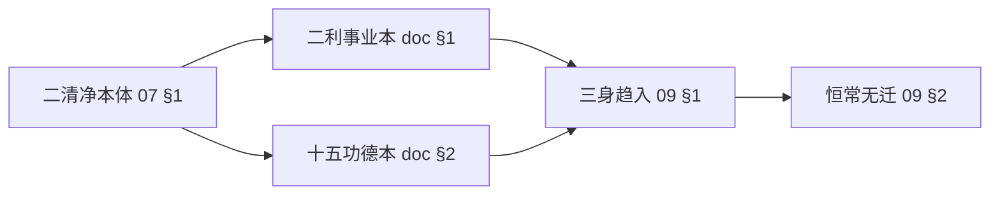

# 《宝性论》菩提品之二——二利事业与十五功德

本文件承 [`07-菩提-二清净本体.md`](./07-菩提-二清净本体.md) 所立 "二清净本体 + 离垢果" 立场, 展开菩提品七科判的 **庚三自他二利事业之义** 与 **庚四所依具功德之义**——即菩提 "二利" + "具" 两事。庚五三身广说留待 [`09-菩提-三身恒常.md`](./09-菩提-三身恒常.md) 处理。

## 〇、承前启后——从"二清净"到"二利"与"具德"

### 0.1 承 07 §2 二清净之自然显发

07 doc §1.5 立 "二清净双轨": **自性清净** (功德本具) + **离垢清净** (客尘已除); 07 §2 广说 "离垢果"——客尘既除, 果体自显。本 doc 两大科判正是这 "二清净显发" 的两面:

| 立场 | 07 doc | 本 doc |
|---|---|---|
| 二清净本体 | §1 庚一本体因 | (承) |
| 二清净显发为果 | §2 庚二离垢果 | (承) |
| **二清净果自然成就二利事业** | → | **§1 庚三二利事业** |
| **二清净果之所依圆具十五功德** | → | **§2 庚四具德之义** |

**核心 doctrinal 继承点** (承 07 §2.7 "得如来藏"伏藏喻): 因 "得" 是 **显发义** 而非 "新生义", 所以事业 **任运自成** 无需勤作, 所有功德 **本具** 非造作——此即本 doc §1-§2 最核心的教义基础。朵洛瓦注 (译作044 菩提品):

> "逝于法性真如性中的佛陀如同无为法的虚空为见色法等提供空间一样, 作为具有缘分圣贤领受并证悟堪为最胜六根各自相应威仪之真义的因。"

**"虚空喻"** 贯穿本 doc 始终——虚空虽非正因, 却是一切色声香味触法所依; 同理, 佛陀断证圆满之无为法身虽非 "造作利他", 却是一切圣者六根领受真义之所依。

### 0.2 本 doc 两大科判总览

科判展开:

- **庚三自他二利事业之义** (L22末—L23)
  - 辛一略说成办二利之理
  - 辛二广说 (分三)
    - 壬一总说成办二利之理及分类
    - 壬二别说自利圆满
    - 壬三别说他利圆满
- **庚四所依具功德之义** (L23末—L24)
  - 辛一略说名称差别 (十五功德总名颂)
  - 辛二广说理由 (分二)
    - 壬一具彼等功德之理 (十五功德总依处)
    - 壬二决定具足之功德 (分二)
      - 癸一广说甚深之理由 — **1 不可思议功德** (子一总说 / 子二别说 / 子三理由对应比喻)
      - 癸二解说后面理由 — **4 不变 + 6 断证 + 4 清净 = 14功德** (子一不变 / 子二断证 / 子三清净)

---

## 一、庚三自他二利事业之义

### 1.1 辛一略说成办二利之理——佛如虚空六根领受喻

总颂一 (L22):

> **无漏周遍无灭法, 稳寂恒常无迁处,**
> **佛如虚空诸正士, 六根领受真义因。**

**颂文结构**:

| 字段 | 含义 | 所摄 |
|---|---|---|
| **无漏周遍无灭法** | 佛陀本身断证圆满 — 无漏 (断究竟) + 周遍 (证究竟) + 无灭 (无为法) | 自利圆满 |
| **稳寂恒常无迁处** | 无老为稳, 无病为寂, 无生为恒, 无死为无迁——佛陀的四德 | (承 07 §1.1 常稳恒 + 05 §4.2 四德) |
| **佛如虚空** | 以虚空作无为法之喻——虚空非正因, 但为一切色根活动提供空间 | 此为 "二利之所依" 的核心喻 |
| **诸正士, 六根领受真义因** | 菩萨圣者依佛陀无为法之因, 六根得以领受一切真义 | 他利圆满 |

索达吉堪布 (L22):

> "因为有了佛陀无为法的功德, 所有的正士——大多数是菩萨和圣者, 依靠他们的六根, 能接受一切万法的真实义。有了佛陀的功德, 所有圣者菩萨能有开悟的机会, 就像有了虚空, 我们有活动的空间。"

**虚空喻的核心立场**: 佛陀不是 "主动造作利他" 的因, 而是 "一切利他赖以发生" 的所依。这正是菩提品 "任运事业" 的第一 doctrinal 根据——承 07 §2.7 "得如来藏 = 本具显发" 立场的直接落地。

### 1.2 六根领受六境——广说虚空喻

总颂二 (L22):

> **见非大种色, 听闻纯妙语,**
> **嗅佛净戒香, 品大圣法味,**
> **受定所触乐, 证体深理因。**
> **细思胜义乐, 佛如空离相。**

**六根 ↔ 六境圣者受用表**:

| 根 | 所得境 | 内涵 |
|---|---|---|
| **殊胜眼根** | 见非大种色 | 不是四大粗色, 而是佛陀光明清净的色相 |
| **殊胜耳根** | 听闻纯妙语 | 无相微妙、不杂世间语、如六十梵音 |
| **殊胜鼻根** | 嗅佛净戒香 | 善逝清净戒香——《佛说戒德香经》"戒香最无上" |
| **殊胜舌根** | 品大圣法味 | 如甘露般的最妙法味 |
| **殊胜身根** | 受定所触乐 | 依禅定所生无痛之轻安身触 |
| **殊胜意根** | 证体深理因 | 证悟诸法体性甚深法理 |

朵洛瓦注:

> "也就是说, 如此所化的殊胜眼根见到的不是由四大所成极微尘积聚、而是富有自在的佛陀之种种色相, 以殊胜耳根恒常听闻无相、真实妙法不杂世间法的纯净妙语……依靠法尔理详细思维分析, 究竟他利就是令领受胜义无漏大乐, 因为胜义的如来是无为法, 如虚空般, 远离生住灭等有为法的一切相, 无变任运自成。"

**教证** (《大般涅槃经》, L22 隐引意趣):

> "如来无上王, 无生亦无灭, 为诸众生故, 示现于生灭。"

**应用外延 (索达吉堪布 L23)**: 此"六根对接"不仅限于圣者菩萨, 凡夫佛弟子通过祈祷, 也可依 "佛陀解脱身 / 法身无为法之因缘" 相似得到对接——佛涅槃后千年, 弟子为何仍得加持? 依据正在此颂:

> "自己的根本上师、佛陀, 已融入刚才所讲的法身和解脱身的无为法的境界中。因为他有如虚空般的境界, 后学者依靠这种因缘, 通过祈祷佛陀, 依靠无为法的功德, 在我们的净相当中可以显现释迦牟尼佛的身相。"

此为本 doc 最具 **修持意义的 doctrinal** 点——抽象无为法理论直接转为现世修行的对接依据。

### 1.3 辛二·壬一总说——二智生二身为二利根本

总颂:

> **略摄当了知, 二智作用此,**
> **解脱身圆满, 法身即净化。**

**二智 → 二身对应** (承 07 §2.4):

| 因智 | 所断 | 所得身 | 层面 |
|---|---|---|---|
| **入定无分别如所有智** | 烦恼障及习气 | **解脱身** | 断德 |
| **出定辨别尽所有智** | 所知障 | **法身** | 证德 |

索达吉堪布 (L23) 特别说明此处 "解脱身" 与 "法身" 的独特安立:

> "《宝性论》中, 讲到菩提的时候有两种身, 一是解脱身, 主要是从断德层面讲的; 二是法身, 是现前所有的功德之后的证德圆满。"

**不同译注安立的差异** (L23):

| 注家 | 解脱身定位 | 法身定位 |
|---|---|---|
| **朵洛瓦** (本论所依) | 断德方面 | 证德方面 |
| **贾曹杰** | (自相续证德圆满) | (自他相续证德皆圆) |
| **魏译无著** | 他利为主 | 自利为主 |

本 doc 依朵洛瓦——这也是为什么下文 "自利圆满" 合说解脱身 + 法身的共通断证二德。

### 1.4 二身合具三行相——二一相颂

总颂:

> **解脱与法身, 当知二一相,**
> **无漏周遍故, 无为依处故。**

**三行相结构**:

| # | 行相 | 所摄身 | 含义 |
|---|---|---|---|
| 1 | **无漏** | 解脱身独具 | 所有客尘烦恼习气尽除 |
| 2 | **周遍** | 法身独具 | 尽所有智 + 如所有智, 无所不知 |
| 3 | **无为** | 解脱身 + 法身共具 | 不依因缘造作, 恒住不变 |

"当知二一相" = "二身各具一相 + 二身共具一相"; 二 + 一 = 三行相。

朵洛瓦注:

> "应当了知, 其中解脱障碍之身与成为智慧所依的法身, 分别具有无漏、周遍这两种行相, 共同具有无为法这一种形相。由此解脱身具足毫无漏法之断除、法身具足周遍一切所知之证悟, 故两者都是不以因缘造作的自性。这些说明自利圆满。由于是一切真实性白法之依处, 故令他利圆满。"

索达吉堪布 (L23):

> "真正佛的菩提本性, 很多人都不知道。佛真正菩提的本体是什么呢? 就是自利圆满和他利圆满。自利圆满又分为解脱身和法身两个方面, 解脱身所有的漏法已尽, 断了一切的客尘, 具有无漏的功德; 法身有周遍的功德。他们两个共同具有无为法的功德。"

### 1.5 壬二别说自利圆满——三行相各具理由

总颂:

> **灭烦恼习气, 是故为无漏,**
> **无著无碍故, 许智是周遍。**
> **终究无灭性, 故是无为法。**
> **无灭是略说, 坚等解说彼。**

**三行相理由**:

| 行相 | 理由 | 所依智 |
|---|---|---|
| **无漏** | 灭烦恼障及其习气 | (对比: 阿罗汉断烦恼障但细微习气未尽) |
| **周遍** | 如所有智无著 (无贪) + 尽所有智无碍 (遍知) | 二智 |
| **无为** | 终究无灭性, 不依因缘造作 | (本体) |

**阿罗汉习气未尽三公案** (L23 引《大智度论》):
- 难陀: 断贪但习气在, 罗汉后仍常看女众
- 舍利弗: 断嗔但报复心习气在, 佛呵斥即吐食、不再化缘
- 大迦叶: 断嗔但习气在, 佛圆寂后结集时将阿难赶出

此三公案对比说明: **佛陀无漏 = 烦恼障 + 习气皆尽**, 是圆满断德; 阿罗汉仅断现行烦恼, 非佛无漏。

### 1.6 四种灭的反面——坚寂常不迁

总颂:

> **当知四种灭, 与坚等反故,**
> **衰败变中断, 不可思变迁,**
> **无彼故可知, 坚寂常不迁。**

**四种灭 vs 四德对应表** (承 05 §4.2 佛位四德 + 07 §1.1 常稳恒):

| 四种灭 (有为法) | 喻 | 对治的四德 (菩提) |
|---|---|---|
| **衰败** (腐朽衰老) | 老 | **坚固** (无老) |
| **变** (身体变化痛苦) | 病 | **寂灭** (无病) |
| **中断** (前世续中断转后世) | 生 | **常有** (无生) |
| **不可思变迁** (死迁种种) | 死 | **无迁变** (无死) |

朵洛瓦注:

> "应当从认清反方面来了知, 因为有为法具有坏灭的四理, 即与坚固相反的不坚固, '等'字包括了与寂灭相反的不寂灭、与常有相反的无常、与无迁变相反的有迁变。那四种灭是指什么呢? 诸行成熟而腐朽衰败的老、身体变化而痛苦的病、前世相续中断而形成后世的生、不可思议变为种种相的死迁四种。解脱身与法身无有这四种毁灭的缘故, 依次可知因无老而坚固、因无病而寂灭、因无生而常有、因无死而无迁变。"

**教证** (L23 明引《华严经》):

> "示有生老病死苦, 亦示住寿处于世, 虽顺世间如是现, 体性清净如虚空。"

—— 佛陀示现生老病死是随顺世间, 非本体生灭。

### 1.7 壬三别说他利圆满——虚空喻最显立处

总颂:

> **无垢智彼是, 白法依故处,**
> **如非因虚空, 见色闻声等,**
> **香味触法因, 二身无障行,**
> **坚稳根境生, 无漏功德因。**

**虚空喻的精确含义** (L23):

- 虚空 **非能生因** — 眼见色法不从虚空生
- 虚空 **是能作因 (不起障碍)** — 无虚空则六根不能行、六境不能显
- 同理: 佛陀解脱身 / 法身虽 **不生** 圣者菩萨的六根六境, 却是圣者菩萨 **无障碍见佛陀二身** 的加行修道之六根行境因

**两层果因**:

| 层面 | 依见 | 所生果 |
|---|---|---|
| **世俗层** | 见佛陀色身等根 | 无漏相好功德 |
| **胜义层** | 见佛陀法身等 | 现量生十力 / 四无畏等所有无漏功德 |

**教证** (《大乘经庄严论》, L23 明引):

> "佛具无比白法故, 亦是利乐之因故, 安乐善妙无尽源。"

### 1.8 【doctrinal 核心】二利不二——自利即他利之方便

庚三三壬合起来呈现一个核心立场: **自利 (断证圆满) 与他利 (白法依处) 不是两事, 而是一事两面**。

**逻辑链**:
1. 断烦恼障 → 解脱身 (具无漏)
2. 断所知障 → 法身 (具周遍)
3. 二身共具无为 (不依因缘造作) → 成 "白法依处"
4. "白法依处" 如虚空无为 → 一切圣者菩萨六根六境得依 → **他利圆满**

**关键**: 自利的 "无为" 正是他利的 "依处"——**自利圆满之无为本身即他利之方便**。这与世俗的 "自利他利对立" 完全不同。

索达吉堪布 (L23) 对此作一个核心宣示:

> "佛为什么利他呢? 利他的对象主要是众生, 佛对佛不需要利他, 对菩萨虽然需要, 但最主要度化的不是菩萨, 主要是我们这些凡夫, 我们要得到利益。因为佛有无为法的功德, 可以对有缘者散发, 现在我们依靠释迦牟尼佛的法身和解脱身可以得到利益。"

**承 07 §2.7 立场的延伸**: 07 doc §2.7 "得如来藏 = 本具显发" 说的是 "果本具于所依"; 本 §1.8 在此基础上延伸为 "自利之本具即他利之方便"——事业无需勤作, 本具自显。

---

## 二、庚四所依具功德之义——十五功德

### 2.1 十五功德一表总览

【retrieval 优先】十五功德通常科判分组为: **1 不可思议 + 4 不变 + 6 断证 + 4 清净**。本 doc 核心一表尽览如下:

| 组 | # | 功德 | 依颂字段 | 所断 / 所证 | 核心义 |
|---|---|---|---|---|---|
| **甚深 (癸一)** | 1 | **不可思议** | 无思 | 超闻思修三慧境 | 唯佛行境, 非凡夫菩萨所思议 |
| **不变 (癸二·子一)** | 2 | **常有** | 常 | 离生 | 本远离因缘所生 |
| | 3 | **坚固** | 坚 | 无老 | 无生所以无灭, 故坚固 |
| | 4 | **寂灭** | 寂 | 无病 | 无生灭二法之不寂灭 |
| | 5 | **永恒** | 永恒 | 无死 | 法性自性涅槃原本安住 |
| **断证 (癸二·子二)·证三** | 6 | **善灭** | 灭 | 灭谛究竟 | 灭苦谛集谛之大乐 |
| | 7 | **周遍** | 遍 | 普证 | 尽所有智遍知一切所知 |
| | 8 | **无念** | 离念 / 无念 | 无住 | 如所有智无所缘住 |
| **断证 (癸二·子二)·断三** | 9 | **无著** (如虚空) | 如虚空 / 无著 | 断烦恼障 + 习气 | 于如所有义无贪 |
| | 10 | **无碍** | 无碍 | 断所知障 | 于尽所有义一切通彻 |
| | 11 | **断粗触** | 断粗触 | 断等持障 | 身心柔和堪能, 无沉掉 |
| **清净 (癸二·子三)** | 12 | **无见** | 无见 | 无色 | 无极微尘色, 凡夫根不可见 |
| | 13 | **无取** | 取 (无取) | 无相 | 无因等相, 凡夫心不可缘取 |
| | 14 | **善性** | 善 | 自性清净 | 法界自性清净, 胜义善 |
| | 15 | **无垢** | 无垢 | 断客尘 | 无余断尽客尘及习气 |

**三组内在逻辑**:
- **不变 4** = 无生老病死 → 坚稳常不迁
- **断证 6** = 证三 (灭苦 + 遍知 + 无住) + 断三 (烦恼 + 所知 + 等持) — 与如来藏品 "五果" 侧重点不同, 此处按 "具"的所依圆具角度安立
- **清净 4** = 无见 + 无取 + 善性 + 无垢 — 从凡夫受用不得之角度显佛陀之清净

### 2.2 辛一略说——十五功德总名颂

总颂 (L23):

> **无思常坚寂永恒, 灭遍离念如虚空。**
> **无著无碍断粗触, 无见取善无垢佛。**

此颂两句列出十五功德的名目 (一字或二字称呼), 便于记诵。朵洛瓦注:

> "以听闻无可思维性、因无生而常有、因无老而坚固、因无病而寂静、因无死而永恒、因无苦而寂灭、以尽所有智周遍所知、以如所有智远离分别断除我与烦恼障、如虚空般无著、断除所知障而在一切时于对境通彻无碍、因断除等至障而断除粗糙所触、因无碍而无见、因离相而无有执取、因自性清净而善妙、因清净客尘而无垢。具足这十五种胜义功德, 就是证得大菩提的佛陀。"

索达吉堪布 (L24) 呼吁:

> "这些数目、名词要记着……甚深有一个功德, 恒常不变有四个功德, 断证有六个功德, 清净有四个功德。"

### 2.3 辛二·壬一总依处——十五功德依二身

总颂:

> **以解脱法身, 宣说自他利,**
> **二利所依具, 不可思等德。**

**理由链**: 
- 解脱身 + 法身 → 成就自他二利
- 二利所依 (即此二身) → 圆具不可思议等十五功德

朵洛瓦注:

> "以断证本性的解脱身与法身这二者, 说明成办自利圆满与他利圆满: 解脱所断的所有束缚而成就自利, 依靠证悟法身功德的事业而成办他利。由此可知, 成为成办自利与他利之所依的二身, 具足以心识不可思议等十五种功德法。"

**承 §1 的 doctrinal 链**: 庚三立 "二身 → 二利", 庚四立 "二身 (作为二利所依) → 十五功德"——两个科判本质上是同一二身的两个面: **作用面** (二利) 与 **所依面** (具德)。

### 2.4 癸一广说甚深之理由——第1功德·不可思议

#### 2.4.1 子一总说

总颂:

> **遍知智慧境, 佛非三慧境,**
> **故当了悟智, 有情不可思。**

**核心宣示**: 佛陀是 **遍知之智唯一行境**, 非闻慧 / 思慧 / 修慧所能摄。除佛陀外, 凡夫有情皆不可思议是此是彼。

**教证** (《大般涅槃经》, L23 明引):

> "唯有诸佛能赞佛, 除佛无能赞叹者。"

#### 2.4.2 子二别说差别——三慧各不能至

总颂:

> **细故非闻境, 胜义非思境,**
> **法性甚深故, 非世修等境。**

**三慧非佛境对应表**:

| 三慧 | 不能至之理 |
|---|---|
| **闻慧** | 佛陀极其细微, 非依闻所能了 |
| **思慧** | 胜义是各别自证境, 非分别念寻伺 |
| **修慧** (世间) | 法性甚深究竟, 非世间修所生慧所能测 |

**教证** (《入行论》, L23 明引):

> "胜义非心境, 说心是世俗。"

**教证** (《方广大庄严经》, L23 明引):

> "我得甘露无为法, 甚深寂静离尘垢, 一切众生无能了, 是故静处默然住。"

#### 2.4.3 子三理由对应比喻——天盲喻 + 初生婴儿喻

总颂:

> **如天盲于色, 凡夫未曾见,**
> **圣亦如初生, 室内婴光色。**

**二喻对应**:

| 喻 | 对应 | 含义 |
|---|---|---|
| **天盲** | **凡夫** | 先天盲于色, 对佛陀智慧少许也不可能见——"盲人摸象" |
| **初生室内婴儿** | **十地圣者** / 声缘阿罗汉 | 新生婴儿只能见少许微弱光色, 不能正视太阳——圣者仅现量见少许法身 |

朵洛瓦注:

> "就像天盲对于色形等种种色法以前少许也不曾见过一样, 凡夫异生无余都是以前少许也不曾现量见过无垢真如。刚出生的室内婴儿虽然可以稍微看看太阳的光色, 但无法正视更多的光色, 同样, 住于十地的圣者佛子也仅是现量见到了少许法身, 而不能现量圆满彻见。"

### 2.5 癸二·子一不变功德 (2-5)

总颂:

> **离生故常有, 无灭故坚固,**
> **无二故寂灭, 法性住故恒。**

**四功德理由详解**:

| # | 功德 | 颂文理由 | 内涵 |
|---|---|---|---|
| 2 | **常有** | 离生故 | 本远离一切因缘所生 |
| 3 | **坚固** | 无灭故 | 无生则无灭, 故坚固 |
| 4 | **寂灭** | 无二故 | 无生灭二者 (导致未寂灭) |
| 5 | **永恒** | 法性住故 | 法性自性涅槃原本安住无变 |

**教证** (《金光明最胜王经》, L24 明引):

> "佛非血肉身, 云何有舍利? 方便留身骨, 为益诸众生。"

—— 佛本身恒常不变, 示现舍利是善巧方便。

**关联 07 §1.1 四德**: 此四功德 (常 / 坚 / 寂 / 恒) 即 07 §1.1 "离垢具佛德, **常稳恒佛陀**" 所立佛位四德在十五功德结构中的再定位。

### 2.6 癸二·子二断证功德 (6-11)

#### 2.6.1 证三功德 (6-8)

总颂前三句:

> **灭谛故善灭, 普证故周遍,**
> **无住故无念, ……**

**证三详解**:

| # | 功德 | 颂文理由 | 内涵 |
|---|---|---|---|
| 6 | **善灭** | 灭谛故 | 灭尽苦谛集谛, 灭谛究竟, 灭苦即成大乐 |
| 7 | **周遍** | 普证故 | 尽所有智, 遍知世间一切现相 |
| 8 | **无念** | 无住故 | 如所有智得胜义空性, 无所缘住 |

**疑点辨析** (L24): "灭谛故善灭" 看似是 "断" 的功德, 为何朵洛瓦放在 "证" 方面?

> "灭了痛苦自然有安乐, 所以佛陀有断除一切苦因和苦果的功德。"

—— **灭苦 = 大乐**; 从 "灭尽" 角度看是断, 从 "成大乐" 角度看是证。朵洛瓦从 "大乐功德" 角度归为证。

#### 2.6.2 断三功德 (9-11)

总颂后四句:

> **…… 断惑故无著。净所知障故,**
> **无碍于一切, 无二堪能故,**
> **是离粗所触。**

**断三详解**:

| # | 功德 | 所断 | 内涵 |
|---|---|---|---|
| 9 | **无著** | 烦恼障 + 习气 | 障解脱之烦恼及其习气无余, 于如所有义无贪 |
| 10 | **无碍** | 所知障 | 障成佛之所知障清净, 对一切所知通彻 |
| 11 | **断粗触** | 等持障 | 无沉掉等禅定障, 身心柔和堪能, 远离粗糙所触 |

**等持障特别说明** (L24): 等持障在 "弥勒五论" 中常被单列, 有时归所知障, 有时归烦恼障, 因其对禅定造成障碍。凡夫打坐时, 心不能如如不动——"胸前像压着石头" 即此粗糙所触的体验。

**教证** (《佛说宝雨经》, 达摩流支译, L24 明引):

> "有诸烦恼, 心则驰散。不能得彼诸三摩地。如来无彼烦恼尘垢起无漏智。"

#### 2.6.3 断证六功德的结构性意义

六功德合起来 = **证 (大乐 + 遍知 + 无住) + 断 (烦恼 + 所知 + 等持)**, 对应 "证德圆满 + 断德圆满"。此结构承 07 §1.2 "佛陀 = 智断二法相合一" 立场——本 doc 是 "智断二法相" 在具德层面的六功德化展开。

**与如来藏品 "五果" 的联系** (承 05 §6): 如来藏品庚八四名四义中的 "五果" (对应四颠倒之对治 + 灭尽道之自在) 与菩提品此处的 "五功德" (灭 / 遍 / 念 / 著 / 碍) 在 "所依功德" 层面互为表里——前者偏显 "净 / 我 / 乐 / 常" 的大乘正观之安立, 后者偏显 **二障断尽后自具的六相**。本 doc 不重述 05 §6 对应细节, 仅作编辑 link。

### 2.7 癸二·子三清净功德 (12-15)

总颂:

> **无色故无见, 无相故无取,**
> **清净故善性, 除垢故无垢。**

**四功德详解**:

| # | 功德 | 颂文理由 | 内涵 |
|---|---|---|---|
| 12 | **无见** | 无色 | 无极微尘聚积之色, 超有为法, 凡夫根无可见 |
| 13 | **无取** | 无相 | 无因 (推理) 等相, 清净心识法, 凡夫心无可缘取 |
| 14 | **善性** | 清净 (自性清净) | 法界自性清净, 具胜义善功德 |
| 15 | **无垢** | 除垢 (离垢清净) | 无余断客尘及习气, 极其无垢 |

**教证** (《大宝积经》, L24 明引):

> "不应以色相, 种族及生处, 乃至梵音声, 而欲观如来。"

**关联 07 §1.5 二清净**: 第14 "善性 (自性清净)" + 第15 "无垢 (离垢清净)" 即 07 §1.5 立下的 **二清净双轨** 在十五功德中的直接落位——自性清净 + 离垢清净合起来, 说明菩提之所以 "清净" 的两层理由。

**《俱舍论》教证** (L24): 善分世俗善 / 胜义善; 自性清净即胜义善, 与 "人之初性本善" 世间观亦有呼应 (但后者仅是比喻, 非本体立场)。

### 2.8 【doctrinal 核心】十五功德为何不可思议——与四不可思议的关系

菩提十五功德中 **第1 "不可思议"** 居首, 朵洛瓦单独以 "广说甚深之理由" (癸一) 展开, 与 "后面十四功德" (癸二) 并列——这说明 "不可思议" 不是十五功德中普通一项, 而是 **统摄十四功德的总相**。

**呼应 01 §9 四不可思议** (总说品): 七金刚处之 "菩提" 的不可思议在总说品已立为 "**无染清净故**" (本体无染 × 需修道显); 本 doc §2.4 在菩提品内展开的 "不可思议", 正是此立场的广说——从 "三慧非境" + "天盲 / 婴儿喻" 两个维度宣示佛陀之难测。

**两个维度的差别**:

| 层面 | 01 §9 四不可思议 | 本 doc §2.4 菩提不可思议 |
|---|---|---|
| 定位 | 总说七金刚处共有的不可思议 | 菩提独具的不可思议 |
| 理由 | 无染清净 × 本体 × 需修道显 | 三慧非境 + 圣凡所见皆不圆 |
| 广度 | 七金刚处各具 | 菩提 14 功德之总相 |

### 2.9 【编辑注】朵洛瓦觉囊派"本具实有"读法 vs 索达吉堪布宁玛补遗

依据 [`../../topics/tathagatagarbha/index.md §Editorial Policy`](../../topics/tathagatagarbha/index.md#editorial-policy):

**朵洛瓦 / 觉囊派立场**: 十五功德是 **本具实有** 于如来藏, 非修道新造。自性清净 (功德本具) + 离垢清净 (客尘已除) = 十五功德圆显。此处易读为 "众生位如来藏实有 15 个分立功德, 客尘已除即显"。

**索达吉堪布 / 宁玛补遗**: 保留 "本具" 正面语汇, 但 "本具" 应理解为 **离戏大双运之明分本具**, 非 "实有 15 个分立的实体功德"。十五功德不是 15 个独立实体, 而是离戏大双运之明分本体的 **15 个侧面化分类**——从空分看 "无色无相无见无取 (第12-13)", 从光明分看 "周遍无著无碍 (第7, 9-10)", 从断证合一看 "善灭无念 (第6, 8)" 等。每一功德皆是同一大双运的某一侧面表达, 非实有分立。

**麦彭《如来藏大纲要狮吼论》立场依据**:

> "凡是承许无变之法界为成佛种性, 首先需要认识所谓的法界是于何施设之基——真胜义二谛大双运极为不住的中观义。"

> "以胜义理论观察诸法无实之后得出一个成实之法, 犹如由光明产生黑暗, 必无是处。"

**读法要点**: 
- 十五功德本具 = 大双运本具 15 个侧面; 非实有 15 个分立功德的堆积
- "清净 4 功德" 中的第14 "自性清净" = 光明分; 第15 "离垢清净" = 空分; 二者合为大双运
- "不变 4 功德" 不是 "时间上常住的实体", 而是 "离戏大双运不堕四种有为法相" 的侧面安立

### 2.10 【编辑注】十五功德与如来藏品"功德无别"的关系

**本 doc §2 与 05 §6 庚八四名四义的内在联系**:

05 §6 庚八 "功德无别" 讲如来藏与菩提 "功德无别"——众生位如来藏所具的 "五果 (净我乐常 + 断尽道之自在)" 与佛位菩提的功德性质无别, 只是位分不同。本 doc §2 展开的十五功德, 则是佛位菩提所具的 **圆具十五相**——从所依功德角度安立。

**对应框架** (本 doc 不重述整个对应细节, 仅作定位):

| 位分 | 如来藏品 | 菩提品 |
|---|---|---|
| 众生位 (因侧) | 五果 (净我乐常 + 寂灭) | — |
| 佛位 (果侧) | (功德无别) | 十五功德 (不可思议 + 不变 + 断证 + 清净) |

详参 [`./05-如来藏-恒常无变与功德无别.md §6`](./05-如来藏-恒常无变与功德无别.md)。

---

## 三、三身位——本 doc 仅点位, 不展开

### 3.1 为何本 doc 不展开三身

菩提品科判中, **庚五以三身类别趋入之义** (L24 末 — L26) 单独展开本性身 / 受用圆满身 / 化身三身的完整内容, 理路密集、教证丰富 (包括显密三身安立差异等 correctness anchor 内容)。故本 doc **仅作承前启后的 link**, 不展开。

### 3.2 本 doc 所立的为三身作的铺垫

本 doc §1.4 二身 "解脱身 + 法身" 的安立 **不等于** 庚五的 "三身"——是 **不同角度的安立**:

| 角度 | 身数 | 出处 |
|---|---|---|
| 从断证角度 | 二身 (解脱身 + 法身) | 本 doc §1.3-§1.4 (L23) |
| 从三身趋入角度 | 三身 (本性身 + 报身 + 化身) | 09 doc (L24 末 - L26) |

索达吉堪布 (L23) 提示:

> "大家都知道, 佛陀有法身、报身、化身, 在密法当中还有不动金刚身、现前菩提身等五身的分类。在《宝性论》中, 讲到菩提的时候有两种身……"

### 3.3 十五功德作为三身的铺垫

**十五功德是三身的 "所依圆具" 层面**; 三身是 **同一圆具十五功德的佛陀在趋入众生时的三种示现**。本 doc §2 十五功德是静态的 "所依", 09 doc 庚五三身是动态的 "趋入"。关系:

详细三身内容 (本性身具五相 / 报身具五差别 / 化身具三法 / 法身具五功德 / 殊胜化身十二相等) 详参 [`./09-菩提-三身恒常.md`](./09-菩提-三身恒常.md) (forthcoming)。

---

## 四、Correctness anchor 交叉定位

### 4.1 "二转三转所诠实相无二" (主 anchor)

承 07 §1.6 已立的 "二清净 = 二转三转融通" 立场, 本 doc §2.7 "清净 4 功德" 第14 "自性清净 (光明分)" + 第15 "离垢清净 (空分)" 是此 anchor 在 **具德层面的落位**——十五功德圆具于 **二清净合一之大双运**, 而非偏显一侧。

### 4.2 "不空如来藏 = 离戏大双运"

承 06 §7 + 07 §1.3 立下的 "不空如来藏" 立场, 本 doc §2.9 "编辑注" 明确: 十五功德 "本具" 不是 15 个实有功德的堆积, 而是 **大双运本具 15 个侧面**——此为 "不空" 的精细展开。"不空于功德" 在此具体化为 "光明分本具 15 个侧面", 而非 "本体实有"。

### 4.3 "如来藏不是外道的「我」" (间接)

本 doc §2.8 强调菩提不可思议 "超三慧境", 此立场在 **辨析 "十五功德是否是一个实有自我可被感知" 的误读** 时起作用: 凡夫以分别念思维功德, 即是执 "实有功德可被思" 的 "我见" 变相; 佛陀之所以不可思议, 正在于其已超越此类执著。

详参 [`../../topics/tathagatagarbha/index.md §Correctness Anchors`](../../topics/tathagatagarbha/index.md#correctness-anchors)。

---

## 五、小结——本 doc 立下的关键论式

1. **庚三二利事业**: 
   - **辛一**: 佛如虚空, 诸正士六根领受真义 — 虚空喻作为 "二利所依" 的核心喻
   - **辛二·壬一**: 二智 → 二身; 解脱身 (无漏 / 断德) + 法身 (周遍 / 证德) + 共具无为法
   - **辛二·壬二**: 自利圆满三行相 — 无漏 + 周遍 + 无为; 与 "四种灭" 对照显 "坚寂常不迁" 四德
   - **辛二·壬三**: 他利圆满 — 虚空无为喻的精确应用 (非正因而为依处)
   - **核心立场**: 自利之 "无为" 即他利之 "依处", 自他二利不二

2. **庚四十五功德**:
   - **辛一**: 十五功德总名颂 (无思常坚寂永恒, 灭遍离念如虚空, 无著无碍断粗触, 无见取善无垢)
   - **辛二·壬一**: 十五功德依二身 (二利所依即具德所依)
   - **辛二·壬二**: 决定具足之功德
     - **癸一甚深 (1)**: 不可思议 — 三慧非境 + 天盲 / 婴儿喻
     - **癸二·子一不变 (2-5)**: 常 / 坚 / 寂 / 恒 — 承 05 §4.2 + 07 §1.1 四德
     - **癸二·子二断证 (6-11)**: 证三 (灭 / 遍 / 念) + 断三 (著 / 碍 / 粗触)
     - **癸二·子三清净 (12-15)**: 无见 / 无取 / 善性 / 无垢 — 承 07 §1.5 二清净双轨

3. **双层立场**:
   - **朵洛瓦觉囊**: 十五功德本具实有
   - **索达吉堪布宁玛**: 本具 = 大双运明分 15 侧面, 非实有 15 分立功德
   - 承 07 §1.6 "二转三转融通"立场, 完成 anchor 在 "具德层面" 的二度教证落地

4. **留待 09 doc**:
   - 庚五三身 (本性身 / 报身 / 化身) 广说
   - 庚六彼等恒常之义
   - 庚七如实不可思议之义 (总摄)

---

## 六、相关文档交叉索引

### 本文上游

- [`./07-菩提-二清净本体.md §1.5 二清净结构`](./07-菩提-二清净本体.md) — 本 doc §2.7 清净 4 功德 (自性清净 + 离垢清净) 直接承接
- [`./07-菩提-二清净本体.md §2.7 "得如来藏"伏藏喻`](./07-菩提-二清净本体.md) — 本 doc §1.8 "自利即他利之方便" 立场的 doctrinal 根据
- [`./05-如来藏-恒常无变与功德无别.md §4.2 佛位四德`](./05-如来藏-恒常无变与功德无别.md) — 本 doc §1.6 四种灭 vs 四德 + §2.5 不变四功德直接承接
- [`./05-如来藏-恒常无变与功德无别.md §6 庚八功德无别`](./05-如来藏-恒常无变与功德无别.md) — 本 doc §2.10 十五功德与如来藏品 "功德无别" 的关系

### 本文下游

- [`./09-菩提-三身恒常.md`](./09-菩提-三身恒常.md) (forthcoming) — 庚五三身 / 庚六恒常 / 庚七不可思议总摄; 本 doc 十五功德是三身所依圆具功德 (§3.3 点位)

### 本文 Topic 层立场依据

- [`../../topics/tathagatagarbha/index.md §Editorial Policy`](../../topics/tathagatagarbha/index.md#editorial-policy) — 双层立场强制规则 (§2.9 编辑注遵循)
- [`../../topics/tathagatagarbha/index.md §Correctness Anchors`](../../topics/tathagatagarbha/index.md#correctness-anchors):
  - "二转三转所诠实相无二" — §2.7 + §4.1 (本 doc 具德层面二度落地)
  - "不空如来藏 = 离戏大双运" — §2.9 + §4.2 (十五功德之 "本具" 解为大双运 15 侧面)
  - "如来藏不是外道的「我」" — §4.3 (菩提不可思议超三慧境)

### 跨 Topic 连接

- [`../../topics/madhyamaka/debates.md §1 第九诤辩`](../../topics/madhyamaka/debates.md) — 菩提 "十五功德本具" 立场的 madhyamaka 裁定依据
- [`../../topics/madhyamaka/classifications.md §1 自空/他空`](../../topics/madhyamaka/classifications.md) — 十五功德是否实有的教派立场差异辨析

### 全论坐标

- [`./01-总说-七金刚处.md §四个"不可思议"`](./01-总说-七金刚处.md) — 菩提的总说不可思议 (无染清净故) 与本 doc §2.4 菩提具德不可思议 (三慧非境) 的两维度呼应 (§2.8)
- [`./结构总览.md §四因三果`](./结构总览.md) — 本 doc 继续展开 "四因中第二因菩提" 的具德侧面 (承 03-06 如来藏 + 07 二清净 + 本 doc 二利具德); 下一站 09 三身
