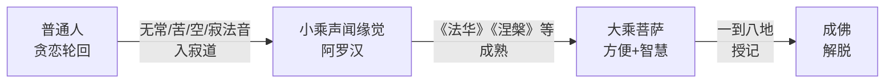
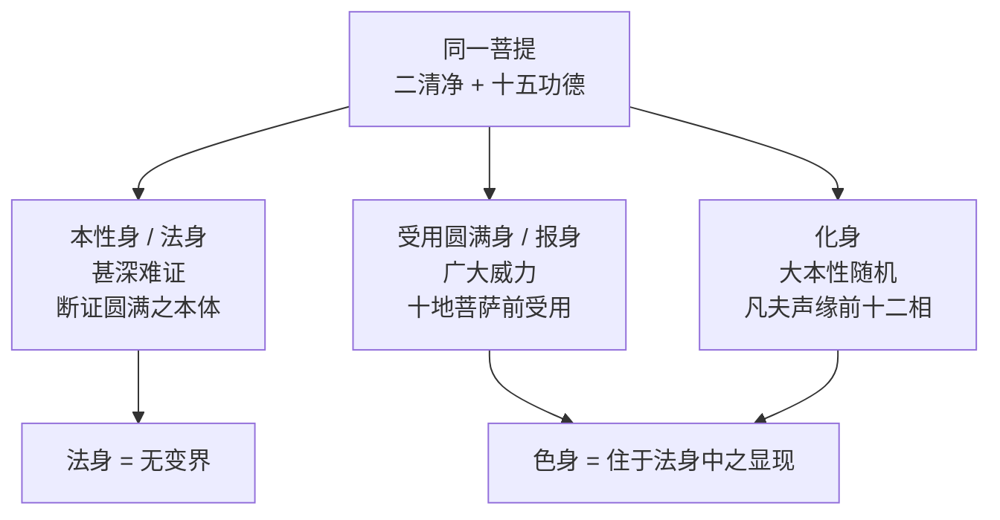
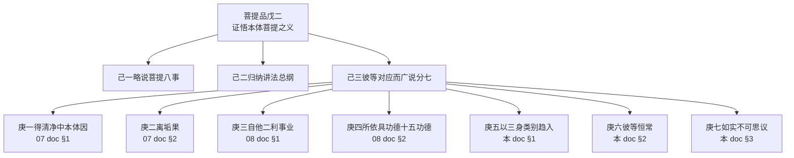

# 《宝性论》菩提品之三——三身·恒常·不可思议

本文件是《宝性论》菩提品的终篇 doc, 承 [`08-菩提-事业功德.md`](./08-菩提-事业功德.md) 所立 "二身二利 + 十五功德" 立场, 展开菩提品七科判的 **庚五·以三身类别趋入之义** + **庚六·彼等恒常之义** + **庚七·如实不可思议之义**, 完成菩提品 (戊二) 的整体收束, 并引入功德品 (戊三) 与事业品 (戊四)。

## 〇、承前启后——从"二身具德"到"三身趋入恒常"

### 0.1 承 08 十五功德与二身二利

08 doc §1 立 "二身 (解脱身 + 法身) + 二利 (自利 + 他利)"; §2 立 "十五功德" (不可思议 + 不变 + 断证 + 清净) 作为二身作为二利之所依所圆具的功德。08 doc 收束时已明言 (§3.1-§3.3): 二身乃从 **断证角度** 的佛身安立; 庚五将从 **三身趋入角度** 别作安立, 是 "同一佛陀圆具十五功德" 在**动态趋入众生**时的三种示现。

**核心 doctrinal 继承链**:

| doc | 科判 | 佛身角度 | 所立身数 | 侧重 |
|---|---|---|---|---|
| 07 §1 | 庚一 | (净得) | — | 二清净本体 |
| 07 §2 | 庚二 | (离果) | — | 离垢果 |
| 08 §1 | 庚三 | 断证合一 | **二身** (解脱身 + 法身) | 作用面 — 二利 |
| 08 §2 | 庚四 | (所依) | — | 十五功德 |
| **本 doc §1** | **庚五** | **趋入动态** | **三身** (本性 + 报 + 化) | **趋入面 — 摄受所化** |
| 本 doc §2 | 庚六 | (恒常) | 三身恒常 | 色身 7 + 法身 3 理由 |
| 本 doc §3 | 庚七 | (不可思议) | 二身不可思议 | 菩提究竟不可思议 |

索达吉堪布 (L25) 提示: "这里的本性身和前面的解脱身, 有些方面比较像, 但我们还是分开说明, 不需要融合在一起。前面的科判是从具有的层面讲的, 这里是说如何让众生趋入, 科判上没有重复。"

### 0.2 菩提品整体七科判回望

本 doc 是菩提品 (戊二) 的最终 doc, 覆盖七科判中末三科判 (庚五 + 庚六 + 庚七):

| # | 庚级科判 | 核心义 | 覆盖 doc |
|---|---|---|---|
| 庚一 | 得清净中本体因 | 二清净 + 二智 | 07 |
| 庚二 | 离垢果 | 九喻果位 | 07 |
| 庚三 | 自他二利事业 | 二身 → 二利 | 08 |
| 庚四 | 所依具功德 | 十五功德 | 08 |
| **庚五** | **以三身类别趋入** | **本性 + 报 + 化** | **本 doc §1** |
| **庚六** | **彼等恒常** | **色身 7 + 法身 3** | **本 doc §2** |
| **庚七** | **如实不可思议** | **三慧非境总摄** | **本 doc §3** |

菩提品全品至庚七即止, L28 "功德事业不可思议" 一段讲完后直接进入 "第三功德品", 本 doc 严守此界。

---

## 一、庚五·以三身类别趋入之义

科判: 戊二·己三·庚五分二——**辛一** 略说法相之差别 + **辛二** 广说其义。

### 1.1 三身总览一表 (retrieval 核心)

**三身 (Trikāya) 结构性对照**:

| 三身 | 梵/藏义 | 法相数 | 所对众生 | 核心义 |
|---|---|---|---|---|
| **本性身** (自性身, 法身) | svābhāvikakāya | **五相 + 五功德** | 唯佛自证 (入定瑜伽士可部分见) | 断证圆满之本体, 无为法 |
| **受用圆满身** (报身) | saṃbhogakāya | **五差别** | 十地菩萨 (或三清净地菩萨) | 五决定 (语/身/心/勤/本体) 圆满受用 |
| **化身** | nirmāṇakāya | **三法** (入寂道 / 成熟 / 授记) | 凡夫与声闻缘觉 | 殊胜十二相 + 作用次第引导 |

**三身三功德对应**:

> **析彼以深广, 大本性功德,**
> **所立自性等, 三身而行持。** (L25 共同分类颂)

| 身 | 所立功德 | 义 |
|---|---|---|
| 本性身 | **深** (甚深) — 难证细微 | 法身 |
| 受用圆满身 | **广** (广大) — 成办他利之威力 | 报身 |
| 化身 | **大本性** — 随凡机应化 | 色化身 |

朵洛瓦注 (译作044): "具足难证甚深的功德、具足威力广大的功德、随缘大本性功德的三法所安立的缘故, 依次是甚深自性或本性身, 及'等'字包括的广大受用圆满身、大本性化身。如是以三身任运自成不间断的行持自利他利。"

### 1.2 辛一·壬一本性身具五相 + 五功德

**总颂** (L24 末):

> **无初中后无分割, 无二三无垢分别,**
> **法界自性证悟彼, 入定瑜伽行者见。**

#### 1.2.1 本性身五相

| # | 五相 | 颂文字段 | 内涵 |
|---|---|---|---|
| 1 | **无为** | 无初中后 | 无生住灭三相, 是无为法, 无变迁 |
| 2 | **无分割** | 无分割 | 无漏法界 + 究竟智慧合而为一, 境与有境无二 |
| 3 | **离二边** | 无二 | 无 "有" (不堕增益) 亦无 "无" (不堕损减) |
| 4 | **离三障** | 无三 | 解脱烦恼障、所知障、等持障 |
| 5 | **自性光明** | 无垢分别, 法界自性, 瑜伽者见 | 无烦恼垢 + 非分别境 + 瑜伽士各别自证之行境 |

**"无二" 的朵洛瓦觉囊读法** (L25): 觉囊派承许他空, 故解释为 "世俗客尘本体无有 (远离增益), 胜义如来藏本体存在 (远离损减)"; 其他注释则直接解释为 "本性身远离有无二边", 二种读法皆可通。

**教证** (《华严经》, L24): "最胜妙法身, 一切莫能见。"
**教证** (《月灯三昧经》, L24): "若睹佛色身, 说已见如来, 我身非色像, 无有能见者。"
**教证** (《华严经》, L25): "法性无作无变易, 犹如虚空本清净。"
**教证** (《现观庄严论》, L25): "能仁自性身, 得诸无漏法, 一切种清净, 彼自性为相。"

#### 1.2.2 本性身五功德

**总颂** (L24 末):

> **无量超恒沙, 无思无等德,**
> **如来无垢界, 断诸习气过。**

| # | 五功德 | 对应 "无量等依次" (L25) | 内涵 |
|---|---|---|---|
| 1 | **无量** | 广大故 (本体如虚空) | 本体广大, 因无可量 |
| 2 | **无数** (超恒沙) | 无数故 | 数字无可计数, 超越恒河沙数 |
| 3 | **无思** | 非寻思境故 | 非寻伺分别之行境 |
| 4 | **无等** | 唯佛故 | 唯佛独具, 凡夫声缘皆无 |
| 5 | **清净究竟** (无垢界, 断习气) | 断习故 | 无余断二障 + 习气, 证圆满 + 断圆满 |

**前二句 (无量 / 无数 / 无思 / 无等) 为证方面功德, 后二句 (无垢界 / 断习气) 为断方面功德** (L24)。

**真谛译《佛说无上依经》对应** (L24 脚注): 五相 = 无为 / 不相离 / 离二边 / 脱一切障 / 自性清净; 五功德 = 不可量 / 不可数 / 难思 / 不共 / 究竟清净。

**教证** (《华严经》, L25): "如人持尺量虚空, 复有随行计其数, 虚空边际不可得, 如来境界亦如是。"

### 1.3 辛一·壬二报身具五差别——五决定 / 五不间断

**总颂** (L24 末 / L25):

> **受用种种法, 自性法现故,**
> **净悲之等流, 利生不断故。**
> **任运无分别, 如求满愿故,**
> **以摩尼神变, 安住圆受用。**

**报身五差别 (五不间断)**:

| # | 差别 | 颂文字段 | 内涵 | 传统 "五决定" 对应 |
|---|---|---|---|---|
| 1 | **语不间断** | 受用种种法 | 放大乘甚深广妙法之光芒, 说法不间断 | **法决定** (唯说大乘法) |
| 2 | **身不间断** | 自性法现 | 相好庄严光明身, 于三清净地菩萨或一地以上菩萨前显现不间断 | **身决定** (大乘相好庄严) |
| 3 | **心 (大悲) 事业不间断** | 净悲之等流, 利生不断 | 无缘大悲清净等流果, 恒时利生 | **眷属决定** (十地菩萨为所化) |
| 4 | **任运不间断** | 任运无分别, 如求满愿 | 无分别无勤作, 任运自成满愿 | **时决定** (乃至轮回未空) |
| 5 | **本体非彼性** | 以摩尼神变, 种种事物非彼性 | 如摩尼宝随底色显种种, 非报身本色 | **处决定** (密严刹土 / 报身本体远离四边) |

**(L25) 总结颂**:

> **说示事不断, 无有诸现行,**
> **示非彼本体, 此示种种五。**

**关于 "五决定" 的安立方式差异** (编辑说明): 《大圆满心性休息大车疏》《法界宝藏论》等宁玛论典, 以及显宗其他经论, 常以 "处决定 (密严刹土) / 身决定 (大乘相好) / 眷属决定 (十地菩萨) / 法决定 (大乘法) / 时决定 (乃至轮回未空)" 安立报身 "五决定"; 《宝性论》则以 "语不间断 / 身不间断 / 心不间断 / 任运不间断 / 本体非彼性" 安立报身 "五不间断" (或 "五差别")。两套语汇所诠基本对应, 读者可互参, 不必强行等同。

**索达吉堪布 (L25) 报身专讲立场**: "报身固定在一个地方转法轮, 不断地给大家传授大乘法, 一地菩萨以上才能听到, 都是大乘法, 不是小乘、人天乘。报身从来不讲人天乘, 是大乘的专家。" —— 此为 "**法决定 + 眷属决定**" 的核心宣示。

**摩尼神变喻** (L25): 如意宝随底色显现各色, 但非本色; 同理, 报身随众生根器显现毗卢遮那佛之蓝色、宝生佛之黄色等, 并非报身本色。

**教证** (《华严经》, L25): "犹如随意珠, 能现无量色, 此色非真色, 诸佛亦如是。"
**教证** (《心地观经》, L25): 报身在千叶莲花上开千法明门, 万叶莲花上开万法明门。

#### 1.3.1 子三依缘显现差别

**总颂** (L25):

> **如依种种色, 非真宝珠现,**
> **众生种种缘, 遍主非真现。**

"遍主" 非指遍入天 (外道神), 而指 "大悲周遍众生之主尊"。佛陀依所化众生界性、意乐、信解不同, 示现种种相, 但这些 "并不是真正的他" —— 真实的佛陀是现空无二之法身, 无有变化、如如不动。

**教证** (《入楞伽经》, L25): "依法身有报, 从报起化身, 此为根本佛, 余皆化所现。"

### 1.4 辛一·壬三化身具三法

**总颂** (L24 末):

> **世间入寂道, 成熟与授记,**
> **因色此常住, 如虚空色法。**

**化身三法 (作用次第引导所化之理)**:

| # | 三法 | 所摄对象 | 义 |
|---|---|---|---|
| 1 | **令入寂灭道** | 贪恋轮回之普通人 | 以无常/苦/空/寂之法音令生厌离, 入小乘声闻缘觉道 |
| 2 | **成熟** | 入小乘者 (阿罗汉 / 辟支佛) | 宣说《法华》《涅槃》等, 令趋入大乘而成熟 |
| 3 | **授记** | 成熟大乘者 (八地菩萨以上) | 授记刹土、名号、成佛时、眷属、法住世等 |

**"因色此常住, 如虚空色法"**: 化身在法身无变法界中乃至有轮回期间 **恒常不间断安住**, 如无为法虚空界中有为法色之生灭不间断一样。

#### 1.4.1 化身的三种分类 (总)

索达吉堪布 (L26) 提示: "一般来讲, 佛有工巧化身、投生化身、殊胜化身等很多不同的化身, 在《大圆满心性休息》《大乘经庄严论》等大乘论典中讲得很清楚。"

| 化身 | 义 |
|---|---|
| **殊胜化身** | 示现十二相成道之佛陀化身 (释迦牟尼佛为代表) |
| **受生化身** (投生化身) | 随众生根机投生六道, 如六能仁, 以普通众生相度化 |
| **工巧化身** | 示现为工匠、艺人、桥梁、道路、如意树、花园等利生 |

《宝性论》在此科下仅广说殊胜化身十二相, 投生与工巧化身在别处论典中广说。

#### 1.4.2 殊胜化身十二相 (核心 retrieval)

**总颂** (L26):

> **大悲知世间, 照见诸世间,**
> **法身不动中, 以异化身性,**
> **示现真投生, 从兜率天降,**
> **入胎及诞生, 精通工巧明。**
> **游戏享妃眷, 出家与苦行,**
> **至菩提迦耶, 降魔圆正觉,**
> **转大妙法轮, 趣入涅槃相,**
> **于诸不净刹, 示现有际间。**

**十二相详列** (每一相前皆加 "示现"):

| # | 十二相 | 内涵要点 |
|---|---|---|
| 1 | **从兜率天降** | 示现投生兜率天白顶天子 (又名圣善天子 / 白幢天子 / 护明天子), 给天子众说法, 以五种观照后降人间 |
| 2 | **入胎** | 以六牙白象形入胎, 为胎宫无量众生说法 |
| 3 | **诞生** | 萨嘎月 (多数历算四月初八), 蓝毗尼花园右胁降生, 七朵莲花承足, 说 "天上天下, 唯我独尊" |
| 4 | **精通工巧明** | 从七岁到十几岁, 随世俗显现学习声明、医方、骑象骑马、射箭、文字、技艺等 |
| 5 | **游戏享妃眷** | 接受以耶输陀罗为主的三位王妃、六万婇女, 至二十九岁前享世俗欲妙 (断外道 "黄门" 诽谤) |
| 6 | **出家** | 城门四游见老病死生, 四大天王抬骏马飞越王宫, 自剃出家 |
| 7 | **苦行** | 尼连禅河畔六年苦行, 牧牛女供醍醐恢复体力 |
| 8 | **至菩提迦耶** | 吉祥婆罗门供吉祥草, 坐菩提树下发愿 "不成正觉不起此座" |
| 9 | **降魔** | 魔王波旬以美女 (佛加持令变衰老) 与魔军 (箭化花雨) 诱惑攻击, 以慈悲等持降伏 |
| 10 | **圆正觉** | 三十五岁出现启明星时, 大彻大悟, 成就正等觉 |
| 11 | **转大妙法轮** | 鹿野苑转四谛法轮, 灵鹫山转空性法轮, 广严城/玛拉雅等转如来藏与密乘法轮 (三转法轮) |
| 12 | **趣入涅槃** | 八十岁 (或八十一岁) 拘尸那罗娑罗双树下, 萨嘎月四月十五示现圆寂 |

**因示现 (L26)**: "大悲知世间, 照见诸世间" —— 根本因是**大悲心** + **智慧** (尽所有 + 如所有)。"法身不动中, 以异化身性" —— 佛陀安住法身无变境界中, 同时以异化身性示现此十二相。

**何处示现**: 不清净的娑婆世界等无边刹土。
**何时示现**: 乃至所化流转轮回之诸有未空期间, 不间断任运自成示现。

**(L26) 十二相与其他安立的关系**:
- **八相成道** (汉传 / 天台宗 / 《大乘起信论》《佛本行集经》): 天降 / 入胎 / 诞生 / 出家 / 降魔 / 成道 / 转法轮 / 示涅槃
- **龙猛菩萨礼赞文十二相**: 与《宝性论》略同, 增 "住胎 / 降伏外道 / 大显神变"
- **智悲光尊者 (晋美林巴) 十二相礼赞文**: 承龙猛, 将 "降伏外道 + 示现神变" 合为一相

索达吉堪布 (L26) 定说: "关于十二相成道, 以后你们引用教证的时候, 以《宝性论》为主是很好的。"

**关于佛陀示现密严刹土成佛的密宗说法** (L26): "按照密宗的说法: 佛陀在尼连禅河苦行, 获得了智慧身, 将他的色身留在尼连禅河旁边, 自己依靠神变到密严刹土示现成佛、转法轮, 之后又进入他的色身, 到印度金刚座再次示现成佛。所以, 针对内外的不同所化都有不同的显现。"

#### 1.4.3 化身作用次第引导 (四阶段引导)

承 §1.4 总述之化身三法 "令入寂 / 成熟 / 授记", 展开为四阶段所化引导 (L27):

**阶段一: 普通人入小乘** (L27 丑一)

> **知无常苦空, 寂音之方便,**
> **令众厌三有, 趋入于涅槃。**

佛陀通达四法印 (诸有为法无常 / 有漏皆苦 / 诸法无我 / 涅槃寂静), 以此法音令贪恋轮回者生厌离, 趋入小乘涅槃道。

**教证** (《佛所行赞》, L27): "如是观三界, 无常无有主, 众苦常炽然, 智者岂愿乐。"
**教证** (《成实论》, L27): "众生以利益因缘, 便相亲爱。无有决定。"

**阶段二: 小乘者以大乘成熟** (L27 丑二)

> **入于寂道者, 具得涅槃想,**
> **宣说法华等, 法之真实性。**
> **彼等除前执, 方便智慧摄,**
> **成熟于胜乘。**

对自以为证得涅槃的阿罗汉, 佛宣说《妙法莲华经》《大涅槃经》《狮吼经》等, 破除 "已得究竟涅槃" 之执, 以大悲方便 + 空性智慧摄持, 成熟于大乘。此承 05 §6 "佛外无余涅槃" 立场 — 声缘涅槃非究竟, 终须回入大乘。

**教证** (《妙法莲华经》, L27): "今为汝说实, 汝所得非灭, 为佛一切智, 当发大精进。" (化城喻)

**阶段三: 大乘者行于解脱** (L27 丑三)

> **授记大菩提。**

一地到八地之间 (利根加行道忍位 / 中根一地 / 钝根八地), 菩萨获授记: 刹土名、佛号、成佛时、眷属数、所转法轮等。

**《金光明经》注 (慧沼撰)** 授记四种 (L27): 未发心授记 / 正发心授记 / 秘密授记 / 无生法忍时授记。

**索达吉堪布 (L27) 辨析**: "不要认为哪里有相同的名字就认为'我得到授记'……大菩提的授记, 一般是一地菩萨以上才有。"

### 1.5 辛二·壬一共同分类 — 佛陀七种名称

**总颂** (L25):

> **自生一切智, 是名谓佛陀,**
> **胜涅槃无思, 摧敌各别性。**

**佛陀七种异名** (含义不同, 所表相同):

| # | 名称 | 内涵 |
|---|---|---|
| 1 | **自生** | 不依他缘, 菩提伽耶现前自然本智 (≠《中论》所破之自生) |
| 2 | **一切智** | 具足了知一切所知之智慧 |
| 3 | **佛陀** | 断证究竟圆满, 正等觉 |
| 4 | **胜涅槃** | 不住二边 (声缘住寂边 / 众生住轮回边, 佛不住轮涅) |
| 5 | **无思** | 超越一切分别寻伺 |
| 6 | **摧敌** (出有坏 / 扎炯巴) | 摧毁一切烦恼怨敌 |
| 7 | **各别性** | 依各别自证现前, 亦名大本性 / 大菩提 |

贾曹杰等注释有不同七种异名, 所表唯一菩提, 可兼通本性身、受用圆满身、化身。

**教证** (《大集经》, L25): "具足无量诸功德, 无师独悟诸法界。"

### 1.6 辛二·壬三彼等摄义

#### 1.6.1 癸一对应理由摄为三

**总颂** (L27 末 — 参见朵洛瓦注):

> **甚深圆满力, 随凡义引故,**
> **依如此等数, 深广大本性。**

**三身所立的三理由**:

| 身 | 理由 | 所摄功德 |
|---|---|---|
| **本性身** | 细微难证, 甚深故 | 甚深 |
| **受用圆满身** | 具成办他利之圆满威力故 | 广大 |
| **化身** | 随顺凡夫意乐而说法引导故 | 大本性 |

#### 1.6.2 癸二对应实相摄为二 — 法身 + 色身

**总颂** (L27):

> **于此初法身, 后者即色身,**
> **如色住虚空, 色身住法身。**

**二身关系**:

| 身 | 摄 | 所显 | 与虚空/色法喻对应 |
|---|---|---|---|
| **法身** (= 本性身) | 初 / 诸法自性 / 非他证行境 | 甚深难证 | 如虚空 (无为法) |
| **色身** (= 报身 + 化身) | 后 / 随缘显现于所化前 | 清净 (报) + 不清净 (化) | 如虚空中显现的色法 |

色身 (报 + 化) 住于法身无变界中, 如色法住于虚空中。承 08 §1.1 "虚空喻" — 虚空非能生因, 却是一切色法所依。

**教证** (《金光明经》, L27): "佛真法身, 犹如虚空, 应物现形, 如水中月。"

**索达吉堪布 (L27) 强调**: "我们现在祈祷的是色身, 文殊菩萨或者释迦牟尼佛的色身, 但色身背后的本体跟法身无二无别, 并不是除了法身以外另外有一个色身。"

### 1.7 【核心 correctness anchor】三身显密安立的层次差别

依 [`../../topics/tathagatagarbha/index.md §Correctness Anchors "三身 (法身/报身/化身) 显密安立的层次差别"`](../../topics/tathagatagarbha/index.md#correctness-anchors), 此处是此 anchor 的最深落地处:

**常见误解**: 显宗三身与密宗三身完全相同概念。

**正确立场**: 名同而安立角度有层次差别, 显密可贯通, 但不可粗糙等同。

| 层面 | 法身 / 本性身 | 报身 / 受用圆满身 | 化身 |
|---|---|---|---|
| **显宗 (《宝性论》)** 侧重 **断证功德** | 断证圆满 (五相 + 五功德, 无为 + 自性光明) | 受用圆满于十地菩萨 (五决定) | 随化现于凡夫声缘前 (十二相 + 三法引导) |
| **密宗 (尤大圆满)** 侧重 **心性本体** | **本体空性** (原本清净) | **自性光明** (任运明分) | **大悲周遍** (普现利他) |

**《宝性论》自身的显密兼通性**:

1. **显宗正面**: 本 §1 所立三身, 主要以断证功德侧面安立, 以 "瑜伽士各别自证" / "摩尼宝神变" / "十二相" 等教证说明
2. **密宗兼摄**: 《宝性论》藏文名 "极喇嘛" (无上续) 含密续意味, 朵洛瓦宗派以此为显密津梁; 本性身 "自性光明" 之法相 (L24 "无垢分别, 是瑜伽境故, 法界本体性, 清净故光明") 已具密宗 "自性光明" 雏形
3. **索达吉堪布 (L25) 明引**: "《大圆满心性休息大车疏》《法界宝藏论》的后面部分也有提到 (报身功德差别)" — 此为显密对接提示

**宁玛立场的结构性辨析** (承 [`../../topics/tathagatagarbha/index.md §Correctness Anchors "不空如来藏 = 离戏大双运"`](../../topics/tathagatagarbha/index.md#correctness-anchors)):

- 密宗 **法身 = 本体空性**, 与显宗 **本性身 = 断证圆满** 合观: 断证圆满的究极归处, 即是本体空性之大双运; 非二安立
- 密宗 **报身 = 自性光明**, 与显宗 **受用圆满身 = 五决定** 合观: 五决定所圆满的 "大乘相好 + 密严刹土" 的终极本体, 即是自性光明
- 密宗 **化身 = 大悲周遍**, 与显宗 **化身 = 十二相 + 三法引导** 合观: 十二相与三法引导的动机根源, 即大悲周遍遍一切众生

**读法要点**:

- **不可粗糙等同**: 不能说 "显宗法身就是密宗法身"; 二者所诠虽同一实相, 但安立侧面有深浅
- **不可截然分隔**: 也不能说 "显宗三身与密宗三身毫不相干"; 《宝性论》本身即显密津梁
- **层次贯通原则**: 以显宗断证功德为基础, 以密宗心性本体为究竟; 由显入密, 层层深入

**跨 topic 连接** — `foundations/` collection (大圆满前行):

- 《大圆满前行》"皈依" 章节讲 "胜义皈依处 = 如来藏" 与 "显密四层皈依 (外 / 内 / 密 / 密密)" 时, 外层皈依对应显宗三身 (《宝性论》此处所立), 内层皈依对应密宗三身 (三根本 / 传承上师), 密层 + 密密层皈依对应大圆满本净 + 任运 (法身 + 报身 + 化身本体)
- 详参 [`foundations/大圆满前行/皈依.md`](../foundations/大圆满前行/皈依.md) (forthcoming / TBD)

**参见**:

- [`../../topics/tathagatagarbha/index.md §Correctness Anchors "三身显密安立的层次差别"`](../../topics/tathagatagarbha/index.md#correctness-anchors)
- [`../../topics/madhyamaka/classifications.md §他空中观`](../../topics/madhyamaka/classifications.md) — "就无为光明显现分的侧面抉择, 由此成为连结显密之津梁的中观"
- [`./05-如来藏-恒常无变与功德无别.md §5.3`](./05-如来藏-恒常无变与功德无别.md) — 二转三转法身双照立场, 本 anchor 的 doctrinal 根据

### 1.8 【doctrinal 核心】三身一体——同一佛陀之三种趋入

三身不是三个独立佛陀, 而是 **同一佛陀** 之 **三种趋入众生** 的方式。承 §1.6.2 "法身 + 色身" 二身摄义, 再配合 §1.1 三身所立三功德 (深 / 广 / 大本性), 得如下 doctrinal 结构:

**核心立场**:

1. **本性身 (法身) = 基**: 如虚空, 无为, 为一切所依
2. **受用圆满身 + 化身 (色身) = 显**: 如虚空中色法, 住于法身中, 非离法身别有
3. **三身任运自成不间断, 行持自利他利** (承 08 §1.8 "自利即他利" 立场)

承 07 §2.7 "得如来藏 = 显发义" 立场, 在此处三身层面落地为: **三身不是修成的三个新身, 而是本具佛体 (如来藏之果位) 在三种众生层面的对应显发**。

---

## 二、庚六·彼等恒常之义

科判: 戊二·己三·庚六分二——**辛一** 略说恒常之理由 + **辛二** 广说彼义。

### 2.1 辛一略说恒常之理由 — 十理合览

**总颂** (L27):

> **无量因与众无尽, 悲神变智具圆满,**
> **法之自在摧死魔, 无体世怙故恒常。**

**十种恒常理由 (色身 7 + 法身 3)** 一表汇览:

| # | 理由 | 颂字段 | 所属 | 内涵 |
|---|---|---|---|---|
| 1 | **无量因** | 无量因 | 色身 | 因地无贪受持妙法等无量因所成之果 |
| 2 | **众无尽** | 众无尽 | 色身 | 亲口承诺度无量众生, 所化无尽 |
| 3 | **悲** | 悲 | 色身 | 成办他利动机 — 大悲不间断 |
| 4 | **神变** | 神变 | 色身 | 神境通 + 神足通获得自在 |
| 5 | **智** | 智 | 色身 | 轮涅自性无二, 永无厌烦 |
| 6 | **具圆满** | 具圆满 | 色身 | 无漏等持之圆满安乐, 不为痛苦所害 |
| 7 | **法之自在** | 法之自在 | 色身 | 诸法自在入世间, 不染轮回过患 |
| 8 | **摧死魔** | 摧死魔 | 法身 | 证无死果位, 摧毁死主魔 |
| 9 | **无体** | 无体 | 法身 | 原本无为, 无有有为之本体 |
| 10 | **世怙** | 世怙 | 法身 | 直至后际为一切世间依怙 |

### 2.2 色身恒常之 "恒常" 义辨析

**核心 doctrinal 立场** (L27 — 承 08 §2.5 "四种灭 vs 四德"):

- **法身恒常** — 本来不生不灭, 大家都能理解
- **色身恒常** — 大多数人不理解; 化身显现生灭, 如何说恒常?

**正确立场**: 色身的 "恒常" 并非 "刹那不变 / 常住不动", 而是 **"不间断" 之义**:

- 不在这边显现度化 → 就在另一处显现度化
- 同一时间十方世界可同时示现降生、转法轮、出家、苦行等
- 故化身乃至轮回未空期间 **无穷尽**

索达吉堪布 (L27) 明宣: "佛的法身是恒常的, 报身也是恒常的, 化身也是恒常的, 但化身的恒常并非刹那不变, 而是指没有间断的意思。"

**教证** (《大乘经庄严论》, L27): "自性不间断, 相续恒常性。"
**教证** (《妙法莲华经》, L27): 佛不会灭, 法也不会灭。

### 2.3 辛二·壬一色身恒常之八理由 (广说)

科判: 辛二广说中, 色身由前 7 理由中的第 2 "众无尽" 再细分为 "普利众生" + "初誓究竟" 两支, 故色身广说成 **八理由**, 法身仍 3 理由, 合十一; 最终彼等总摄仍归为 "前七色身 + 后三法身" (见 §2.5)。

**前三理由** (L27):

> **舍身命受用, 受持妙法故,**
> **普利众生故, 初誓究竟故。**

| # | 理由 | 内涵 | 教证 |
|---|---|---|---|
| 1 | **舍身命受用, 受持妙法** | 因地无贪舍身命王位珍宝以求法 | 《华严经》"头目手足等, 难舍悉能施" |
| 2 | **普利众生** | 为度天下无边众生, 色身不间断 | — |
| 3 | **初誓究竟** | 最初度尽众生之誓愿未究竟前, 色身不间断 | — |

**中二理由**:

> **佛陀即清净, 大悲趋入故,**
> **神通足示现, 彼住行持故。**

| # | 理由 | 内涵 |
|---|---|---|
| 4 | **大悲清净** | 清净烦恼障 + 所知障之大悲不间断 |
| 5 | **神境通 + 神足通** | 一化多 / 多化一 / 火水转换等等持自在, 应机示现色身相, 乃至轮回存在间安住 |

**(L27) 《长阿含经》教证**: 佛接近涅槃时再三告诉阿难, "我因为有四神足, 住世一个大劫都没有问题", 但魔王波旬遮阿难耳, 阿难未祈请, 佛示现涅槃。此为 "神通足具, 但示现随顺" 之典范。

**后三理由**:

> **依智而解脱, 轮涅执二故,**
> **恒具无量定, 圆满安乐故。**
> **行于世间中, 不染世法故。**

| # | 理由 | 内涵 |
|---|---|---|
| 6 | **依智解脱轮涅执二** | 证悟轮涅无二, 无厌倦心 |
| 7 | **恒具无量定 + 圆满安乐** | 无漏等持恒安乐, 不为痛苦所害 |
| 8 | **行世不染世法** | 八法 (称/讥/毁/誉/利/衰/苦/乐) 不染, 如莲花出淤泥 |

**教证** (《大宝积经》, L27): "大悲力故, 堪忍众恶, 不染生死, 亦无疲厌。"

### 2.4 辛二·壬二法身恒常之三理由 (广说)

**总颂** (L27):

> **无死得住寂, 无死魔行故。**
> **无为之自性, 能仁本灭故。**
> **恒成无依者, 依怙等之故。**

| # | 理由 | 内涵 | 宣说角度 |
|---|---|---|---|
| 1 | **摧死魔** | 业与烦恼死迁已断, 住于无余寂灭生灭之殊胜涅槃处 | 究竟对治角度 |
| 2 | **无体** (无为自性) | 具不以因缘造作之自性, 能仁法身原本善灭一切有为法相 | 自性角度 |
| 3 | **世怙** | 直至后际为一切无依众生之究竟依怙 | 无欺角度 |

**承 07 §1.1 "常稳恒" 四德 + 08 §1.6 "四种灭 vs 四德" 结构**: 法身之 "无死 / 无为 / 无依怙" 即 "常 / 坚 / 寂 / 恒" 四德在恒常义上的展开 — 非时间上常住, 而是大双运不堕四种有为法相之恒常。

### 2.5 辛二·壬三彼等总摄义

**总颂** (L27):

> **以初七种因, 色身恒常性,**
> **后三是本师, 法身恒常性。**

**总结**: 前七因说明色身恒常不间断利他; 后三因说明本师佛陀法身无变恒常。虽广说色身八理由, 总摄时第 2 "普利众生" + 第 3 "初誓究竟" 合为原颂 "众无尽" 一因, 故最终仍是 "7 + 3" 结构。

---

## 三、庚七·如实不可思议之义

科判: 戊二·己三·庚七分二——**辛一** 略说不可思议之理 + **辛二** 广说原因。

### 3.1 辛一略说不可思议之理 — 八因总揽

**总颂** (L28):

> **因非语境胜义摄, 非分别境离喻故,**
> **无上有寂不摄故, 佛境圣亦不可思。**

**菩提不可思议的八因**:

| # | 因 | 颂字段 | 内涵 |
|---|---|---|---|
| 1 | **非语境** | 非语境 | 非语言所诠 (用指指月, 非月本身) |
| 2 | **胜义摄** | 胜义摄 | 各别自证二清净胜义谛, 胜义不可言说 |
| 3 | **非分别境** | 非分别境 | 凡夫分别念之行境非此 (麻雀翅膀衡虚空) |
| 4 | **离喻** | 离喻 | 超越自性因 / 果因 / 不可得因等一切三相推理 |
| 5 | **无上** | 无上 | 超越一切世间 |
| 6 | **有寂不摄** | 有寂不摄 | 不属轮回亦不属涅槃 |
| 7 | **佛境** | 佛境 | 唯佛尽所有智 + 如所有智之行境 |
| 8 | **圣亦不可思** | 圣亦不可思 | 十地菩萨 / 声缘 / 凡夫皆不能思 |

**核心宣示**: 菩提是 **佛独境**, 十地圣者 "亦" 不能如实思维, 凡夫更不言而喻。

### 3.2 辛二·壬一依次说原因 — 八因环环相扣

**总颂** (L28):

> **无诠故无思, 胜义故无诠,**
> **非择故胜义, 非量故非择。**
> **无上故非量, 非摄故无上,**
> **无住故非摄, 功过无别故。**

**八因如链** (由 "无思" 层层推上到 "功过无别"):

| 层 | 因 | 所立 |
|---|---|---|
| 1 | 无诠 | → 无思 (不可思议) |
| 2 | 胜义 | → 无诠 (不可言说) |
| 3 | 非择 | → 胜义 (分别念不可抉择) |
| 4 | 非量 | → 非择 (世间比喻 / 比量皆无法衡量) |
| 5 | 无上 | → 非量 (超越世间一切) |
| 6 | 非摄 | → 无上 (不属轮涅所摄) |
| 7 | 无住 | → 非摄 (不住有寂二边) |
| 8 | **功过无别** | → 无住 (无执寂灭为功德 / 轮回为过失之分别) |

**核心基础**: **功过无别** (有寂功过无分别) 是八因最基础的根源; 若执轮回为过失、涅槃为功德 → 即堕二边 → 菩提即可安立 → 不再不可思议。佛陀之菩提超越此一切分别。

**教证** (《入大乘论》, L28): "法身功德业, 一切无能知, 不可以形类, 言辞巧宣说。"

### 3.3 辛二·壬二对应二身总结

**总颂** (L28):

> **五因细微故, 法身不可思,**
> **六非彼性故, 色身不可思。**

**八因分摄二身**:

| 身 | 所摄因 | 理由 |
|---|---|---|
| **法身** 不可思议 | 前五因 (无诠 / 胜义 / 非择 / 非量 / 无上) | 极其细微甚深难测 |
| **色身** 不可思议 | 第六因 (非摄 / 有寂不摄) | 虽显现为生灭有寂法, 但并非其真实性, 故幻变不可思议 |

**关键立场** (L28): **色身也不可思议** —— 常见误读: "法身不可思议易懂; 色身既然我们看得到听得到, 应该可以思议"。正解: 色身是缘起空性中幻化的报身 / 化身, 真正生灭自性没有, 示现利他的幻变本身即不可思议。

**教证** (《华严经》, L28): "如来法身不思议, 无色无相无伦匹, 示现色身为众生, 十方受化靡不见。"
**教证** (《华严经》"非至非不至", L28): "虚空无身故" — 如来身遍一切处、遍一切众生、遍一切国土, 而 "非至非不至"。

### 3.4 辛二·壬三功德事业不可思议之理

**总颂** (L28):

> **无上智悲等功德, 功德竟佛不可思,**
> **自生末者之此理, 仙大自在亦未觉。**

**核心宣示**:

- **佛具无上智悲等功德** (尽所有智 / 如所有智 + 救度众生之大悲等) = 功德究竟之波罗蜜多 = 一切功德最圆满境界
- 唯佛以自心自证此境, 故 "自生末者之此理"
- 仙人 / 住清净地大菩萨 (十地) / 获十自在者皆未现量觉悟, 更何况一般众生

**菩提八事安立之末**: 菩提八事 (见 07 §0.4) 末一事即 "不可思议" — 是八事的最终归结。此 "不可思议" 不是第 8 事, 而是覆盖前 7 事的总相 (承 08 §2.8 "不可思议统摄十四功德" 立场)。

### 3.5 对应 01 §9 与 08 §2.8 的四不可思议

本 §3 菩提不可思议是 **二维度** 对应:

| 层面 | 01 §9 四不可思议 | 08 §2.8 菩提具德不可思议 | 本 doc §3 菩提总不可思议 |
|---|---|---|---|
| 定位 | 总说七金刚处共有 | 菩提十五功德之第 1 | 菩提品之第八事 (庚七) |
| 理由 | 无染清净故 (本体无染 × 需修道显) | 三慧非境 + 天盲 / 婴儿喻 | 八因环环 + 二身分摄 + 功德究竟 |
| 广度 | 七金刚处各具 | 菩提 14 功德之总相 | 菩提品整体之最终归宿 |

**承 08 §2.8 "与四不可思议的关系" 立场**: 08 §2.8 已 "菩提具德层面" 展开不可思议 (三慧非境 + 天盲 / 婴儿喻); 本 doc §3 是 "菩提整体层面" 的终极展开 (八因环环 + 功德究竟)。二者互摄, 合观即菩提不可思议之完整 doctrinal 图景。

**教证** (《佛说如来不思议秘密大乘经》, L28 — 四不可思议): 业不可思议 / 龙不可思议 / 定不可思议 / 佛不可思议, 佛最超胜。

### 3.6 "非至非不至" — 现代科技比喻的 doctrinal 承接

索达吉堪布 (L28) 用现代网络直播比喻 "非至非不至":

> "比如说我在这里讲课, 如果可以上网的话就可以直播, 全世界的众生都能看得到、都能听得到, 但是我的声音'非至非不至', 我的身相也是'非至非不至'。"

**此喻的 doctrinal 立场**: 非直说 "佛即是网络", 而是以现代人可理解的缘起现象, 反显 "如来身相周遍一切处, 同时非至亦非不至" 的不可思议。此喻承 08 §1.2 "六根六境依虚空喻" 立场 — 虚空非正因, 却是一切活动之依处; 同理, 佛陀化身非真实到来, 却是一切众生可见可闻的依处。

---

## 四、【编辑注】三身双层立场张力点汇总

本 doc 涉及的觉囊 / 宁玛双层张力按位置汇总:

| 位置 | 朵洛瓦 / 觉囊立场 | 索达吉堪布 / 宁玛调整 | 处理方式 |
|---|---|---|---|
| §1.2.1 本性身 "离二边" | 胜义如来藏本体存在 (远离损减) | 二种读法兼收, 宁玛倾向直读为离有无二边 | L25 明列两种读法, 本 doc 并置 |
| §1.3 报身 "五决定" | 朵洛瓦注以 "五不间断" 安立 | 宁玛《大圆满心性休息》等以 "五决定" (处 / 身 / 眷 / 法 / 时) 安立 | 本 doc §1.3 并置两套语汇, 互参不必强同 |
| §1.7 三身显密安立 | 显宗三身 = 断证功德侧面安立 | 密宗三身 = 心性本体侧面安立; 二者层次贯通但不等同 | 本 doc §1.7 单列 correctness anchor 明辨 |
| §1.8 三身一体 | 三身本具 (承如来藏功德本具立场) | 三身是 "本具佛体在三种众生层面的对应显发"; 非修成新身 | 承 07 §2.7 "显发义" 立场 |
| §3.2 "功过无别" | 功过无别 = 如来藏远离一切有寂之分别 (倾向义他空读法: 如来藏本具而无功过) | 功过无别 = 大双运离戏, 不是实有 "一个无差别本体" | 承 06 §7 "此无何所破, 亦无少所立" 立场 |

**总原则** (参 [`../../topics/tathagatagarbha/index.md §Editorial Policy`](../../topics/tathagatagarbha/index.md#editorial-policy)):

- 引朵洛瓦注释时保留 "三身任运自成" / "摩尼宝神变" 等正面语汇
- 显密三身层次差别须单列 correctness anchor, 不可粗糙等同
- 不可思议之八因 "功过无别" 以离戏大双运立场为最终 anchor

---

## 五、Correctness anchor 交叉定位

### 5.1 "三身 (法身/报身/化身) 显密安立的层次差别" (本 doc 最核心 anchor)

§1.7 是此 anchor 的最深落地处 — 完整展开显宗三身 (断证功德) vs 密宗三身 (心性本体) 的层次差别, 并承《宝性论》显密津梁性质作结构性辨析。

详参 [`../../topics/tathagatagarbha/index.md §Correctness Anchors "三身显密安立的层次差别"`](../../topics/tathagatagarbha/index.md#correctness-anchors)。

### 5.2 "佛外无涅槃 (究竟唯一乘)"

§1.4.3 "化身作用次第引导" 中 "阶段二: 小乘者以大乘成熟" (《法华》化城喻) + §1.4 "化身三法" 之 "成熟" 一条, 是此 anchor 的核心展开。声缘涅槃非究竟, 终须回入大乘成佛。

详参 [`./05-如来藏-恒常无变与功德无别.md §6 "佛外无余涅槃"`](./05-如来藏-恒常无变与功德无别.md) + [`../../topics/tathagatagarbha/index.md §Correctness Anchors "佛外无涅槃"`](../../topics/tathagatagarbha/index.md#correctness-anchors)。

### 5.3 "不空如来藏 = 离戏大双运"

§2.4 法身恒常三理由 (摧死魔 / 无体 / 世怙) + §3.2 八因 "功过无别" 承 06 §7 "此无何所破, 亦无少所立" + 07 §1.6 "二清净 = 大双运" + 08 §2.9 "十五功德 = 大双运 15 侧面" 立场 — 三身恒常不可思议之究极, 正是离戏大双运本身。

### 5.4 "第二转与第三转所诠实相无二"

§1.2 本性身 "自性光明" + §3.3 "色身也不可思议" 承 05 §5.3 二转三转双照立场的菩提品终篇 — 显宗三身所立之法身 / 报身 / 化身, 与第二转自空与第三转光明无二, 唯所诠侧面不同。

---

## 六、菩提品整体收束 — 七科判回望

本 doc 之完成, 标志菩提品 (戊二) 全部结束。回顾菩提品整体:

**菩提品核心 doctrinal 立场总摄**:

1. **菩提 = 无垢真如** = 如来藏于客尘尽处之名, 非新生 (07 §0 + §2.7 伏藏喻)
2. **二清净双轨** = 自性清净 (功德本具) + 离垢清净 (客尘可除); 此即大双运之施设基 (07 §1.5 + §1.6)
3. **二身 (解脱 + 法) + 二利 (自利 + 他利) + 十五功德 (不可思 + 不变 + 断证 + 清净)** = 菩提本体的作用面 + 所依面 (08 §1 + §2)
4. **三身 (本性 + 报 + 化) + 恒常 (色身 7 + 法身 3) + 不可思议 (八因 + 二身分摄 + 功德究竟)** = 菩提的趋入面 + 恒常面 + 不可思议面 (本 doc §1 + §2 + §3)
5. **显密三身层次贯通** — 显宗断证 vs 密宗心性; 二者以大双运为究极通合
6. **菩提品整体 = 四金刚处之第二 (果侧)** — 承如来藏品 (因侧 / 有垢真如) 而立 "佛地" 名号, 为功德品 + 事业品展开所依

---

## 七、引向功德品 (戊三) 与事业品 (戊四)

菩提品 (戊二) 收束之际, 有两条 doctrinal 延伸线通向功德品与事业品:

### 7.1 引向第三·功德品 (戊三)

**菩提品十五功德 (08 §2) → 功德品 64 功德** 的展开:

| 层面 | 菩提品 (戊二) | 功德品 (戊三) |
|---|---|---|
| 所依 | 二身 (解脱身 + 法身) | 二身 (胜义身 + 世俗身 = 法身 + 色身) |
| 功德数 | 十五 (不可思议 + 不变 4 + 断证 6 + 清净 4) | **六十四 (离系 32 + 异熟 32)** |
| 离系果 (法身所具) | — | **32: 十力 + 四无畏 + 十八不共法** (依智慧资粮现前) |
| 异熟果 (色身所具) | — | **32: 大士三十二相** (依福德资粮成熟) |
| 表示喻 | 日 + 虚空 (07) / 莲湖 / 月 (08) | 金刚 (十力) + 狮子 (四无畏) + 虚空 (十八不共) + 水月 (色身三十二相) |

L28 末 (本 doc §3 之后, 功德品开篇) 即颂:

> **二利胜义身, 依彼世俗身,**
> **离系异熟果, 六十四功德。**

本 doc §1.6.2 所立 "法身 (胜义身) + 色身 (世俗身)" 二身结构, 在功德品直接承接, 展开为 **离系 32 (法身, 智慧资粮所显) + 异熟 32 (色身, 福德资粮所成)** 之六十四功德。

**→ 详参** `10-功德品.md` (forthcoming)

### 7.2 引向第四·事业品 (戊四)

**菩提品化身作用 (本 doc §1.4.3 四阶段引导) → 事业品九喻** 的展开:

| 层面 | 菩提品 (戊二·庚五) | 事业品 (戊四) |
|---|---|---|
| 事业核心 | 化身作用次第引导 (入寂 / 成熟 / 授记) | **任运 + 不间断两大法相** |
| 事业喻 | 虚空喻 (08 §1.1) + 摩尼神变喻 (本 §1.3) | **九喻: 天王 / 天鼓 / 云 / 梵天 / 日轮 / 摩尼宝 / 回响 / 虚空 / 大地** |
| 所对众生 | 凡夫 → 小乘 → 大乘 → 解脱 | 九喻分对应不同根机 |

本 doc §1.4 化身三法 "令入寂 / 成熟 / 授记" 与 §1.4.3 四阶段引导, 是事业品 "九喻事业" 的前行; 事业品将以九喻更广、更形象地展开佛陀任运不间断事业如何遍应各类众生。

**→ 详参** `11-事业品-*.md` (forthcoming)

---

## 八、小结 — 本 doc 立下的关键论式

1. **庚五三身** (本 doc §1):
   - **本性身五相** = 无为 / 无分割 / 离二边 / 离三障 / 自性光明; **五功德** = 无量 / 无数 / 无思 / 无等 / 清净究竟
   - **报身五差别** = 语 / 身 / 心 / 任运 / 本体非彼性; 对应传统五决定 (处/身/眷/法/时)
   - **化身三法** = 令入寂 / 成熟 / 授记; **殊胜化身十二相** (从兜率降 → 入胎 → 诞生 → 精通工巧明 → 游戏妃眷 → 出家 → 苦行 → 至菩提迦耶 → 降魔 → 圆正觉 → 转法轮 → 入涅槃)
   - **四阶段引导** 普通人 → 小乘 → 大乘 → 解脱
   - **三身摄二身**: 法身 (本性身) + 色身 (报身 + 化身), 色身住于法身中如色住虚空
   - **核心 correctness anchor**: 三身显密安立的层次差别 — 显宗断证 vs 密宗心性, 二者层次贯通但不等同

2. **庚六恒常** (本 doc §2):
   - **色身 7 理由**: 无量因 / 众无尽 / 悲 / 神变 / 智 / 具圆满 / 法之自在 (广说开为八)
   - **法身 3 理由**: 摧死魔 / 无体 / 世怙
   - **"恒常" 义辨析**: 化身之恒常非 "刹那不变", 而是 **"不间断"** — 此处不败此彼现, 同一时间十方可同时十二相

3. **庚七不可思议** (本 doc §3):
   - **八因环环**: 无诠 ← 胜义 ← 非择 ← 非量 ← 无上 ← 非摄 ← 无住 ← 功过无别
   - **二身分摄**: 前 5 因 → 法身不可思; 第 6 因 "非摄" → 色身不可思 (色身也不可思议是核心立场)
   - **功德事业不可思议**: 无上智悲等功德, 唯佛自证; 十地菩萨、仙人、获十自在者皆未觉
   - 承 01 §9 + 08 §2.8 构成 "四不可思议 → 具德不可思议 → 整体不可思议" 三维度呼应

4. **菩提品整体收束**: 七科判完整铺陈, 由因 → 果 → 事业 → 具德 → 趋入 → 恒常 → 不可思议, 成就 "佛地" 八事之全景安立

---

## 九、相关文档交叉索引

### 本文上游

- [`./07-菩提-二清净本体.md §1 二清净 + §2 离垢果`](./07-菩提-二清净本体.md) — 菩提品起点, 本 doc 三身所承之 "同一菩提" 的本体
- [`./08-菩提-事业功德.md §1 二身二利 + §2 十五功德`](./08-菩提-事业功德.md) — 本 doc 三身所承之 "二身具德" 基础; §3 "三身留待 09" 的 direct link
- [`./05-如来藏-恒常无变与功德无别.md §4.2 佛位四德 + §5.3 二转三转法身差别`](./05-如来藏-恒常无变与功德无别.md) — 本 doc §1.2 本性身五相 + §2.4 法身恒常立场的 doctrinal 根据
- [`./06-九喻与不空五过.md §7 "此无何所破"`](./06-九喻与不空五过.md) — 本 doc §3.2 "功过无别" + §1.8 "三身非新修成" 立场根据
- [`./01-总说-七金刚处.md §9 四不可思议`](./01-总说-七金刚处.md) — 本 doc §3.5 不可思议二维度呼应的起点

### 本文下游

- `./10-功德品.md` (forthcoming) — 本 doc §7.1 引向的功德品 64 功德 (离系 32 + 异熟 32); 本 doc §1.6.2 二身 + 08 §2 十五功德为其直接基础
- `./11-事业品-*.md` (forthcoming) — 本 doc §7.2 引向的事业品九喻; 本 doc §1.4.3 化身四阶段引导为其前行
- `./13-利益品.md` (forthcoming) — 四处难证 / 超胜布施持戒修行之理 / 六度相摄

### 本文 Topic 层立场依据

- [`../../topics/tathagatagarbha/index.md §Editorial Policy`](../../topics/tathagatagarbha/index.md#editorial-policy) — 双层立场强制规则 (§1.2.1, §1.3, §1.7, §4 编辑注遵循)
- [`../../topics/tathagatagarbha/index.md §Correctness Anchors`](../../topics/tathagatagarbha/index.md#correctness-anchors):
  - "三身显密安立的层次差别" — §1.7 + §5.1 (本 doc 最核心 anchor)
  - "佛外无涅槃 / 究竟唯一乘" — §1.4.3 + §5.2
  - "不空如来藏 = 离戏大双运" — §3.2 + §5.3
  - "第二转与第三转所诠实相无二" — §1.2 + §3.3 + §5.4

### 跨 Topic 连接

- [`../../topics/madhyamaka/classifications.md §他空中观`](../../topics/madhyamaka/classifications.md) — "就无为光明显现分的侧面抉择, 由此成为连结显密之津梁的中观" — §1.7 显密津梁立场的 madhyamaka 对应
- [`../../topics/madhyamaka/debates.md §第九诤辩`](../../topics/madhyamaka/debates.md) — 三身 "功过无别" 的 madhyamaka 裁定
- `foundations/大圆满前行/皈依.md` (TBD) — 显密四层皈依与显密三身对应; §1.7 提及

### 全论坐标

- [`./结构总览.md §四因三果`](./结构总览.md) — 本 doc 完成 "四因中第二因菩提" 的全部展开 (承 07 + 08 + 本 doc); 下一站功德品 (第三因) + 事业品 (第四因)
- [`./01-总说-七金刚处.md §四个"不可思议"`](./01-总说-七金刚处.md) — 菩提的总说不可思议 (无染清净故) 与本 doc §3 菩提整体不可思议 + 08 §2.4 菩提具德不可思议, 三维度完整呼应
