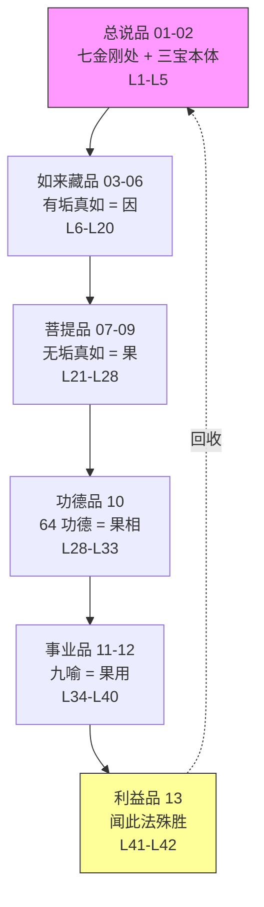

# 《宝性论》第五·利益品与甲四·造论后记——全论终章

本文件是《宝性论》的**最后一篇单元 doc**, 覆盖**第五利益品** (丙三彼等功德) 与**甲四解说圆满造论事宜** (后记), 对应 L41-L42 两堂课。

至本 doc 收束, 《宝性论》全 13 篇 doc (01-13) 完整覆盖所有四十二堂课, **全论闭环**。

本 doc 承 [`12-事业品-后六喻与归纳.md §10.3 引向利益品`](./12-事业品-后六喻与归纳.md) 所立:

> 既然佛陀是世出世一切圆满之所依, 那此教法 (《宝性论》第三转法轮 / 如来藏教义) **为何殊胜**? 为何超胜布施 / 持戒 / 修行? 六度之间如何相摄?

此即利益品所答的核心问题——**为什么学这部论值得**。

---

## 〇、利益品在全论中的位置

### 0.1 从 "教义安立" 到 "教法殊胜" 的转向

《宝性论》前四品 (如来藏 / 菩提 / 功德 / 事业) 已完整安立**教义**——说明 "凡夫如何可能成佛"、"成佛之因何在"、"成佛之果何相"、"成佛之用何行"。

利益品不再安立新教义, 而是回到**为什么学这部论**的角度——阐明**闻信此教的殊胜功德**, 证成 "此教法为何必须学"。

科判承接关系:

```
甲三·乙二·丙 (甚深意义)
├── 丙一·所证 (总说品)  ← 三宝立果
├── 丙二·能证方便 (四品)  ← 四处立因果
│   ├── 丁一·所证真实性 → 如来藏品
│   ├── 丁二·证悟本体 → 菩提品
│   ├── 丁三·随顺功德 → 功德品
│   └── 丁四·能证方便事业 → 事业品
└── 丙三·彼等功德 (利益品) ← 立信闻法之德
```

### 0.2 利益品的核心 argument

一句话概括:

> **闻《宝性论》一偈, 功德超胜布施 / 持戒 / 修行多生累劫。**

此 argument 的 doctrinal 支撑: **慧外无有断, 彼等余因故, 慧胜其基闻, 是故闻殊胜** (庚二颂) ——智慧是断二障的唯一根源, 而智慧的根基在闻, 故闻此教超胜前五度。

### 0.3 本 doc 结构

| 科判 | 内容 | 本 doc 节 |
|---|---|---|
| 戊一·己一 | 四处难证之理 | §1 |
| 戊一·己二庚一 | 超胜三福德事 (布施/持戒/修行) | §2 |
| 戊一·己二庚二 | 殊胜智慧之方式 | §3 |
| 戊二·己一 | 获得究竟利益 (三信) | §4 |
| 戊二·己二庚一 | 菩提心利益 | §5 |
| 戊二·己二庚二 | 六度利益四辛 | §6 |
| 甲四·乙一·丙一 | 如何造论五丁 | §7 |
| 甲四·乙一·丙二 | 断除损法三丁 | §8 |
| 甲四·乙一·丙三 | 回向造论福德 | §9 |
| 甲四·乙二 | 讲法归纳 | §10 |
| — | 全论闭环 | §11 |
| — | 朵洛瓦与索达吉堪布终结 | §12 |

---

## 一、四处难证之理 (戊一·己一)

### 1.1 颂词与经义

> **佛性佛菩提, 佛法佛事业,**
> **净众尚不思, 此是佛行境。**

此颂回收全论前四品, 将**四处**作为 "佛行境" 正式宣告——**只有佛能究竟了知, 菩萨仅能部分证得, 凡夫二乘根本不能**。

"佛法僧" 在哪里? 第一品已讲过, 佛法僧已摄于佛菩提中, 故此处不单独列出——索达吉堪布 L41 明确: "这四个金刚处加上佛法僧三宝, 就是前面刚开始讲到的七金刚处。因为第一品当中已经讲了佛法僧, 在佛菩提中都已经具足, 因此没有单独安立。"

### 1.2 四处难证回顾——回呼 01 §9 "四不可思议"

此处与总说品**四不可思议**遥相呼应, 但侧重不同:

- **01 §9 四不可思议**: 聚焦 "为何四处各自表面相违" (清净具染 / 无染清净 / 无分之法 / 任运无念)
- **本 §1**: 聚焦 "四处难以被凡夫二乘菩萨通达" (唯佛行境)

二者是同一实相从**结构面**与**认识面**的两种展开。

| 四处 | 难证原因 | 能证者 |
|---|---|---|
| **如来藏** (有垢真如) | 自性清净 + 客尘同在, 甚深微妙 | 唯佛能究竟见, 十地菩萨部分见 |
| **菩提** (无垢真如) | 无垢真如远离凡夫境 | 十地菩萨 + 佛 |
| **功德** (64 种) | 六十四功德不可思议 | 佛之境界 (菩萨亦模糊) |
| **事业** | 任运无念而能利生 | 佛之境界 |

### 1.3 "大部分客尘清净之菩萨亦不可思议" (朵洛瓦注释)

朵洛瓦在注释中明文:

> 随同成就三宝的四金刚处真实性而大部分客尘清净的有情——大菩萨尚且不可思议, 异生凡夫及声闻缘觉更不必说, 因为如前所述不可思议。

索达吉堪布 L41 补充:

> 相续当中的罪业已经逐渐清净了的、从一地到十地之间的菩萨, 还不能完全理了知上所讲的四个金刚处, 还是不可思议的。对于菩萨来讲, 四个金刚处都是模模糊糊, 不是特别清楚的话, 那声闻、缘觉和凡夫人就更不用说了。

**要点**: "难证" 不是 "无法趋入", 而是 "不能完全通达"——通过**信解作意**可以部分证得。

### 1.4 《大般涅槃经》教证

索达吉堪布 L41 引:

> 《大般涅槃经》中亦云: "佛性甚深甚深, 难见难入。声闻缘觉所不能服。"

此教证与 topic anchor "**如来藏不是外道的「我」**" 呼应——正因为佛性难证, 故若未经自空中观二无我抉择即直说 "我者即是如来藏义", 极易滑入外道神我; 而正确立场是: 此 "大我" 是 "难见难入" 之胜义自性光明, 非凡夫心识所及的 "我"。

### 1.5 胜义谛依信心而证悟

"对如来信仰者, 依靠信解作意的方式也可以证悟" (朵洛瓦注释) ——此立场贯通全论:

- **03 §2.2 "三相离戏"**: 如来藏非凡夫比量所及, 唯**自信**可入
- **04 §4 菩萨趋入**: 凡夫进入的桥梁是 "深信佛语"
- **05 §6 佛外无涅槃**: 胜义三宝唯由信心现前
- **本 §1**: 四处难证, 但信解可证

故利益品强调**信**——非盲目之信, 而是建基于前四品教理理路之**智信**。

---

## 二、超胜三福德事 (戊一·己二·庚一)

### 2.1 略说 (辛一)

> **具慧信佛境, 佛众功德器,**
> **喜无思功德, 胜众生福德。**

具慧菩萨若对 "佛境" (四处) 生胜解信, 即堪为大乘如海功德的**法器**——"苏醒了大乘种姓, 会速得究竟果" (朵洛瓦)。

"喜无思功德" = 欢喜信解那不可思议的功德——不被 "这功德太大不可能实现" 的怯弱心所退。

索达吉堪布 L41:

> 凡是对佛不可思议的行境——四金刚处, 去听闻、思维、了解, 则功德非常大。

### 2.2 广说三颂——闻法三颂 (辛二·壬一至壬三)

此三颂是利益品最核心、也是索达吉堪布反复引用的**闻法功德教证**。2019 年开讲《宝性论》时即引此三颂, 2021 年讲到利益品时再度完整展开。

#### 2.2.1 三颂超胜结构表 (本 doc 最核心 retrieval 入口)

| 所比较福德 | 福德之能作 | 果 | 闻《宝性论》一偈 |
|---|---|---|---|
| **超胜布施 (壬一)** | 希求菩提者, 金刹严宝珠, 等同刹尘数, 每日恒供佛 | 广大布施福德 (异熟受用圆满) | 他闻此一句, 闻已复信解, 此得施生善, 更多之福德 |
| **超胜持戒 (壬二)** | 具慧求无上, 菩提多劫中, 身语无勤作, 守护无垢戒 | 广大持戒福德 (善趣人天圆满) | 他闻此一句, 闻已复信解, 此得戒生善, 更多之福德 |
| **超胜修行 (壬三)** | 谁此除三有, 惑火修禅天, 梵住至究竟, 无变菩提法 | 广大禅定福德 (断三界惑) | 他闻此一句, 闻已复信解, 此得禅生善, 更多之福德 |

#### 2.2.2 壬一·超胜布施

**颂**:

> 希求菩提者, 金刹严宝珠,
> 等同刹尘数, 每日恒供佛。
> 他闻此一句, 闻已复信解,
> 此得施生善, 更多之福德。

**逐句析**:

- **"希求菩提者"** — 以大乘菩提心摄持的善男子善女人 (非求阿罗汉果或人天果)
- **"金刹严宝珠, 等同刹尘数"** — 用无数宝珠遍满由黄金组成的刹土, 供养等同无量世界微尘数的诸佛; 朵洛瓦: "用广大无量宝珠严饰充满纯金物所成的刹土, 量等同无量佛土极微尘数"
- **"每日恒供佛"** — 时间上每天不间断, 一直供养
- **"他闻此一句"** — 另有人听闻《宝性论》四金刚处的一个偈颂或一句
- **"闻已复信解"** — 听闻后不生颠倒邪见与怀疑, 以信心受持
- **"此得施生善, 更多之福德"** — 超胜前者无数倍的布施福德

索达吉堪布 L41 教证补充:

> 《不退转法轮经》中云: "于亿福田中, 佛福田最胜。"

> 《央掘魔罗经》中说, 能听闻如来藏法门, 是曾经供养诸佛如来, 令佛欢喜的结果, 否则无缘无故是听不到的。

#### 2.2.3 壬二·超胜持戒

**颂**:

> 具慧求无上, 菩提多劫中,
> 身语无勤作, 守护无垢戒。
> 他闻此一句, 闻已复信解,
> 此得戒生善, 更多之福德。

**逐句析**:

- **"具慧求无上, 菩提多劫中"** — 求无上菩提 (非人天果)、多生累劫长时修持
- **"身语无勤作, 守护无垢戒"** — 注释中还有 "意", 即身语意三门**过了长时勤作后**达到**无勤守护无垢戒**的境界; 朵洛瓦: "长久时间于许多阿僧祇劫中依靠身语意极力修习, 之后能无有勤作自然守护断除所有罪行、无堕垢的戒律"
- **"他闻此一句..."** — 超胜前者

索达吉堪布 L41 引证:

> 《中观四百论》中云: "具戒久存活, 能作大福德。"

索达吉堪布个人感言:

> 2019 年大概五六月份开始宣讲《宝性论》, 当时很想让很多人得到这个功德。第一节课有六万多人, 但后来剩下的人不多。不过, 后来好多人通过不同的平台来听受、看书、做笔记......

#### 2.2.4 壬三·超胜修行

**颂**:

> 谁此除三有, 惑火修禅天,
> 梵住至究竟, 无变菩提法。
> 他闻此一句, 闻已复信解,
> 此得禅生善, 更多之福德。

**逐句析**:

- **"谁此除三有, 惑火修禅天"** — 任何善男子善女人, 为了去除欲界、色界、无色界如烈火般的烦恼而修禅定
- **"梵住至究竟"** — 以**四禅 + 四梵住 (慈悲喜舍四无量心)** 为主的禅定
- **"无变菩提法"** — 为了获得无迁变的圆满正等觉菩提果位
- **"他闻此一句..."** — 超胜前者

**邪见与正信对比** (索达吉堪布 L41):

- **邪见**: "肯定不会有如来藏, 肯定不会有菩提, 肯定不会有佛的功德, 九种比喻所表示的佛的事业, 这不可能有的......"
- **正信**: "《宝性论》讲得确实很殊胜, 每个众生肯定都有如来藏, 如来藏将来清净的话会获得菩提, 得菩提以后功德非常大。这个功德不是让自己快乐, 而是能利益众生, 而且是任运自成地利益众生。"

### 2.3 "闻法胜三福德事" 的正确理解 (editorial)

**不是贬低布施持戒修行**! 索达吉堪布 L42 明确:

> 这次学了《宝性论》以后, 一方面对持戒、布施, 我们也没有否认, 这些也都很重要, 但更重要的应该是闻思修行这些大乘究竟了义的法要——七金刚处或者四金刚处。

**正确理解**:

1. **见地先行**: 五度若无智慧摄持, 不能断轮回根本——《中观四百论》"不害生人天, 观空证解脱"
2. **三殊胜须兼备**: 见解 (闻四处) + 戒律 + 行持, 不可偏废
3. **如来藏见是根基种子**: 在阿赖耶中熏习如来藏种子, 是究竟一乘佛果的根基
4. **不是 "可以睡懒觉"**: 索达吉堪布 L41 幽默: "以后不用修行了, 每天听一个《宝性论》的偈颂就睡懒觉。(众笑)" ——玩笑背后是强调闻法之极殊胜, 非真的弃修

### 2.4 "宝积经" 教证的智慧种子义

索达吉堪布 L41 引《宗镜录》教证:

> 众生相续当中有阿赖耶, 如果听闻十恶, 熏习诸恶业的种子; 如果听闻六波罗蜜多, 熏习菩提的种子; 如果听闻到究竟一乘, 熏习佛的种子。

"听闻到究竟一乘, 熏习佛的种子" ——这是 "闻超胜" 的 doctrinal 根据, 也与 03 §2 **自性住种姓 / 随增性种姓**的双种姓结构接榫。

---

## 三、殊胜智慧之方式 (戊一·己二·庚二)

### 3.1 颂词

> **因施成受用, 戒善修断惑,**
> **慧断诸二障, 此胜因闻此。**

此颂从 "所成之果" 角度说明闻法超胜的理由:

| 方便 | 所成果 | 能否断二障 |
|---|---|---|
| 布施 | 异熟果圆满受用 (未来富饶) | 不能 |
| 持戒 | 暂时善趣的圆满身体 (人天) | 不能 |
| 修行 (禅定) | 断除三界烦恼 (压伏现行) | 不能根除种子 |
| **智慧** | **能无余断二障及习气** | **究竟根除** |

### 3.2 "慧之基是闻" 的 doctrinal 环节

智慧不是无缘无故产生, 它的**来源和基础**是**如理听闻宣说四处的经论**。朵洛瓦注:

> 远离智慧的布施等, 只能压伏现行的障碍, 但不能根除种子, 而智慧才能究竟根除二障及习气的种子, 为此, 智慧资粮所摄的智慧, 超胜福德资粮所摄的五度。这种智慧增长的基础, 是如理听闻宣说这四处的经典及注疏。

索达吉堪布 L41 强调:

> 为什么藏传佛教一直说闻思修行? 如果没有闻不可能知道《宝性论》的意义, 从来没有听过《宝性论》的人, 除了极个别根基, 自学成材很难很难。

此处与 topic anchor "**如来藏以自空中观为前行**" 相呼应——闻是智慧之始, 自空中观抉择是闻之核心内容, 如来藏见是闻达最深之处所显发。

### 3.3 《量理宝藏论》的辅证

索达吉堪布 L41 引:

> 《量理宝藏论》中讲, 慈悲等与我执并不直接相违, 依此不能断除烦恼的种子。

**核心义**: 慈悲、布施、持戒、禅定等**不与 "我执"** 直接对抗——只有**无我智慧**才是我执的对治品。

这也是为什么 "闻《宝性论》一偈" 胜多劫持戒修行——因为闻法直接种下**无我智慧**的种子, 而非仅修慈悲等。

---

## 四、获得究竟利益 (戊二·己一)

### 4.1 颂词

> **安住彼转依, 功德成办利,**
> **是佛智慧境, 所说此四处。**
> **具慧信解有, 能力具功德,**
> **具有速获得, 佛果之缘分。**

此颂以**四处** + **三信**对应表示究竟利益:

### 4.2 四处与全论对应

| 颂词 | 对应 | 全论位置 |
|---|---|---|
| "安住彼" | 如来藏周遍安住 | 第一品如来藏品 |
| "转依" | 客尘离开, 转成菩提 | 第二品菩提品 |
| "功德" | 十力等功德具足 | 第三品功德品 |
| "成办利" | 任运利生事业 | 第四品事业品 |

**这四金刚处是佛陀智慧的行境** (回呼 §1)。

### 4.3 三信与四处对应 (本 doc 核心表)

| 信 | 对境 | 对应四处 |
|---|---|---|
| **诚挚信 (不退转信)** | 众生具有如来藏 | 第一处如来藏 |
| **欲求信** | 离垢能获得菩提 | 第二处菩提 |
| **清净信** | 获菩提则具功德 + 成办利业 | 第三 + 第四处功德 + 事业 |

索达吉堪布 L41:

> 如果有刚才所讲到的三种信心, 这个具慧的菩萨具有很快获得如来果位的非常殊胜的因缘。

**信心三要素** (索达吉堪布 L41):

> 前辈的大德们也说: 佛法当中不可缺少的三个要素, 就是信心、悲心和智慧。如果没有信心, 首先不会趋入大乘佛法; 中间不会精进——因为没有信心, 中间不会维持这种状态; 最后不会不退转, 所以信心确实很重要。

### 4.4 《华严经》信之功德四句 (索达吉堪布 L41)

> 《华严经》云: "信为功德不坏种, 信能生长菩提树, 信能增益最胜智, 信能示现一切佛。"

- **"信为功德不坏种"** → 功德种子不毁坏
- **"信能生长菩提树"** → 菩提树开花结果
- **"信能增益最胜智"** → 增长最殊胜的智慧
- **"信能示现一切佛"** → 能获佛之一切身语意功德

---

## 五、意乐发殊胜菩提心之利益 (戊二·己二·庚一)

### 5.1 颂词

> **不可思议境, 有我能得果,**
> **得具此功德, 由信胜解故。**
> **成欲勤念定, 慧等功德器,**
> **彼等菩提心, 恒常近安住。**

### 5.2 四 "有" 义——即四处的肯定转述

索达吉堪布 L41 析此颂四义:

1. **"有"** — 四不可思议金刚处是**存在的** (第一处如来藏肯定)
2. **"我能得果"** — 如第二品所讲, **我有如来藏作为资源**, 所以我能得菩提 (第二处菩提肯定)
3. **"得具此功德"** — 得菩提后具足 (十力等) 功德 (第三处功德肯定)
4. **"事业圆满"** — 隐含在颂中, 有功德则事业任运 (第四处事业肯定)

### 5.3 "有我能得果" 的特殊诠释

索达吉堪布 L41 精妙例证:

> 如果没有如来藏, 连学外语都没办法。比如我是藏族人, 那学其他民族的语言都没办法, 因为我固定是一个藏族人; 但是我有如来藏, 如来藏中什么东西都有, 学语言、学技术、学任何知识都没问题, 只不过遍知的智慧还没有开显, 是以种子的方式存在。

这是对 "众生皆有如来藏" 在**日常认知能力**层面的生动应用——承 03 §3 种姓义 + 05 §1 三分位恒常, 将如来藏从抽象本体拉到修行者日常可感知的经验中。

### 5.4 五根五力与法器

颂 "成欲勤念定, 慧等功德器":

- **欲乐** (追求妙法)
- **精进** (欢喜善品)
- **正念** (不忘教言)
- **禅定** (一心专注)
- **智慧** (辨别所知)

此即佛教所讲的**五根五力**之果——有了这些, 能成为不可思议功德的**法器**。

### 5.5 菩提心恒常安住

"彼等菩提心, 恒常近安住" ——对如来藏法门信解者, 菩提心自然生起且恒常安住。

索达吉堪布 L41 教证:

> 《华严经》云: "深信于佛及佛法, 亦信佛子所行道, 及信无上大菩提, 菩萨以是初发心。"

四重深信 (佛 + 法 + 僧 + 无上菩提) 是初发心菩萨的资粮——此即**全论闭环的信号**, 回到总说品 "三宝 + 四处" 的起点。

### 5.6 增长信心的方法 (索达吉堪布 L41)

> 增加信心的方法, 实际上就是听闻、祈祷, 还有平时要观清净心, 这些都可以增上信心。

- **听闻** — 智慧之基 (承 §3)
- **祈祷** — 信心之滋养 (承 12 §10.4 "祈祷无需节约")
- **观清净心** — 见佛之关键 (承 12 §9.1.1 "心器常净常见佛身")

---

## 六、加行行六度之利益 (戊二·己二·庚二)

### 6.1 四辛结构

| 辛 | 主题 | 核心义 |
|---|---|---|
| 辛一 | 圆满清净之理 | 六度以三轮体空而圆满清净 |
| 辛二 | 摄为福德三事之理 | 六度归入福德三事 |
| 辛三 | 认清违品二障 | 所知障 vs 烦恼障 |
| 辛四 | 以对治得殊胜智慧 | 慧胜其基闻 |

### 6.2 辛一·圆满清净之理

#### 6.2.1 颂词

> **恒常近住彼, 佛子不退转,**
> **福德波罗蜜, 圆满普清净。**
> **福德之五度, 三轮无分别,**
> **圆满普清净, 断彼违品故。**

#### 6.2.2 "圆满" 与 "清净" 之别

朵洛瓦注释未将二者分开, 但按某些注释:

- **圆满** = 三轮体空 (无作者、所作、对境三轮分别)
- **清净** = 断除相应违品

#### 6.2.3 《大宝积经》辅证 (索达吉堪布 L41)

> 《大宝积经》中说: "能于所施物, 施者及受人, 等无分别心, 是则施圆满。"

**三轮体空的标准**: 布施者、布施物、受者三轮无分别, 以 "显而无自性、如梦如幻" 的智慧摄持, 即得圆满——《入中论》每一度均依此三法清净而圆满。

### 6.3 辛二·摄为福德三事之理

#### 6.3.1 颂词

> **施生福是施, 戒生是持戒,**
> **安忍禅定二, 修生勤遍行。**

#### 6.3.2 六度摄入福德三事

| 福德事 | 所含波罗蜜多 |
|---|---|
| **布施** 所生福 | 布施波罗蜜多 |
| **持戒** 所生福 | 持戒波罗蜜多 |
| **修行** 所生福 | 安忍 + 禅定波罗蜜多 |
| 精进 | 遍行于三事 (不单列) |
| 智慧 | 藏文颂中隐含 (索达吉堪布 L41 按此说) |

索达吉堪布 L41 注: 藏文颂作 "六度", 注释也作 "六度"; 颂词中未直接点出智慧, 说五度亦可——这是净土法门与汉传 "福德三事" 的传统表述。

#### 6.3.3 精进遍行三事

"不管是布施、持戒、还有禅定、安忍, 都不能离开精进波罗蜜多" (索达吉堪布 L41) ——精进是三事的**遍行驱动力**, 不单列而贯穿全局。

### 6.4 辛三·认清违品二障

#### 6.4.1 颂词 (宝性论最常被引用的定义颂之一)

> **分别三轮者, 彼许所知障,**
> **分别悭吝等, 彼许烦恼障。**

#### 6.4.2 二障定义

| 障 | 定义 | 对应五度 |
|---|---|---|
| **所知障** | 分别三轮 (作者/所作/对境) | 对五度皆有所知障 |
| **烦恼障** | 分别悭吝 (布施违品) / 破戒 / 嗔恨 / 懈怠 / 散乱等 | 对应五度违品 |

#### 6.4.3 弥勒菩萨此颂的 locus classicus 地位

索达吉堪布 L41:

> 这个颂词在其他地方经常被引用。要说明什么是烦恼障、什么是所知障, 前辈大德都会引用弥勒菩萨的这句话。

**二障不同立场的共存** (索达吉堪布 L41):

1. 本颂立场: 三轮分别 = 所知障; 悭吝等 = 烦恼障
2. 他论立场: 对解脱起障 = 烦恼障; 对遍知起障 = 所知障
3. 粗细立场: 粗大 = 烦恼障; 细微习气 = 所知障

弥勒菩萨在此以**三轮分别 vs 悭吝等** 的结构安立二障, 是一种独特教判。

### 6.5 辛四·以对治得殊胜智慧之理

#### 6.5.1 颂词——利益品最终总摄

> **慧外无有断, 彼等余因故,**
> **慧胜其基闻, 是故闻殊胜。**

#### 6.5.2 全颂解析

- **"慧外无有断"** — 除智慧外, 无有根除二障的方便
- **"彼等余因故"** — 其他 (布施等) 仅压伏现行, 不能根除种子
- **"慧胜其基闻"** — 智慧最殊胜; 智慧的根基是闻
- **"是故闻殊胜"** — 所以闻《宝性论》最殊胜

#### 6.5.3 《般若摄颂》辅证 (索达吉堪布 L41)

> 千万个盲人如果没有带路者, 则没办法到达目的地; 同样, 五度没有智慧摄持, 就不能断除相续当中的执著。

#### 6.5.4 "闻法最殊胜" 的 doctrinal 闭环

此颂既总结利益品全部论证 (超胜三福德事 + 二障对治), 也回到 **§2 "闻一偈胜多劫修" 的命题根据**——**原来闻之所以胜, 不是因为 "听一下就完", 而是因为闻是智慧生起的根基, 而智慧是唯一的断障因**。

### 6.6 多闻增智之实践应用 (索达吉堪布 L41)

> 闻法比什么都重要。前面讲了, 光听闻《宝性论》一句话的功德就超越了布施、持戒、修行, 所以听闻确实很重要。《大宝积经》云: "多闻解了法, 多闻不造恶, 多闻舍无义, 多闻得涅槃。"

四重多闻功德:

- 多闻解了法 (正见)
- 多闻不造恶 (正行)
- 多闻舍无义 (出离)
- 多闻得涅槃 (解脱)

---

## 七、甲四·如何造论之理 (丙一)

### 7.1 五丁总纲

| 丁 | 主题 | 颂词关键字 |
|---|---|---|
| 丁一 | 依何宣说 | 依可信教理 |
| 丁二 | 为何宣说 | 为自唯清净, 为摄具信解, 圆善者说此 |
| 丁三 | 以如何方式宣说 | 依灯电宝珠, 日月有眼见, 依佛大义法, 辩光而说此 |
| 丁四 | 所说之本体 | 具义与法系, 断三界惑语, 令显寂功德, 佛语余反之 |
| 丁五 | 恭敬顶戴之理 | 唯一依佛说, 无乱心诠释, 随得解脱道, 顶戴如佛经 |

### 7.2 丁一·依何宣说 ——**"依可信教理"**

弥勒菩萨是十地菩萨、佛陀补处, 但他自谦:

> 我并没有以自己的分别念臆造、杜撰, 而是依靠特别可信的佛经的教和理。

**依教**: 以下教典为依据——

- 《陀罗尼自在王请问经》
- 《如来藏经》
- 《吉祥鬘请问经》
- 《佛说无增无减经》
- 《入诸佛境智光庄严经》
- 《涅槃经》《宝女经》等宣说如来藏了义末转法轮经典

**依理**: 四种道理——

| 理 | 内涵 |
|---|---|
| **作用理** | 因果所作关系 |
| **观待理** | 相待缘起关系 |
| **证成理** | 以量成立之理 |
| **法尔理** | 究竟本然之理 (最究竟) |

索达吉堪布 L42 引《入中论》:

> 如彼通达甚深法, 依于经教及正理, 如是龙猛诸论中, 随所安立今当说。

### 7.3 丁二·为何宣说——自利利他二目的

颂:

> 为自唯清净, 为摄具信解,
> 圆善者说此。

**自利** (为自唯清净):

- 弥勒菩萨 "为了究竟清净自相续当中的障碍, 得到佛的无余涅槃"
- 虽已十地, 仍有极细微所知障, 谦说为自净余习而造
- 承《入行论》造论动机的自谦传统

**利他** (为摄具信解, 圆善者):

1. 摄受对**甚深义具不退转信解心**者 (有信心)
2. 摄受**想获得比福德三事更殊胜智慧**者 (有智慧)

索达吉堪布 L42:

> 《宝性论》好像一个广大的喜宴, 依靠这种喜宴能摄受很多人, 有信心的人也来了, 有智慧的人也来了。

### 7.4 丁三·以如何方式宣说——四无碍解之光

颂:

> 依灯电宝珠, 日月有眼见,
> 依佛大义法, 辩光而说此。

**五光五见** 的比喻:

- 依**五种光** (灯 / 电 / 宝珠 / 日 / 月) + 有眼者 → 能见色法
- 依**四无碍解光** + 慧眼 → 能见甚深真如

**四无碍解** 对应:

| 无碍解 | 内涵 |
|---|---|
| **义无碍解** | 通达一切法总相 / 自相 / 对治 / 烦恼 |
| **法无碍解** | 通达能诠文字名称 |
| **词无碍解** | 通达众生不同语言 (颂中未明, 但注释有) |
| **辩无碍解** | 通达分类 / 法相 / 作用等 |

索达吉堪布 L42 翻译技术细节:

> 下面讲四无碍解, 但颂词里面只有三个无碍解, 词无碍解在颂词里面不明显。有些翻译把词无碍解也加在里面, 但弥勒菩萨的原文中确实没有......有些不懂藏文的人说 "你译错了, 别人都加了", 但是我确实不敢, 你们敢的话加上吧 (众笑)。

此处索达吉堪布守译文**原颂之正直**, 是其翻译风格的代表性一节。

### 7.5 丁四·所说之本体——佛语四特征

颂:

> 具义与法系, 断三界惑语,
> 令显寂功德, 佛语余反之。

**佛语四特征**:

1. **具义** — 所诠有甚深广大义
2. **法系** — 能诠以无垢词句连接 (如 "诸法无常" 的义与言相连)
3. **断三界惑** — 能所断三界烦恼
4. **令显寂功德** — 令相续显现寂灭涅槃功德

**反之** = 四者相反的颠倒邪说, 非佛语。

索达吉堪布 L42:

> 《宝性论》里讲的是断除烦恼、障碍的方法, 并不是讲军事、爱情、经济、社会问题。

### 7.6 丁五·恭敬顶戴之理——四条件顶戴如佛经

颂:

> 唯一依佛说, 无乱心诠释,
> 随得解脱道, 顶戴如佛经。

**四条件**:

| 颂词 | 条件 | 内涵 |
|---|---|---|
| 唯一依佛说 | 作者差别 | 依佛密意, 无自我杜撰 |
| 无乱心诠释 | 说者差别 | 无贪名利之散乱心 |
| 随得解脱道 | 果之差别 | 为究竟解脱非人天 |
| (方便差别) | (方便差别) | 所说皆与解脱道相合 |

具足四条件的论典, **应如佛经一样顶戴**。

**造论者的标准**:

- 上等者: 登地菩萨
- 中等者: 能面见本尊
- 下等者: 精通五明
- 至少: 无散乱心 (贪名利心)

索达吉堪布 L42 应用:

> 希望大家能背下这个教证, 以后在有些重要的场合可以引用, 以前上师如意宝也经常引用这个教证。

---

## 八、甲四·断除损法之理 (丙二)

### 8.1 丁一·认清清净方便而教授依止

#### 8.1.1 戊一·断除自我杜撰之理

颂 (藏文一颂, 汉译分两颂):

> 此世无何人, 智慧高佛陀,
> 如理遍智知, 胜真如非余。
> 仙人自安立, 经藏不搅彼,
> 毁坏佛理故, 亦害微妙法。

**核心义**: 没有人智慧高过佛陀——**不应以自我杜撰将了义说不了义 / 不了义说了义, 搅乱佛陀安立的了不了义判教**。

**宁玛自宗立场** (索达吉堪布 L42, 承 topic anchor "第二转与第三转所诠实相无二"):

> 按照宁玛巴自宗, 或者按照无垢光尊者、麦彭仁波切的观点来讲, 第二转法轮宣说空性的部分和第三转宣说如来藏光明的部分都是了义的。个别观点只承认光明不承认空性, 有些只承认空性不承认光明, 这其实已经误解了如来的密意。

**辨析依据** (索达吉堪布 L42):

- 麦彭仁波切《中观庄严论释》
- 《定解宝灯论》
- 无垢光尊者《大圆满心性休息大车疏》第八品 "秘密与意趣" 两把钥匙

此段为**全论最明显的 "二转三转所诠无二" anchor 教证之一**——与 05 §5.3 + 07 §1.6 + topic index Correctness Anchors 呼应。

#### 8.1.2 戊二·断除偏执之理

颂:

> 烦恼愚者谤圣者, 彼执见造轻说法,
> 慧不沾彼执见垢, 净衣染变油染非。

**"衣染油染" 双喻**:

- **净衣** (未受偏执染) → 易染上正见正行 (红蓝彩色)
- **油染衣** (已受偏执染) → 难以再染 (不可救药)

索达吉堪布 L42 梁启超诽谤《楞严经》公案:

> 梁启超为什么诽谤《楞严经》呢? 当时, 他读了一遍、两遍、三遍、四遍, 当读到第五遍的时候, 他觉得: 如果连我都不懂的话, 这肯定是伪经。......于是, 他就开始写文章......这样诽谤以后, 他不久就得了肾癌。做手术的时候, 医生切错了......在很短的时间中死了。

此为 "偏执毁法之果" 的历史教诫, 索达吉堪布以此警示当代学人。

### 8.2 丁二·认清退失之因——十种舍法人

颂:

> 劣慧不信善, 依邪我慢故,
> 贫妙法障性, 不了执了义。
> 贪利随见故, 依止背法故,
> 远离持法故, 信劣舍佛法。

**十种舍法因** (法无过, 人有过):

| # | 舍法因 | 内涵 |
|---|---|---|
| 1 | **劣慧** | 智慧浅薄, 不了解甚深空性 / 如来藏 (《入行论》"慧浅莫言深") |
| 2 | **不信善** | 随增性种姓未苏醒, 对善法无信 |
| 3 | **依邪我慢** | 将非功德视为功德, 傲慢舍善 |
| 4 | **贫妙法障性** | 前世少积法, 业障深重 |
| 5 | **不了执了义** | 不了义执为了义 / 了义执为不了义 |
| 6 | **贪利** | 贪衣食财物, 不求法 |
| 7 | **随见** | 随坏聚见、常断邪见等恶见 |
| 8 | **依止背法** | 长期依止舍深广妙法之恶友 |
| 9 | **远离持法** | 远离大乘妙法善知识 |
| 10 | **信劣** | 对正法信心微弱, 喜颠倒邪说 |

索达吉堪布 L42 对 "傲慢" 的特别评价:

> 佛的弟子当中, 像贪心大的难陀、嗔恨心大的指鬘、痴心大的周利槃陀, 他们都可以救度, 但是傲慢心大的人不可救药。

索达吉堪布 L42 应机施教总原则:

> 《中观四百论》云: "为下根说施, 为中根说戒, 为上说寂灭, 常应修上者。"

### 8.3 丁三·断除退失深法之果

#### 8.3.1 戊一·断除恶趣之理

颂:

> 深法何智说, 火及猛毒蛇,
> 刽子手霹雳, 非应极恐怖。
> 火蛇敌霹雳, 唯能离性命,
> 非能令堕入, 恐怖无间狱。

**核心义**: 世间最恐怖的并非火 / 猛毒蛇 / 刽子手 / 霹雳——这些**仅能毁今生身命**; 而**舍法之罪能令堕无间地狱, 多生累劫受苦**, 更恐怖。

《入行论》教证:

> 若纵狂象心, 受难无间狱,
> 未驯大狂象, 为患不及此。

#### 8.3.2 戊二·断除轮回之理——舍法无救

颂:

> 谁屡依恶友, 于佛具恶心,
> 杀父母罗汉, 行非行破僧。
> 若定思法性, 从彼速解脱,
> 何人心嗔法, 彼焉有解脱?

**关键 doctrinal 分判**:

1. **造五无间罪** (出佛身血 + 杀父 + 杀母 + 杀阿罗汉 + 破和合僧) — **尚可依法性空观** (阿阇世王例) 速解脱
2. **舍弃 / 嗔恨大乘了义法** — **无药可救**, 因为一切对治法皆被舍弃

《心地观经》教证:

> 法宝能摧生死狱, 犹如金刚碎万物。

索达吉堪布 L42 密宗对应立场:

> 依靠密宗的坛城, 显宗最严重的罪业——五无间罪也有机会忏悔清净, 但是如果谁舍法, 则无药可救了。

**两种必不可舍**:

1. **不舍法**
2. **不舍上师**

只要不舍此二, "临死之前没有破誓言, 那么得过殊胜法的人, 就有机会获得解脱"。

---

## 九、甲四·丙三回向造论福德之理

### 9.1 回向颂

> **三宝净佛性, 净菩提德业,**
> **七处如理说, 我得善愿众,**
> **见具无量光, 无量寿佛陀,**
> **复法眼无垢, 生得大菩提。**

### 9.2 七处回向对应表

| 颂词字段 | 对应金刚处 | 全论位置 |
|---|---|---|
| "三宝" | 佛法僧三宝 | 总说品 (01-02) |
| "净佛性" | 第一品清净如来藏 | 如来藏品 (03-06) |
| "净菩提" | 第二品清净菩提 | 菩提品 (07-09) |
| "德" | 第三品功德 (离系 + 异熟) | 功德品 (10) |
| "业" | 第四品事业 | 事业品 (11-12) |

**"七处如理说, 我得善愿众"** ——弥勒菩萨以无误方式如实解说七金刚处所得之清净善根, **回向众生**。

### 9.3 回向内容——暂时 + 究竟

**暂时之果**:

- 生于阿弥陀佛眷属坛城
- 见具无量光 / 无量寿 / 无量智的阿弥陀佛
- 于佛前闻法实修
- 获**法眼离尘无垢** (见道位) —— 即**不畏深法清净忍**

**究竟之果**:

- 迅速获得无上真实圆满殊胜大菩提

### 9.4 弥勒菩萨 "往生极乐" 的回向意趣

索达吉堪布 L42:

> 弥勒菩萨最后将善根回向一切众生往生极乐世界, 见到阿弥陀佛, 暂时得到登地菩萨远离一切恶见、现前见道的无垢法眼, 也就是不畏深法的清净忍; 究竟得到无上圆满正等觉的大菩提。

此处**弥勒菩萨回向往生阿弥陀佛刹土**是显密共通 "诸佛同体" 的表达——弥勒作为未来娑婆佛 (补处), 回向众生往生阿弥陀佛净土, 显示诸佛无二法身; 此立场与 05 §6 "佛外无余涅槃" (诸佛一体) anchor 直接接榫。

索达吉堪布 L42 个人回向:

> 我讲法的善根也好, 你们辅导、听闻、将来宣说的善根也好, 都回向给所有众生: 愿他们往生极乐世界, 得见阿弥陀佛, 圆满一切地道功德。

---

## 十、甲四·乙二以讲法归纳宣说

### 10.1 四颂总摄

最后三颂是整个甲四的**讲法归纳** (乙二), 将造论事宜的所有颂词以 "由何 / 为何因 / 如何 / 何 / 等流" 五义与断损法三义作总摄。

#### 10.1.1 第一颂——如何造论五义总摄

> **由何为何因, 如何宣说何,**
> **等流是何者, 是以四偈说。**

| 义 | 对应原颂 |
|---|---|
| **由何** 宣说 | "依可信教理" |
| **为何因** 宣说 | "为自唯清净, 为摄具信解, 圆善者说此" |
| **如何** 宣说 | "依灯电宝珠, 日月有眼见, 依佛大义法, 辩光而说此" |
| 宣说**何** | "具义与法系, 断三界惑语, 令显寂功德, 佛语余反之" |
| **等流** 是何者 (能说之相续) | "唯一依佛说, 无乱心诠释, 随得解脱道, 顶戴如佛经" |

("等流" = 相续之意)

#### 10.1.2 第二颂——断损法总摄

> **二说自净法, 一说失毁因,**
> **尔后二偈颂, 则是宣说果。**

| 内容 | 对应原颂 |
|---|---|
| **二颂说自净法** | "此世无何人..." + "仙人自安立..." |
| **一颂说失毁因** | "劣慧不信善..." (十种舍法因) |
| **二颂宣说果** | "深法何智说..." + "火蛇敌霹雳..." (堕恶趣) |

#### 10.1.3 第三颂——回向总摄

> **说眷属坛城, 忍证菩提法,**
> **略摄二种果, 是以末颂说。**

| 二种果 | 内涵 |
|---|---|
| **暂时果** | 生净土眷属坛城 → 见佛 → 闻法 → 获不畏深法忍 |
| **究竟果** | 证得无上菩提 |

### 10.2 结构自述——全论教学范式

"由何 / 为何因 / 如何 / 何 / 等流" **五义造论结构**, 不仅是对《宝性论》自身的结构化总结, 也是大乘**论典组织的通用范式**——后来格鲁、宁玛、萨迦诸派造论均参考此五义原则。

---

## 十一、全论闭环——宝性论七金刚处完整论证结构

### 11.1 全论十三 doc 闭环图 (本 doc 最核心全景 retrieval)



### 11.2 七金刚处 "果 + 因" 回环结构

**外层环** (果→因→果):

```
总说品 (果: 三宝立信)
    ↓
四品 (四因: 如来藏 + 菩提 + 功德 + 事业)
    ↓
利益品 (回到果: 以此信为闻法福德根)
```

**利益品最后回向**: "三宝净佛性, 净菩提德业, 七处如理说" ——完整回到总说品的七处表述, 画一个完美的圆。

### 11.3 全 13 doc 覆盖表

| # | doc | 科判 | 课时 | 关键 doctrinal |
|---|---|---|---|---|
| 01 | 总说-七金刚处 | 甲三·乙一总说 | L1-L5 | 七金刚处 / 四因三果 / 四不可思议 |
| 02 | 总说-三宝本体 | 甲三·乙一总说 | L1-L5 | 胜义三宝 / 佛宝八功德 / 法宝八功德 / 僧宝二智 |
| 03 | 如来藏-总纲十义 | 戊一·己一-三 + 庚一 | L6-L7 | 十义框架 + 本体因清净 (四障/四对治) |
| 04 | 如来藏-果业功德趋入 | 戊一·庚二-六 | L8-L9 | 四果 / 种姓 / 分位 / 普行虚空喻 |
| 05 | 如来藏-恒常无变与功德无别 | 戊一·庚七-八 | L10-L14 | 三分位恒常 / 骤然成轮回 / 佛外无余涅槃 (法王圆寂) |
| 06 | 九喻与不空五过 | 戊一·己四-八 | L15-L20 | 九喻九垢 / 不空如来藏颂 / 五过五功德 |
| 07 | 菩提-二清净本体 | 戊二·己一-三庚一-二 | L21-L22 | 二清净 (自性/离垢) / "得如来藏" 伏藏义 |
| 08 | 菩提-事业功德 | 戊二·庚三-四 | L22-L24 | 十五功德 / 二身基础 / 二利虚空喻 |
| 09 | 菩提-三身恒常 | 戊二·庚五-七 | L24-L28 | 三身 / 十二相成道 / 三身显密差别 anchor |
| 10 | 功德品 | 戊三·己一-二 | L28-L33 | 64 功德 (十力 / 四无畏 / 18 不共法 / 32 相) |
| 11 | 事业品-任运不间断与前三喻 | 戊四·己一-二庚二辛一-三 | L34-L37 | 任运 + 不间断两法相 / 天王 / 天鼓 / 云喻 |
| 12 | 事业品-后六喻与归纳 | 戊四·己二庚二辛四-九 + 庚三-四 | L38-L40 | 梵天/日轮/摩尼宝/回响/虚空/大地 / 三密显密 anchor |
| **13** | **利益品与后记** | **戊五·丙三 + 甲四** | **L41-L42** | **四处难证 / 超胜三福德事 / 造论五义 / 舍法之果 / 回向** |

**总 docs**: 13 篇 + 结构总览 (`结构总览.md`) + 本 log (`log.md`)
**总覆盖课时**: 42 堂课 (索达吉堪布 2019-2021 讲解) + 朵洛瓦注释本完整
**总文字量**: 约 42 万字 (汉文, 不含颂词)

### 11.4 三大 topic anchor 全论回呼

| Anchor | 回呼位置 |
|---|---|
| **佛外无涅槃** | 05 §6 (locus, 法王示现圆寂) + 11 §2.10 + 12 §3.2.2 + §8.2.1 + §9.1.2 + 本 §8.1.1 "二转三转所诠无二" |
| **如来藏不是外道的「我」** | 04 §1.3 + 06 §8.4.5 (locus) + 本 §1.4 回呼 |
| **二转三转所诠无二** | 05 §5.3 (locus) + 07 §1.6 + 08 §2.9 + 09 §1.7 + 10 §9.1 + 本 §8.1.1 (后记层面的再度宣示) |
| **不空如来藏 = 离戏大双运** | 06 §7 (locus) + 07 §1.5-§1.6 + 08 §2.9 + 09 §4 + 10 §8.2 + §9.1 |
| **三身显密安立的层次差别** | 09 §1.7 (locus) + 12 §7 |

### 11.5 全论与麦彭《如来藏大纲要狮吼论》的贯通

麦彭仁波切在《如来藏大纲要狮吼论》中指出:

> 凡是承许无变之法界为成佛种性, 首先需要认识所谓的法界是于何施设之基——真胜义二谛大双运极为不住的中观义。

《宝性论》全论结构恰恰呼应此立场:

- **前置**: 总说品 (01-02) 立三宝, 实即 "胜义谛大双运" 的三宝本体
- **主体**: 四品 (03-12) 以 "**如来藏=因, 菩提=果, 功德=果相, 事业=果用**" 展开大双运的完整因果面貌
- **终结**: 利益品 (13) 以闻法殊胜 "回心立信", 归结于 "慧胜其基闻"——智慧是大双运的开显钥匙, 闻是慧之根基

故《宝性论》**结构性地贯通麦彭立场**——非仅朵洛瓦义他空的静态本体宣说, 而是大双运因果历程的全景展开。

---

## 十二、朵洛瓦原注结束颂与索达吉堪布讲解终语

### 12.1 朵洛瓦原注结束颂 (译作044 line 264-267)

朵洛瓦 (《善说日光》) 原注结尾有一颂:

> **根除诸未证, 邪见怀疑暗,**
> **善说是日光, 善愿驱众暗。**

**颂后识语**:

> 应持藏法师花丹尊哲与花嘉措二人祈请, 云游四方、无偏具四依者撰著于觉囊吉祥山静处, 愿成办广大弘法利生事业。愿增吉祥!

此为朵洛瓦造论回向——"**无偏具四依者**" 为朵洛瓦尊者自指, 撰著地点为**觉囊吉祥山静处** (觉囊派祖庭)。

### 12.2 印度梵藏译跋

译作044 line 255-262:

**著跋**:

> 大乘宝性论, 怙主慈氏撰著圆满。
> 大乘宝性论, 如是乃如来大补处怙主慈氏撰著, 随同大阿阇黎圣无著所造注释而解说, 撰著圆满。

**译跋**:

> 具德无喻城大智者婆罗门仁钦多吉之侄子大班智达萨嘉纳与译师释迦比丘罗丹西绕于无喻城由梵译藏。

索达吉堪布 L42 背景注:

> 这位大班智达叫萨嘉纳, 藏地译师释迦比丘罗丹西绕是后来阿底峡尊者时代的, 其实《宝性论》也有前译的。他们在无喻城将此论从梵语译成藏文。无喻城在克什米尔, 玄奘大师取经时曾经路过, 是一个很出名的城市。

### 12.3 索达吉堪布讲解 42 课结束感言 (完整保留)

索达吉堪布 L42 末尾的 "结文" 段, 完整保留如下 (是全论讲解的句点, 不可省略):

---

**【索达吉堪布 L42 结文原文】**

> 我看了一下日记, 这部《宝性论释》是 2016 年开始翻译, 中间断断续续, 又是翻译又是校对, 到 2019 年才译完。我的日记里关于《宝性论》的内容比较多, 本来还做了一个梦, 但只要一说, 你们就会转发, 今天就不说了。
>
> 下面我念一段日记:
>
> **2019 年 3 月 6 日**
>
> 今天, 在这里的闭关圆满了!
>
> 期间, 我完成了《宝性论》的最后校对、翻译;《梦尘回忆录》9 万多字的初稿也写完了, 而且我还将法王当年去印度、尼泊尔、不丹时, 从智慧中流露出来的莲师祈祷文、紫玛护法神修法等, 也翻译成汉文, 一并附在书里。
>
> 这两个多月, 依靠三宝、护法神的加持, 一切都很顺利。白天精进地翻译、修行, 没有出现障碍, 晚上睡梦也非常吉祥, 真是一个很有成果的美好假期!
>
> 也非常感谢很多人, 在我做寒假作业的过程中, 没有打扰我。
>
> 闭关期间, 我每天吃得简简单单, 早饭吃点糌粑, 中午一菜一汤, 晚上基本不吃。今天借我房子的居士看我出关, 就请我去如是素餐厅吃大餐, 作为庆祝, 我也答应了。
>
> 那个居士今天应该在场, 好像是昨天来的。我闭关的时候, 他从来不管我, "从今天开始, 我就不管了, 三个月后再见!" 我就喜欢这种风格。(众笑)
>
> 今天, 《宝性论》已经圆满了, 特别感谢所有的发心人员, 也特别感谢本尊、空行、护法给予的大力支持!
>
> 今天刚好是会供日, 各方面圆满顺利, 非常好, 大家一起来做会供和回向......

---

### 12.4 索达吉堪布 L41 末 "多闻增智自利利他" 结语

L41 课末 "多闻增智, 自利利他" 段的精华保留:

> 每个人得到佛法确实也是很难得的。身边有那么多众生都在不断造业, 造恶业方面特别擅长, 行持善法不是很理想。我们得了佛法以后, 将来在弘法利生方面能起到很大的作用, 大家应该先听闻正法, 有了智慧以后, 慢慢可以无私地利益众生。

### 12.5 索达吉堪布 L42 "普愿沉溺诸众生速往无量光佛刹" 结语

L42 课末回向段落:

> 我讲法的善根也好, 你们辅导、听闻、将来宣说的善根也好, 都回向给所有众生: 愿他们往生极乐世界, 得见阿弥陀佛, 圆满一切地道功德。
>
> 其实, 要完整学完这样一部论, 在过去, 还是比较容易的; 而现在, 大家都知道, 国内外也好, 包括自身各方面违缘特别多, 能善始善终圆满这些课程确实也不容易。
>
> 有些人可能只有头没有尾, 有些只有尾没有头, 但这些人不算。有头有尾的人确实很了不起, 一节课都不落, 一分钟也没有打瞌睡, 心连一秒钟也没有散乱, 我们要把这些善根一起回向。

---

## 十三、本 doc 编辑注

### 13.1 双层立场张力——极轻

利益品基本**无大 doctrinal 张力**——主要是闻法功德论述, 觉囊与宁玛共许。唯一需要辨别的:

| 点 | 双层处理 |
|---|---|
| **"闻一偈胜多劫修行"** | 非贬低布施持戒修行, 是强调如来藏见的根基重要性; 须调和三殊胜 (见解 / 戒律 / 行持) |
| **"第二转与第三转是否同等了义"** | 本 §8.1.1 明示宁玛立场 "二者同为了义" vs 朵洛瓦倾向 "第三转更了义" |
| **"舍法罪与五无间罪的比较"** | 显宗立场舍法无救 + 密宗立场金刚乘坛城可净五无间但不能救舍法 |

### 13.2 "三殊胜" 的调和要点

索达吉堪布 L42 特别提醒:

> 作为出家人, 持戒是非常重要的, 但是昨天前面也讲了, 其实认认真真地闻思从功德上面来讲, 完全是超越持戒、布施和禅修的。这是弥勒菩萨说的。
>
> 有一些人习惯性地对某些有相的善事很重视、不间断, 但是往往在闻思修行的方面, 尤其是对了义大乘经典方面, 不是那么精进。有时需要在认知方面有所突破。

**正确实修立场**:

1. 持戒布施修禅定 — **基础必不可少**
2. 闻思大乘了义法 — **最极必要, 智慧根基**
3. 三者兼备 — 即显宗 "闻思修" 三殊胜的完整架构

### 13.3 全论教学的 pragmatic takeaway

1. **从外到内的回归**: 从三宝可见皈依对境 → 到内具如来藏的认识 → 到具体修证菩提
2. **从果到因到果**: 总说品果 (三宝) → 四品因果 → 利益品回到果 (闻法福德)
3. **信解贯穿**: 三信 (诚挚 / 欲求 / 清净) 贯穿全论
4. **慧的根基是闻**: 非盲信, 而是智信; 非空谈, 而是实修的根基
5. **舍法最不可救**: 可以犯五无间, 不可舍法
6. **不舍上师**: 承密宗金刚乘戒律, 亦是显宗弘法依止的底线

### 13.4 CJK 空格校验

- 扫描 CJK-space-CJK 模式, 除科判标识 ("戊一·己一" / "庚一·辛一" 等结构性分级空格) 与章节标签外, 字内**无误加空格**
- 所有字内空格已核对删除, 保持紧贴连写

### 13.5 特别: 全 13 doc 完整覆盖 summary

全 13 doc (01-13) **完整覆盖 L1-L42 全部 42 堂课** + 朵洛瓦《大乘宝性论释·善说日光》译作044 全部章节:

| 品 | doc | 课时 | 源料 |
|---|---|---|---|
| 总说品 | 01-02 | L1-L5 (5 课) | 译作044 总说品 |
| 如来藏品 | 03-06 | L6-L20 (15 课) | 译作044 第一如来藏品 |
| 菩提品 | 07-09 | L21-L28 (7.5 课) | 译作044 第二菩提品 |
| 功德品 | 10 | L28-L33 (5.5 课) | 译作044 第三功德品 |
| 事业品 | 11-12 | L34-L40 (7 课) | 译作044 第四事业品 |
| 利益品 + 后记 | **13** | **L41-L42 (2 课)** | **译作044 第五利益品 + 著跋译跋** |

**至本 doc 收束, 《宝性论》全论 42 课 + 朵洛瓦注释本完整覆盖**, 七金刚处完整闭环, **13 doc 系列完结**。

---

## 十四、跨 doc 连接与 reverse pointers

### 14.1 本 doc 承接的 forward pointers

- [`12-事业品-后六喻与归纳.md §10.3 引向利益品`](./12-事业品-后六喻与归纳.md) — 从大地喻 (世出世一切所依) 引向 "此教法为何殊胜" 的问答
- [`01-总说-七金刚处.md §四因三果`](./01-总说-七金刚处.md) — 本 doc 回收至此, 形成全论闭环
- [`02-总说-三宝本体.md §胜义皈依处`](./02-总说-三宝本体.md) — 回向颂 "见具无量光无量寿佛陀" 与胜义皈依处 (佛宝) 承接
- [`05-如来藏-恒常无变与功德无别.md §6 佛外无余涅槃`](./05-如来藏-恒常无变与功德无别.md) — 本 §9.4 "弥勒回向往生极乐" 与 "佛外无余涅槃" (诸佛一体) 接榫
- [`06-九喻与不空五过.md §7 不空如来藏颂`](./06-九喻与不空五过.md) — 本 §8.1.1 "二转三转所诠无二" 与此处 "句他空 / 义他空" 辨析贯通
- [`../../topics/tathagatagarbha/index.md §Correctness Anchors`](../../topics/tathagatagarbha/index.md) — 本 doc 回呼三大 anchor

### 14.2 应建立的 reverse pointers

- **topic index `index.md` §Concept Map "利益品"** 条目: 从 "forthcoming" 更新为 "→ `collections/宝性论/13-利益品与后记.md`"
- **topic index §Routing Guide**: 可加入 "闻法功德 / 超胜布施持戒修行 / 舍法之果 / 如何造论 → `13-利益品与后记.md`"
- **topic index §Correctness Anchors "第二转与第三转所诠实相无二"**: 建议加 "→ `13-利益品与后记.md §8.1.1` — 后记 '断除自我杜撰' 段明引麦彭 / 无垢光立场"
- **`01-总说-七金刚处.md §12 相关文档交叉索引`**: 加入 "→ `13-利益品与后记.md §11 全论闭环` — 利益品回收至总说品, 形成全论七金刚处论证闭环"
- **`结构总览.md`**: 13 doc 系列完结, 可更新 "全 13 doc 已完成" 状态

### 14.3 全 13 doc 系列完结声明

至本 doc 收束, 《宝性论》全 13 篇 doc + 结构总览 + log 共 15 份文档构成完整的集合内容:

| 类别 | 文件数 | 覆盖内容 |
|---|---|---|
| 单元 doc | 13 (01-13) | 42 课全覆盖 |
| 结构文档 | 1 (结构总览) | 集合入口与 13 doc 索引 |
| 日志 | 1 (log) | 处理记录与开放问题 |
| **总计** | **15** | **《宝性论》全论 + 朵洛瓦注释完整** |

**全 13 doc 单元覆盖率**: 100% (L1-L42 无遗漏, 朵洛瓦注释本译作044 全五品完整)

---

## 十五、小结——全论终章

《宝性论》第五利益品与甲四造论后记是全论的**价值论与教学元反思**:

1. **价值论** (利益品): 闻此教胜多劫修行——因为如来藏见是成佛因的直接开显, 而闻是慧之根基, 慧是断障之唯一方便
2. **教学元反思** (甲四): 如何造论五义 + 断除损法三因 + 回向众生二种果——作为末代学人应如何依止、如何防谤、如何回向
3. **全论闭环** (§11): 从三宝立信始, 至回向众生见阿弥陀佛、究竟菩提终——七金刚处画成一个完美的圆, 首尾衔接
4. **究竟回呼**: 弥勒菩萨造论动机 "为自唯清净, 为摄具信解" 与索达吉堪布 2019-2021 三年讲解的因缘、法王如意宝未竟的九课、朵洛瓦觉囊山静处的注释——三重因缘在本 doc 处汇合

**《宝性论》全 13 doc 系列至此完结**。

《宝性论》核心命题——"**每一众生相续中本具如来藏, 此即究竟成佛之因**"——作为三转法轮教义的顶峰, 通过 13 doc 系统化呈现, 为**佛教基础**、**中观**、**如来藏**三大 topic 提供共同根基。

未来新 collection (如《如来藏大纲要狮吼论》《法界赞》《胜鬘经》讲解等) 可在此 13 doc 的基础上延展, 无需重复本集合的核心 doctrinal, 仅需通过 reverse pointer 接入即可。

**愿以学此、讲此、闻此、护持此之善根, 回向众生速往无量光佛刹, 法眼无垢, 生得大菩提。**

---

